---
## Front matter
title: "Отчёт о прохождении внешнего курса часть 1"
subtitle: "Дисциплина: Операционные системы"
author: "Мишина Анастасия Алексеевна"

## Generic options
lang: ru-RU
toc-title: "Содержание"

## Bibliography
bibliography: bib/cite.bib
csl: pandoc/csl/gost-r-7-0-5-2008-numeric.csl

## Pdf output format
toc: true # Table of contents
toc-depth: 2
lof: true # List of figures
lot: true # List of tables
fontsize: 14pt
linestretch: 1.5
papersize: a4
documentclass: scrreprt
## I18n polyglossia
polyglossia-lang:
  name: russian
  options:
	- spelling=modern
	- babelshorthands=true
polyglossia-otherlangs:
  name: english
## I18n babel
babel-lang: russian
babel-otherlangs: english
## Fonts
mainfont: PT Serif
romanfont: PT Serif
sansfont: PT Sans
monofont: PT Mono
mainfontoptions: Ligatures=TeX
romanfontoptions: Ligatures=TeX
sansfontoptions: Ligatures=TeX,Scale=MatchLowercase
monofontoptions: Scale=MatchLowercase,Scale=0.9
## Biblatex
biblatex: true
biblio-style: "gost-numeric"
biblatexoptions:
  - parentracker=true
  - backend=biber
  - hyperref=auto
  - language=auto
  - autolang=other*
  - citestyle=gost-numeric
## Pandoc-crossref LaTeX customization
figureTitle: "Рис."
tableTitle: "Таблица"
listingTitle: "Листинг"
lofTitle: "Список иллюстраций"
lotTitle: "Список таблиц"
lolTitle: "Листинги"
## Misc options
indent: true
header-includes:
  - \usepackage{indentfirst}
  - \usepackage{float} # keep figures where there are in the text
  - \floatplacement{figure}{H} # keep figures where there are in the text
---

# Цель работы

Приобретение практических навыков работы с операционной системой Линукс. Введение.

# Задание

- 1.1 Общая информация о курсе
- 1.2 Как установить Linux
- 1.3 Осваиваем Linux
- 1.4 Terminal: основы
- 1.5 Запуск исполняемых файлов
- 1.6 Ввод / вывод
- 1.7 Скачивание файлов из интернета
- 1.8 Работа с архивами
- 1.9 Поиск файлов и слов в файлах

# Выполнение лабораторной работы

## Глава 1.1 Общая информация о курсе

Начинаем прохождение курса с решения задания, которое знакомит нас с механикой этого курса. Курс называется введение в Линукс (рис. [-@fig:001])

{ #fig:001 width=70% }

В следующем вопросе изучаем множественный выбор вариантов ответа (рис. [-@fig:002]).

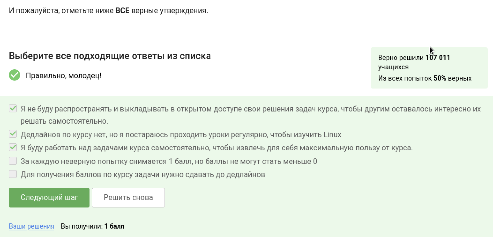{ #fig:002 width=70% }

## Глава 1.2 как установить Linux

Так как виртуальная машина у меня уже поставлена, я пропускаю видеоролики в этой главе и решаю только тестовые вопросы (рис. [-@fig:003]).
 
{ #fig:003 width=70% }

Согласно определению виртуальной машины выбираем из списка самое близкое. Виртуальная машина - программная и/или аппаратная система, эмулирующая аппаратное обеспечение некоторой платформы и исполняющая программы для target-платформы на host-платформе или виртуализирующая некоторую платформу и создающая на ней среды, изолирующие друг от друга программы и даже операционные системы (рис. [-@fig:004]).

{ #fig:004 width=70% }

Мы смогли запустить Linux на своем компьютере, отвечаем положительно (рис. [-@fig:005]).

{ #fig:005 width=70% }

## Глава 1.3 Осваиваем Linux

Первое задание в этой главе (рис. [-@fig:006]).

{ #fig:006 width=70% }

Для выполнения этого задания откроем LibreOfficeWriter, создадим файл и напишем в нем необходимую строку (рис. [-@fig:007]). Сохраняем файл в формате .xml (рис. [-@fig:008]). Готовый файл прикрепляем к курсу на stepik.

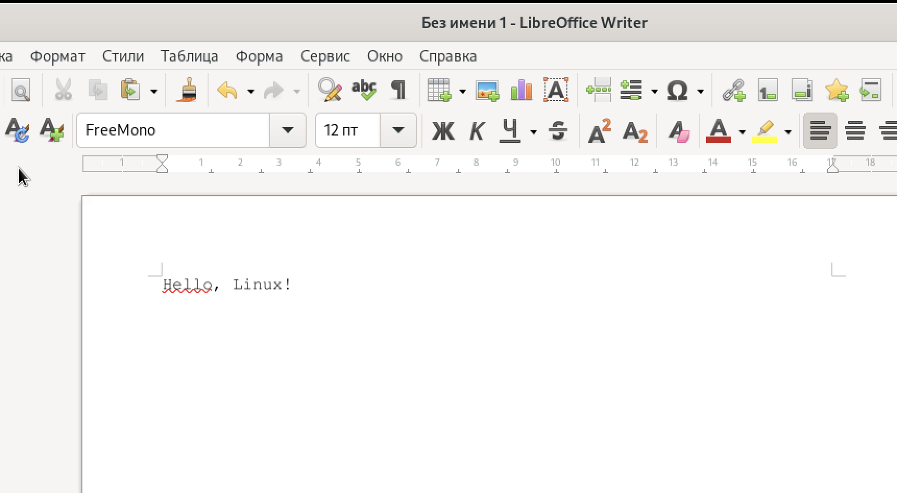{ #fig:007 width=70% }

{ #fig:008 width=70% }

Формат установочного файла в Линуксе - deb (рис. [-@fig:009]). (ubuntu - дистрибутив Linux, ехе - установочный файл на Windows, dmg - установочный файл на Mac OS, txt - текстовый файл). 

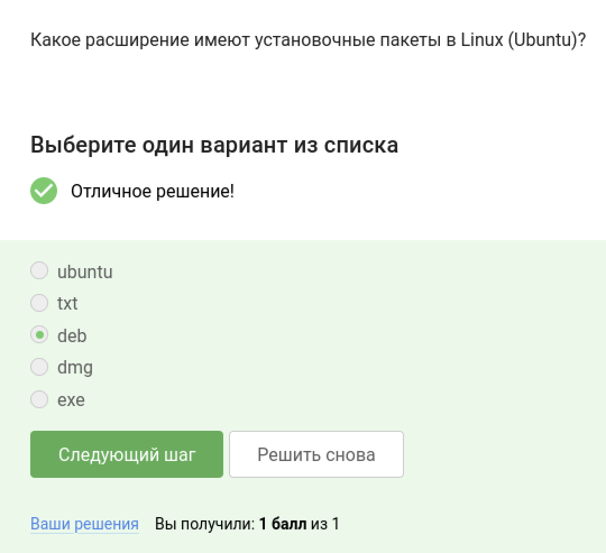{ #fig:009 width=70% }

Затем требовалось поставить VLC и найти первого автора в списке. Ставим VLC (рис. [-@fig:010]), открываем (рис. [-@fig:011]), находим автора (рис. [-@fig:012]).

{ #fig:010 width=70% }

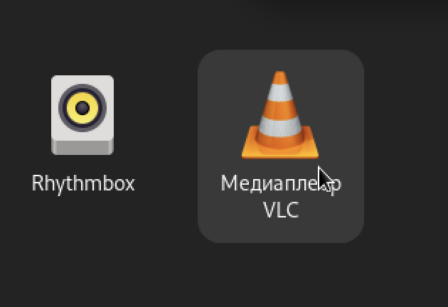{ #fig:011 width=70% }

{ #fig:012 width=70% }

Загружаем ответ на степик (рис. [-@fig:013]).

{ #fig:013 width=70% }

Ответ на вопрос про update manager можно получить из видеоурока на степике. Нам подойдут все варианты об обновлении (как видно из названия update) (рис. [-@fig:014]).

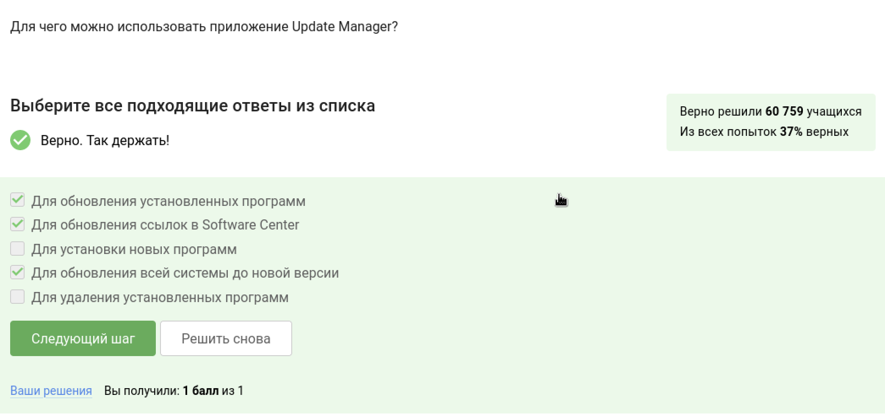{ #fig:014 width=70% }

## Глава 1.4 Terminal: основы

Задание первое (рис. [-@fig:015]) (Ассоль - имя, термин - название определенного понятия, а остальное - синонимы).

{ #fig:015 width=70% }

Команда pwd знакома нам еще с университетского курса, так как регистр важен верным будет всего лишь один ответ (рис. [-@fig:016]).

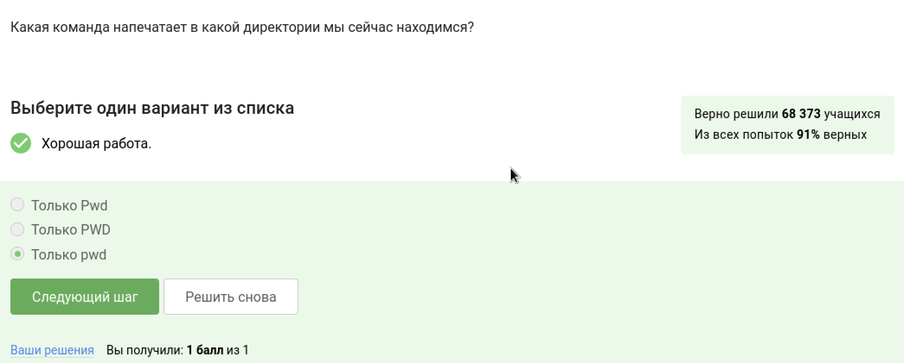{ #fig:016 width=70% }

Для выполнения следующего задания пробуем все команды на практике (рис. [-@fig:017]) и отмечаем верные ответы (рис. [-@fig:018]).

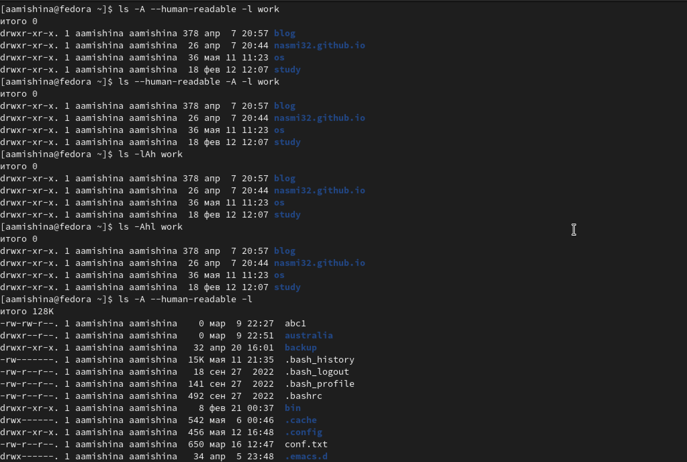{ #fig:017 width=70% }

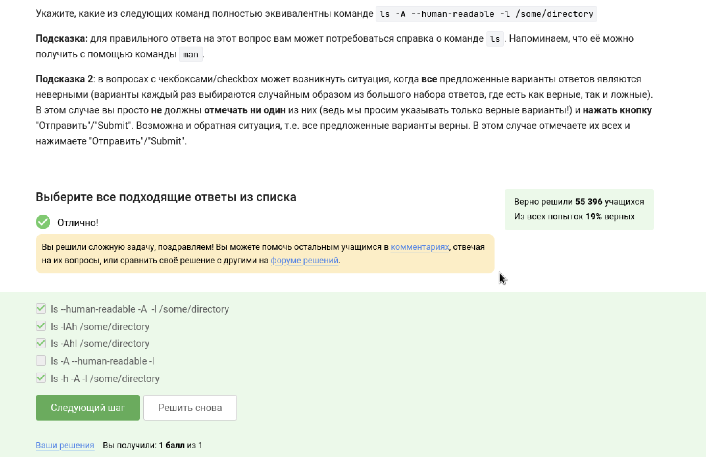{ #fig:018 width=70% }

Аналогично проверяем команды для следующего задания с командой ls (рис. [-@fig:019]), (рис. [-@fig:020]).

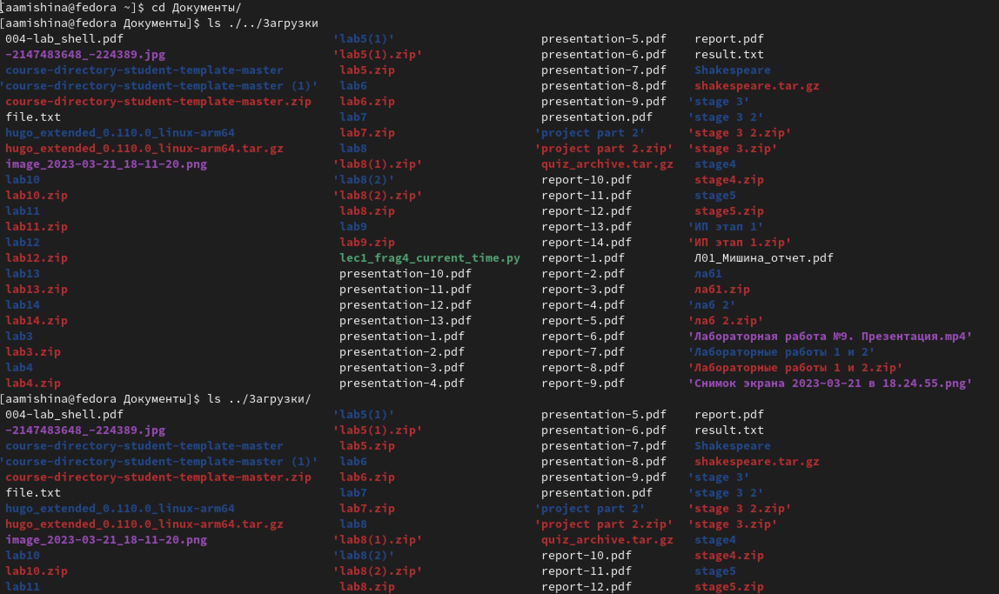{ #fig:019 width=70% }

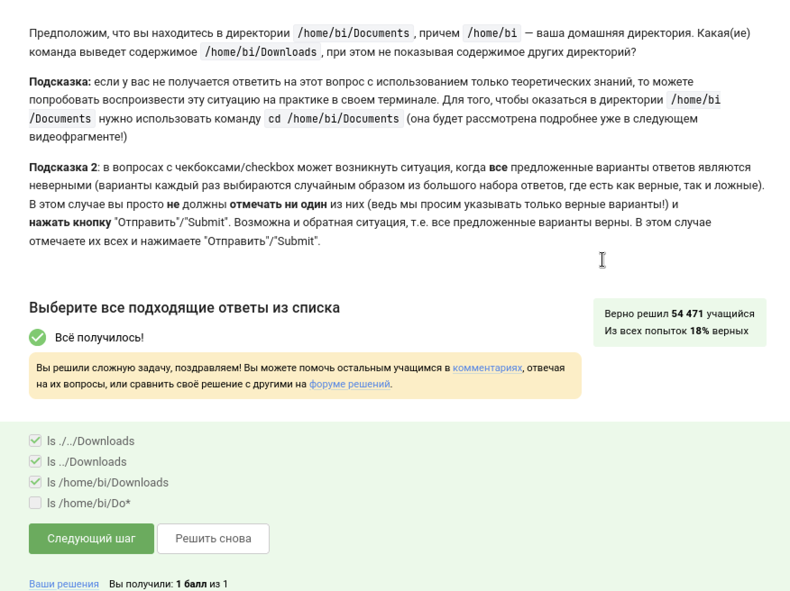{ #fig:020 width=70% }

Команда для удаления директории также знакома нам из университетского курса. Опция -r позволяет рекурсивно удалять директории и их содержащиеся файлы (рис. [-@fig:021]).

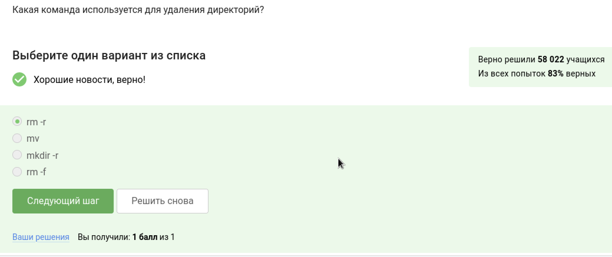{ #fig:021 width=70% }

## Глава 1.5 Запуск исполняемых файлов

Касательно вопроса про командную строку, ранее действительно при запуске firefox нельзя было вводить команду, пока не закрыт браузер. Сейчас все иначе, команду вводить можно, но, чтобы ответ засчитали, выбираем "никто не закроется" (рис. [-@fig:022]).

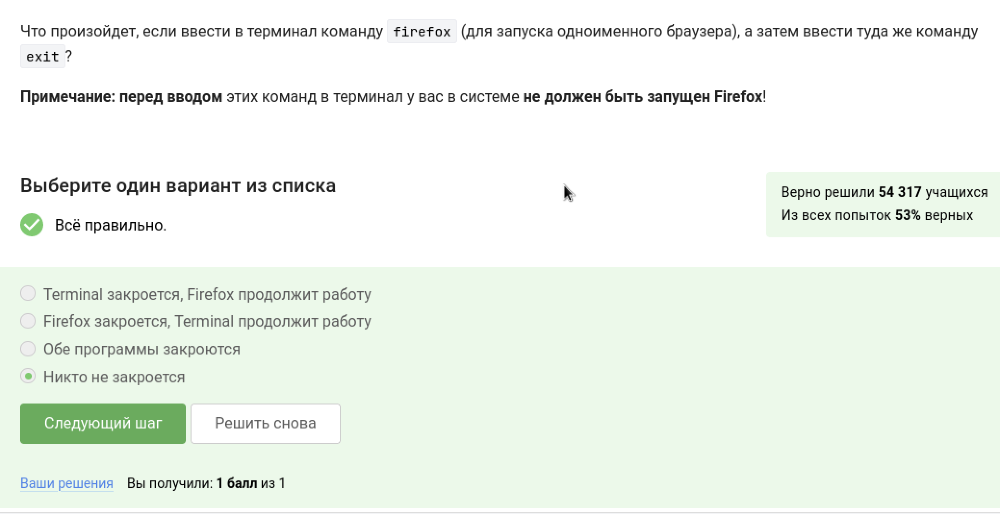{ #fig:022 width=70% }

& заменяет сразу ввод двух команд: "приостановка" и "продолжить на фоне" (рис. [-@fig:023]).

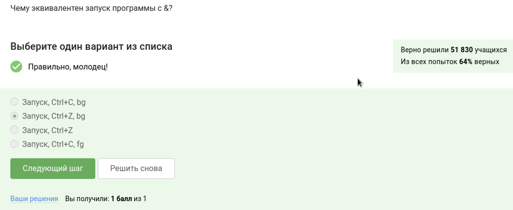{ #fig:023 width=70% }

Финальное задание этой мини-главы выполняю в своей виртуальной машине (рис. [-@fig:024]), копирую ответ и вставляю его на степике (рис. [-@fig:025]).

{ #fig:024 width=70% }

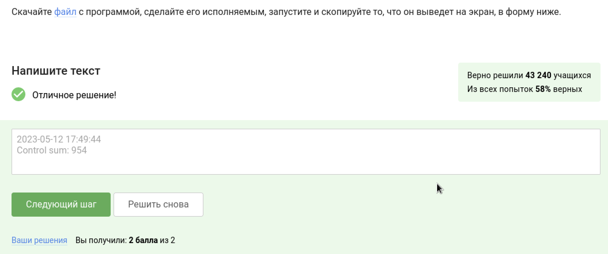{ #fig:025 width=70% }

## Глава 1.6 Ввод / вывод

Поток ошибок программы по умолчанию выводится на экран (объясняется в видеоуроке) (рис. [-@fig:026]).

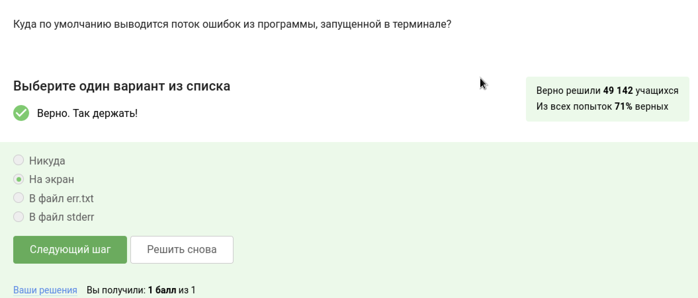{ #fig:026 width=70% }

Следующее задание. Вот мое объяснение решения:
Чтобы перенаправить стандартный поток ошибок в файл, необходимо использовать оператор "2>". Указываем после имени команды оператор 2>, а затем имя файла, который будет служить приемником ошибок выполнения программы.

Таким образом, чтобы записать ошибки выполнения программы program в файл file.txt, введем:

- program 2> file.txt [Enter]

Чтобы добавить стандартный поток ошибок в уже существующий файл, нужно использовать оператор ">>" вместо ">".

- program 2>> file.txt [Enter] 

Соответственно вот мое решение (рис. [-@fig:027]).

{ #fig:027 width=70% }

Следующее задание (рис. [-@fig:028]). При использовании конвейера все ошибки (stderr) никуда не перенаправляются и, как следствие, выводятся на экран.

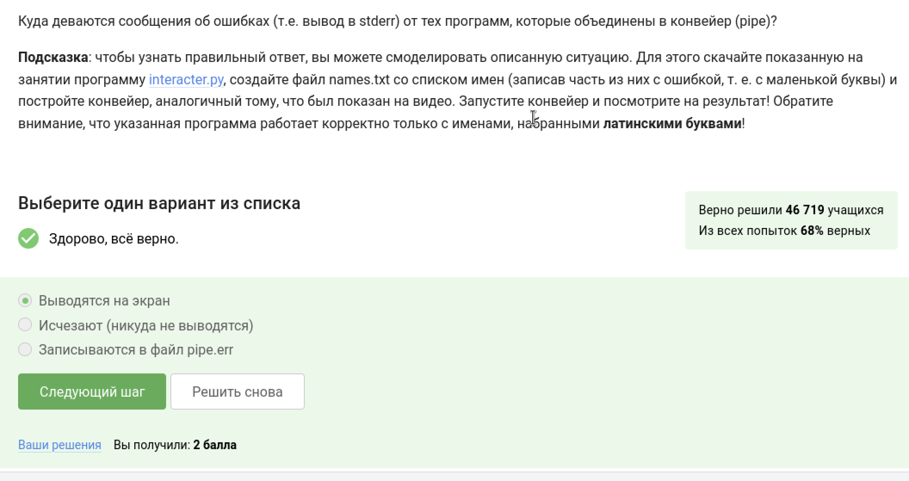{ #fig:028 width=70% }

## Глава 1.7 Скачивание файлов из интернета

Так как префикс -о заслоняет префикс -р, и для префикса -о не указан путь, а просто указано название файла, под которым сохранится картинка, то фотография сохранится в /home/alex/ (рис. [-@fig:029]).

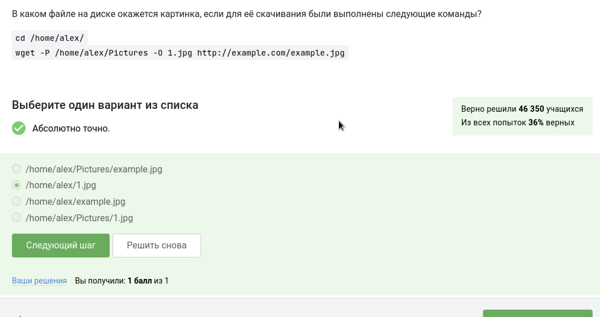{ #fig:029 width=70% }

Следующий вопрос, объяснение: Опция -q (quiet) (рис. [-@fig:030]).

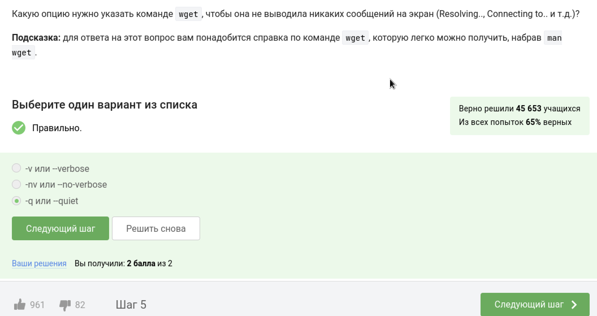{ #fig:030 width=70% }

Финальный вопрос этой главы (рис. [-@fig:031]). Wget скачивает не только запрошенный тип файлов, но и html файлы. В данной команде рекурсивно скачаются все jpg файлы, находящиеся не глубже первого уровня. Одновременно с ними скачаются html файлы. После скачивания все html файлы будут удалены. (обо всем этом говорилось в видеоуроке).

{ #fig:031 width=70% }

## Глава 1.8 Работа с архивами

Про работу gzip рассказывалось в видеоуроке. Он распаковывает архив и затем удаляет его (рис. [-@fig:032]).

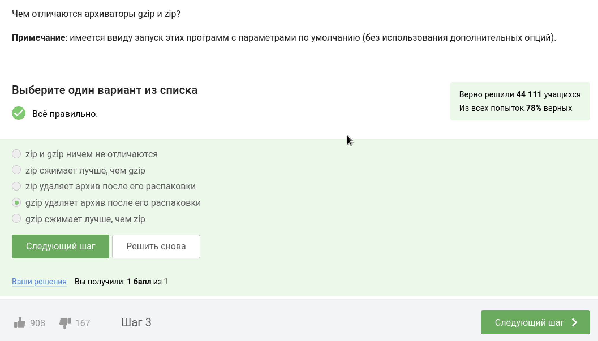{ #fig:032 width=70% }

Команда gzip не может работать с директориями/несколькими файлами (рис. [-@fig:033]).

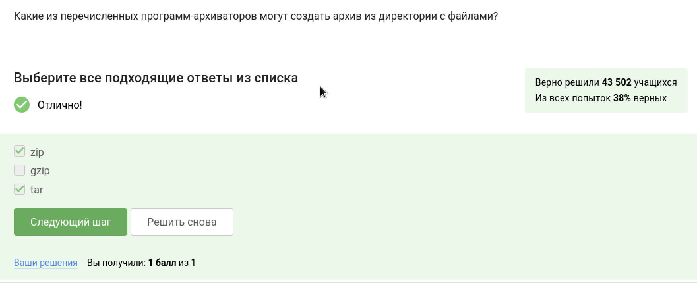{ #fig:033 width=70% }

Опции -cjf, потому что с - для архивирования, j - для использования архиватора bzip, f - создание архива в файловой системе (рис. [-@fig:034]).

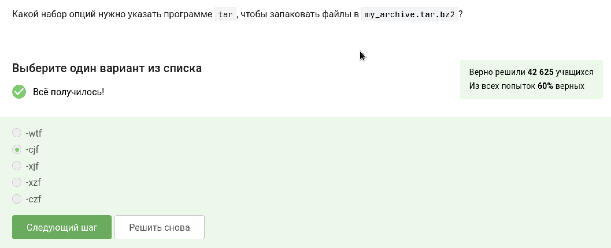{ #fig:034 width=70% }

Задание с терминалом (рис. [-@fig:035]).

{ #fig:035 width=70% }

Задание с терминалом несложное, однако существует проблема на стороне сервера степика, которая не позволяет встроенному терминалу подключаться к сети. Соответственно все такие задания со встроенным терминалом решить не получится из-за внешней проблемы. Доказательство: (рис. [-@fig:036]).

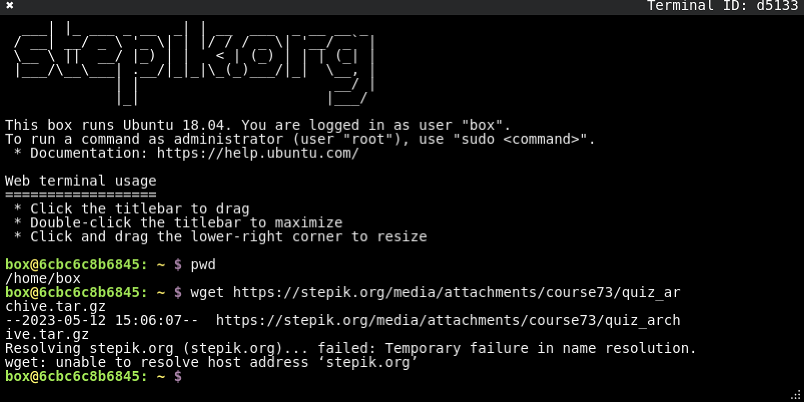{ #fig:036 width=70% }

## Глава 1.9 Поиск файлов и слов в файлах

Объясню свои ответы: alexey.* - маленькая первая буква, *.jpg - наш искомый формат jpeg, *.? - найдет файл с любым именем, но с расширением из одной буквы (а нам надо 4 - jpeg) (рис. [-@fig:037]).

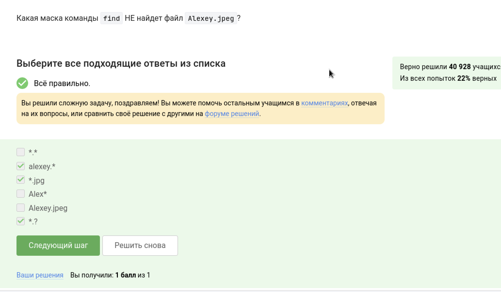{ #fig:037 width=70% }

Следующее задание с командой grep. Для решения задания стоит знать, что значение имеет только регистр, поэтому получаем следующее решение: (рис. [-@fig:038]).

{ #fig:038 width=70% }

Финальное задание главы.

Используя знания, полученные в видео-уроках, выполняем задание (рис. [-@fig:039]).

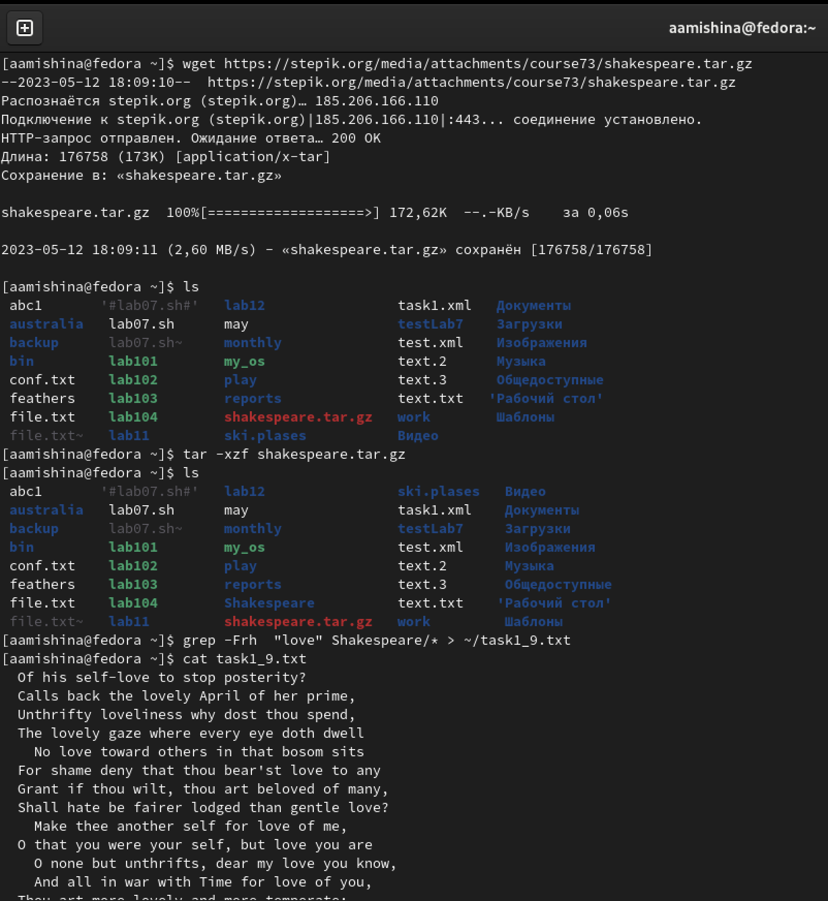{ #fig:039 width=70% }

Прикрепляем файл на степике (рис. [-@fig:040]).

{ #fig:040 width=70% }

# Вывод

В ходе выполнения данной части курса я прошла введение в Linux и познакомилась с основной механикой курса. Также мне рассказали о базовых сведениях в работе с этой операционной системой.
