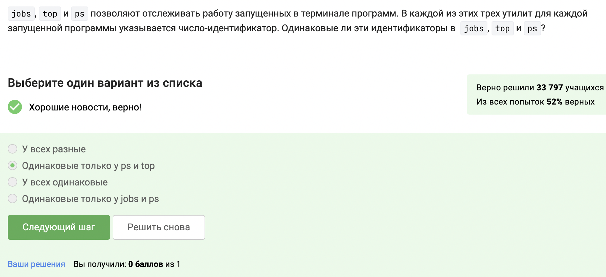
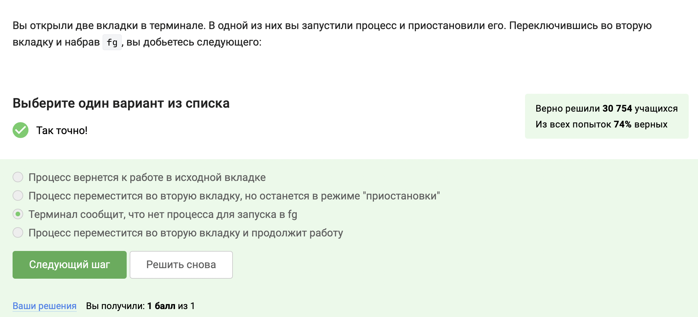

---
## Front matter
title: "Отчёт о прохождении внешнего курса часть 2"
subtitle: "Дисциплина: Операционные системы"
author: "Мишина Анастасия Алексеевна"

## Generic options
lang: ru-RU
toc-title: "Содержание"

## Bibliography
bibliography: bib/cite.bib
csl: pandoc/csl/gost-r-7-0-5-2008-numeric.csl

## Pdf output format
toc: true # Table of contents
toc-depth: 2
lof: true # List of figures
lot: true # List of tables
fontsize: 14pt
linestretch: 1.5
papersize: a4
documentclass: scrreprt
## I18n polyglossia
polyglossia-lang:
  name: russian
  options:
	- spelling=modern
	- babelshorthands=true
polyglossia-otherlangs:
  name: english
## I18n babel
babel-lang: russian
babel-otherlangs: english
## Fonts
mainfont: PT Serif
romanfont: PT Serif
sansfont: PT Sans
monofont: PT Mono
mainfontoptions: Ligatures=TeX
romanfontoptions: Ligatures=TeX
sansfontoptions: Ligatures=TeX,Scale=MatchLowercase
monofontoptions: Scale=MatchLowercase,Scale=0.9
## Biblatex
biblatex: true
biblio-style: "gost-numeric"
biblatexoptions:
  - parentracker=true
  - backend=biber
  - hyperref=auto
  - language=auto
  - autolang=other*
  - citestyle=gost-numeric
## Pandoc-crossref LaTeX customization
figureTitle: "Рис."
tableTitle: "Таблица"
listingTitle: "Листинг"
lofTitle: "Список иллюстраций"
lotTitle: "Список таблиц"
lolTitle: "Листинги"
## Misc options
indent: true
header-includes:
  - \usepackage{indentfirst}
  - \usepackage{float} # keep figures where there are in the text
  - \floatplacement{figure}{H} # keep figures where there are in the text
---

# Цель работы

Приобретение практических навыков работы с операционной системой Линукс. Работа на сервере.

# Задание

- 2.1 Знакомство с сервером
- 2.2 Обмен файлами
- 2.3 Запуск приложений
- 2.4 Контроль запускаемых программ
- 2.5 Многопоточные приложения
- 2.6 Менеджер терминалов tmux
- 2.7 Как установить Linux: расширенное руководство

# Выполнение лабораторной работы

# Глава 2.1 Знакомство с сервером

Первое задание в этой главе (рис. [-@fig:001]). Ответ на него в видеоуроке, в моем случае все ответы были верные.

{ #fig:001 width=70% }

Далее выбираем ключ id_rsa.pub, т.к. это публичный ключ (безопасно передавать), который и передается по интернету (рис. [-@fig:002]).

{ #fig:002 width=70% }

Финальное задание с терминалом снова не работает из-за проблем на стороне сервера степика (рис. [-@fig:003]).

{ #fig:003 width=70% }

# Глава 2.2 Обмен файлами

scp - команда копирования, -r - рекурсивное копирование, stepik - папка, куда скопируется, username@server:~/ - логин_сервера@адрес_сервера:путь (рис. [-@fig:004]).

{ #fig:004 width=70% }

Так как терминал не может найти установочный пакет и еще не приступил к скачиванию, то ошибка не в количестве места на диске. Команда sudo apt-get install --only-upgrade program обновит только этот пакет, в случае если тот установлен! В нашем задании ранее ничего установлено не было. Необходимо проверить интернет соединение, чтобы устройство могло установить соединение с сервером. Также нам понадобится команда sudo apt-get update, чтобы обновить индекс пакетов в системе Linux или списки пакетов. Индексный файл пакетов – это файл или база данных, которые содержат список программных пакетов, определенных в репозиториях, расположенных в файле /etc/apt/sources.list (рис. [-@fig:005]).

{ #fig:005 width=70% }

Программа Filezilla предназначена для просмотра содержимого директорий на сервере, для просмотра содержимого директорий на своем компьютере и для копирования файлов со своего компьютера на сервер. Обо всем этом можно узнать в видеоуроке (рис. [-@fig:006]).

{ #fig:006 width=70% }

Финальное задание с терминалом снова не работает из-за проблем на стороне сервера степика (рис. [-@fig:007]).

{ #fig:007 width=70% }

# Глава 2.3 Запуск приложений

Для того чтобы запустить на сервере программу, которая требует экран для работы, необходимо либо настроить сервер для того, чтобы он поддерживал вывод информации на экран компьютера, либо попробовать найти другую версию программы (специально для терминала) (рис. [-@fig:008]).

{ #fig:008 width=70% }

Для следующего задания пробуем команды на практике (рис. [-@fig:009]). Команда program --help работает (там очень много текста, не влезло в скриншот). Также терминал рекомендует использовать не help program, а info program, однако для теста выбираем этот ответ как правильный (рис. [-@fig:010]).

{ #fig:009 width=70% }

{ #fig:010 width=70% }

Для выполнения следующего задания (рис. [-@fig:011]) обратимся к Интернету и посмотрим справку по программе FastQC (рис. [-@fig:012]).

{ #fig:011 width=70% }

{ #fig:012 width=70% }

Выбираем необходимые ответы на курсе степика (рис. [-@fig:013]).

{ #fig:013 width=70% }

Финальное задание этой мини-главы (рис. [-@fig:014]).

{ #fig:014 width=70% }

Просмотр справки про программе для задания (рис. [-@fig:015]).

{ #fig:015 width=70% }

Соответственно, нам необходимо использовать опцию -align для выполнения множественного выравнивания (multiple alignment). Также указываем файл test.fasta (рис. [-@fig:016]).

{ #fig:016 width=70% }

# Глава 2.4 Контроль запускаемых программ

По выполнении команды jobs будет показана информация только о program2 и program3, т.к. ctrl+c прервет выполнение первой программмы, а ctrl+z лишь приостановит выполнение второй программы, но не прервет ее. Так что в итоге останутся две программы (рис. [-@fig:017]).

{ #fig:017 width=70% }

Ps и top показывают идентификаторы системы в виде pid, а jobs показывает свои внутрение идентификаторы (рис. [-@fig:018]).

{ #fig:018 width=70% }

Завершить остановленный процесс мгновенно можно при помощи команды kill -9. Она позволяет "аварийно" завершить с программу с возможным вредом для машины. А команда kill завершает программу по определенным специальным правилам, с сохранением информации и т.д. (рис. [-@fig:019]).

{ #fig:019 width=70% }

Следующее задание пробуем на практике и получаем нужный ответ (рис. [-@fig:020]).

{ #fig:020 width=70% }

Выбираем ответ процесс приступит к завершению, как только будет продолжен (рис. [-@fig:021]).

{ #fig:021 width=70% }

# Глава 2.5 Многопоточные приложения

Так как остановленное приложение фактически не работает, то оно использует 0% вычислительных ресурсов и не потребляет ресурсы CPU (рис. [-@fig:022]).

{ #fig:022 width=70% }

Это же остановленное приложение будет занимать столько памяти, сколько занимало и до остановки (рис. [-@fig:023]).

{ #fig:023 width=70% }

Следующее задание (рис. [-@fig:024]). Для ответа на него я прочла man по данным командам. Опции kill --thread не существует (рис. [-@fig:025]), так же как и команды threadkill (рис. [-@fig:026]). Ctrl+c прерывает все потоки, а не один поток.

{ #fig:024 width=70% }

{ #fig:025 width=70% }

{ #fig:026 width=70% }

Для выполнения последующих заданий я установила bowtie2. С помощью команды man прочла описание для bowtie2 (рис. [-@fig:027]) и bowtie2-build (рис. [-@fig:028]) можно выполнить в несколько потоков. Отвечаем на вопрос (рис. [-@fig:029]).

{ #fig:027 width=70% }

{ #fig:028 width=70% }

{ #fig:029 width=70% }

Следующее задание (рис. [-@fig:030]).

{ #fig:030 width=70% }

Выполним задание на нашей виртуальной машине (рис. [-@fig:031]). Скачиваем и распаковываем архив. Затем выполняем действия, показанные в видео и получаем файл с выводом stderr (рис. [-@fig:032]).

{ #fig:031 width=70% }

{ #fig:032 width=70% }

# Глава 2.6 Менеджер терминалов tmux

Терминал сообщит, что нет процесса для запуска в fg, так как окна не связаны между собой и новое окно не знает о действиях в предыдущем (рис. [-@fig:033]).

{ #fig:033 width=70% }

Следующий вопрос проверим на практике  (рис. [-@fig:034]). Видим, что tmux завершает работу (рис. [-@fig:035]).

{ #fig:034 width=70% }

{ #fig:035 width=70% }

Следующее задание довольно простое. При закрытии терминала связь с сервером прервется, но так как на сервере tmux не прерывали, он останется работать (рис. [-@fig:036]).

{ #fig:036 width=70% }

На практике проверяем и следующее задание. В фоновый процесс запускаем gedit (рис. [-@fig:037]), после команды ctrl+b, x вкладка закроется, а вместе с ней пропадет и запущенный в ней процесс (рис. [-@fig:038]).

{ #fig:037 width=70% }

{ #fig:038 width=70% }

Затем изучаем справку по tmux, ищем там реализацию команды rename с помощью grep (рис. [-@fig:039]).

{ #fig:039 width=70% }

Выбираем верный ответ (рис. [-@fig:040]).

{ #fig:040 width=70% }

Для ответа на финальный вопрос мини-главы я проверила все утверждения на практике (это можно увидеть в моем скринкасте). Здесь я прикреплю некоторые фотографии, подтверждающие утверждения (рис. [-@fig:041]), (рис. [-@fig:042]). Отмечаем верные варианты (рис. [-@fig:043]).

{ #fig:041 width=70% }

{ #fig:042 width=70% }

{ #fig:043 width=70% }

# Глава 2.7 Как установить Linux: расширенное руководство

В данной главе подробнее расписывалось об установке и настройке виртуальной машины Линукс. Тестовых заданий в ней не было. Так как моя машина UTM и дистрибутив мой - Fedora эта глава мне не очень помогла, но была довольно интересной для общего развития.

# Вывод

В ходе выполнения данной части курса я научилась базовой работе на сервере. Также я узнала про менеджер терминалов tmux, что показалось мне удобно и интересно.
