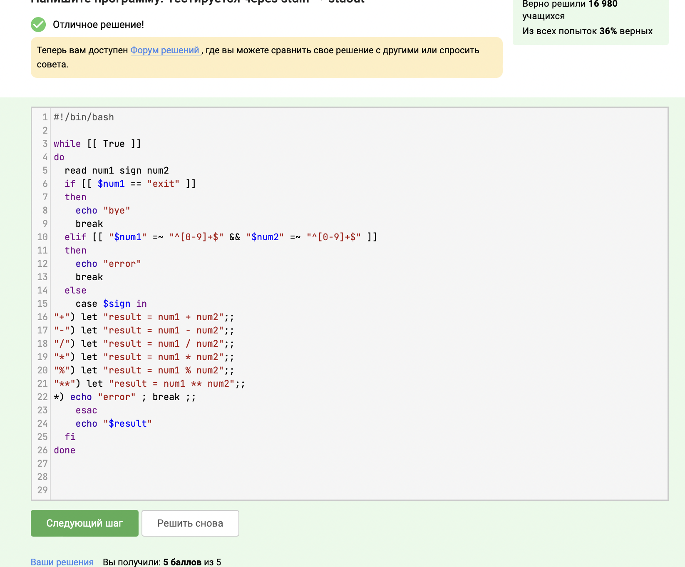

---
## Front matter
title: "Отчёт о прохождении внешнего курса часть 3"
subtitle: "Дисциплина: Операционные системы"
author: "Мишина Анастасия Алексеевна"

## Generic options
lang: ru-RU
toc-title: "Содержание"

## Bibliography
bibliography: bib/cite.bib
csl: pandoc/csl/gost-r-7-0-5-2008-numeric.csl

## Pdf output format
toc: true # Table of contents
toc-depth: 2
lof: true # List of figures
lot: true # List of tables
fontsize: 14pt
linestretch: 1.5
papersize: a4
documentclass: scrreprt
## I18n polyglossia
polyglossia-lang:
  name: russian
  options:
	- spelling=modern
	- babelshorthands=true
polyglossia-otherlangs:
  name: english
## I18n babel
babel-lang: russian
babel-otherlangs: english
## Fonts
mainfont: PT Serif
romanfont: PT Serif
sansfont: PT Sans
monofont: PT Mono
mainfontoptions: Ligatures=TeX
romanfontoptions: Ligatures=TeX
sansfontoptions: Ligatures=TeX,Scale=MatchLowercase
monofontoptions: Scale=MatchLowercase,Scale=0.9
## Biblatex
biblatex: true
biblio-style: "gost-numeric"
biblatexoptions:
  - parentracker=true
  - backend=biber
  - hyperref=auto
  - language=auto
  - autolang=other*
  - citestyle=gost-numeric
## Pandoc-crossref LaTeX customization
figureTitle: "Рис."
tableTitle: "Таблица"
listingTitle: "Листинг"
lofTitle: "Список иллюстраций"
lotTitle: "Список таблиц"
lolTitle: "Листинги"
## Misc options
indent: true
header-includes:
  - \usepackage{indentfirst}
  - \usepackage{float} # keep figures where there are in the text
  - \floatplacement{figure}{H} # keep figures where there are in the text
---

# Цель работы

Приобретение практических навыков работы с операционной системой Линукс. Продвинутые темы.

# Задание

- 3.1 Текстовый редактор vim
- 3.2 Скрипты на bash: основы
- 3.3 Скрипты на bash: ветвления и циклы
- 3.4 Скрипты на bash: разное
- 3.5 Продвинутый поиск и редактирование
- 3.6 Строим графики в gnuplot
- 3.7 Разное

# Выполнение лабораторной работы

# Глава 3.1 Текстовый редактор vim

Первое задание в этой главе (рис. [-@fig:001]). Ответ на него в видеоуроке (двоеточие для ввода команды, q - quit).

{ #fig:001 width=70% }

Следующее задание учит нас работе с кодовыми клавишами в редакторе vim. Для его выполнения я создала файл, записала в него строку и использовала сочетания в примерах, чтобы ответить на вопросы (рис. [-@fig:002]), (рис. [-@fig:003]).

{ #fig:002 width=70% }

{ #fig:003 width=70% }

В видеоуроке рассказывалось об основных клавишах. Например, de - удалить до конца текущего слова, d$ - удалить до конца строки, d5w - удалить 5 слов, dd - удалить строку, d10d - удалить 10 строк, i - войти в insertion mode, a - сдвинуть курсор вправо и войти в insertion mode, o - вставить пустую строку снизу и редактировать ее, О - то же, но строка сверху, y<кол-во><ход> - скопировать, уу - скопировать строку, p - вставить перед, Р - вставить после.

Это задание также выполняем в редакторе (рис. [-@fig:004]), (рис. [-@fig:005]).

{ #fig:004 width=70% }

{ #fig:005 width=70% }

Объяснение следующего задания представлено на картинке (меняем Windows на Linux) (рис. [-@fig:006]), (рис. [-@fig:007]).

{ #fig:006 width=70% }

{ #fig:007 width=70% }

Для решения этого задания обратимся к информации в интернете про режим выделения Visual в vim. Стоит отметить, что режим выделения открывается только из нормального режима, а также для выхода надо использовать двойное нажатие клавиши esc (рис. [-@fig:008]).

{ #fig:008 width=70% }

Финальное задание в этой главе было на работу с удаленным сервером. Терминал степика снова не смог установить соединение с сервером, прикрепляю фотографию с доказательством (рис. [-@fig:009]).

{ #fig:009 width=70% }

# Глава 3.2 Скрипты на bash: основы

Так как мы остаемся в новой третьей оболочке, которая не будет видеть команды предыдущих оболочек, перелистываться будет только набор С (рис. [-@fig:010]).

{ #fig:010 width=70% }

Как видно из кода программы, для начала мы перейдем в директорию /home/bi, где и создадим файл file1.txt. Соответственно, путь до файла будет /home/bi/file1.txt (рис. [-@fig:011]).

{ #fig:011 width=70% }

Из видеоурока мы узнаем, что нельзя использовать точки, тире и слэш в названиях переменных, также они не могут начинаться с цифр (рис. [-@fig:012]).

{ #fig:012 width=70% }

Финальное задание мини-главы требовало написания легкого скрипта на баш, который бы принимал на вход два значения и выводил их. Для начала записываем введенные аргументы в переменные, затем в одной строчке выводим их в сообщении (рис. [-@fig:013]).

{ #fig:013 width=70% }

# Глава 3.3 Скрипты на bash: ветвления и циклы

Выбираем в задании все варианты, которые правдивы при любых значениях переменных. В моем случае всегда верны все ответы. Для решения пользуемся следующими правилами (рис. [-@fig:014]), (рис. [-@fig:015]).

{ #fig:014 width=70% }

{ #fig:015 width=70% }

Объяснение решения (рис. [-@fig:016]):

- -z "" - всегда верно, строка пуста
- !(4 -le 3) - всегда верно, 4 не меньше либо равно 3
- -s $0 - всегда верно, размер файла больше 0
- -n $0 - всегд верно, строка не пуста
- либо переменные равны, либо не равны
- 5 -ge 5 - всегда верно, 5 больше или равно 5

{ #fig:016 width=70% }

Данный код (рис. [-@fig:017]) проверяем на практике (рис. [-@fig:018]). У меня вывелось four и four (рис. [-@fig:019]).

{ #fig:017 width=70% }

{ #fig:018 width=70% }

{ #fig:019 width=70% }

Для выполнения задания (рис. [-@fig:020]) нам нужно написать код, который выводит число студентов. В данном коде программы (рис. [-@fig:021]) мы сначала считываем число студентов в переменную var, а затем с помощью оператора ветвления (if, elif, else) выводим необходимую надпись в зависимости от числа студентов.

{ #fig:020 width=70% }

{ #fig:021 width=70% }

Для выполнения задания скопируем код (рис. [-@fig:022]) в текстовый редактор и запустим файл (рис. [-@fig:023]).

{ #fig:022 width=70% }

{ #fig:023 width=70% }

Как мы видим, 5 раз выводится start и 4 раза finish (рис. [-@fig:024]).

{ #fig:024 width=70% }

Финальное задание (рис. [-@fig:025]) в этой мини-главе - написаное скрипта, который определяет возрастную группу пользователей (рис. [-@fig:026]). В бесконечном цикле считываем имя, если оно пустое, то выходим. Также считываем возраст, если он 0, то выходим. Затем определяем категорию возраста group в конструкции if, elif, else и выводим сообщение с именем и возрастной группой. В конце программы выводим сообщение с прощанием bye.

{ #fig:025 width=70% }

{ #fig:026 width=70% }

# Глава 3.4 Скрипты на bash: разное

Первое задание (рис. [-@fig:027]). О том как складывать переменные рассказывалось в видеоуроке ранее (рис. [-@fig:028]). Используем функцию let, без кавычек записываем через знак $ и без пробелов, в кавычках пишем уже без знака $, используем упрощенную форму записи a += b, ведь это и есть a = a + b. 

{ #fig:027 width=70% }

{ #fig:028 width=70% }

Так как сначала мы переходим в директорию /home/bi/, то она и выведется по команде pwd (рис. [-@fig:029]).

{ #fig:029 width=70% }

Далее, сначала запускаем программ, потом сверяем код возврата. Записываем в some_file.txt результат работы программы (рис. [-@fig:030]).

{ #fig:030 width=70% }

Для выполнения следующего задания пишем скрипт, который в цикле for вызывает функцию от значений от 1 до 10 (рис. [-@fig:031]). Выполняем скрипт (рис. [-@fig:032]) копируем ответ и вставляем его в поле ответа на степике (рис. [-@fig:033]).

{ #fig:031 width=70% }

{ #fig:032 width=70% }

{ #fig:033 width=70% }

Следующее задание (рис. [-@fig:034]).

{ #fig:034 width=70% }

Ниже привожу схему, по которой работает нахождение НОДа (рис. [-@fig:035]). Собственно этот алгоритм и описан в скрипте. Из большего числа вычитается меньшее и записывается в большее. Так происходит, пока числа не сравняются. Полученное одинаковое число и будет НОДом.

{ #fig:035 width=70% }

{ #fig:036 width=70% }

Финальное задание (рис. [-@fig:037]) - написание калькулятора с использованием конструкции switch case. Задание это несложное, так как я знаю язык программирования с++, то придумать идею реализации для меня было нетрудно. Для начала проверяем правильность введенных данных, затем выполняем действие в зависимости от знака и выводим результат (рис. [-@fig:038]).

{ #fig:037 width=70% }

{ #fig:038 width=70% }

# Глава 3.5 Продвинутый поиск и редактирование

Так как iname ищет без учета регистра, а name в точности как в запросе, то ответ будет следующим (рис. [-@fig:039]):

{ #fig:039 width=70% }

find путь -name образец - проверяет на соответствие образцу только собственно имя файла, а find путь -path образец - проверяет на соответствие образцу полное имя файла с путем.

То есть, для файла /home/user/test на соответствие образцу будет проверяться:
- для -name -- только "test"
- для -path -- "/home/user/test"

Причём, для -path проверяется строка целиком, без учета деления на каталоги.

Соответственно выбираем правильные ответы (рис. [-@fig:040]):

{ #fig:040 width=70% }

Так как минимальная глубина поиска 2, то будем искать начина от file1 и dir2, а так как максимальная 3, то заканчивается все содержимым dir2, то есть file2 и dir3 (но в dir3 мы не зайдем, это будет уже новый уровень глубины). Поэтому мы найдем только file1 и file2 (рис. [-@fig:041]).

{ #fig:041 width=70% }

Из описания man "Print NUM lines of trailing context after/before matching lines". То есть если у нас будут 1..2..10..100 строк подряд, в которых найдется совпадение, то контекст будет выведен для этой группы из 100 строк, а не до и после каждой строки в этой группе. Следовательно все размеры файлов results.txt будут одинаковыми (рис. [-@fig:042]).

{ #fig:042 width=70% }

Объяснение на фотографии (рис. [-@fig:043]).

{ #fig:043 width=70% }

Соответственно, решение задания (рис. [-@fig:044]).

{ #fig:044 width=70% }

Если не указывать опцию -n, то каждая строчка будет выведена два раза, так как "The -n option disables the automatic printing, which means the lines you don't specifically tell it to print do not get printed, and lines you do explicitly tell it to print (e.g. with p) get printed only once" (рис. [-@fig:045]).

{ #fig:045 width=70% }

Финальное задание мини-главы - написать sed, которая заменит все аббревиатуры в файле на слово abbreviation. Условия вы видите на скриншоте (рис. [-@fig:046]).

{ #fig:046 width=70% }

Мой ответ: заменяем не менее две большие латинские буквы на слово abbreviation (рис. [-@fig:047]).

{ #fig:047 width=70% }

# Глава 3.6 Строим графики в gnuplot

Необходимо указать опцию -p, --persist (можно узнать из man по gnuplot) (рис. [-@fig:048]).

{ #fig:048 width=70% }

Разобраться с этим поможет предыдущий видеоурок (рис. [-@fig:049]).

{ #fig:049 width=70% }

Следующее задание заключается в написании функции set, которая оформляет нам номера точек и их значения (рис. [-@fig:050]).

{ #fig:050 width=70% }

Для решения финального задания нам необходимо было изменить файл согласно условию (рис. [-@fig:051]).

{ #fig:051 width=70% }

Меняем: зеркальное отражение графика (-x ** 2-y ** 2), вращение изображения в обратную сторону ((zrot+350)%360), скорость вращения увеличиваем в 2 раза (pause 0.1) (рис. [-@fig:052]).

{ #fig:052 width=70% }

# Глава 3.7 Разное

В первом задании выбираем команды, которые позволят изменить права доступа на rwxrw-r-- (рис. [-@fig:053]). Из университетского курса мы уже знаем, как это сделать (рис. [-@fig:054]).

{ #fig:053 width=70% }

{ #fig:054 width=70% }

Следующее задание (рис. [-@fig:055]).

{ #fig:055 width=70% }

Также из фотографии выше видно, что a+w - это разрешение на запись всем (рис. [-@fig:056]).

{ #fig:056 width=70% }

Для следующего задания обратимся за помощью к Интернету:
- wc -l <filename> вывести количество строк
- wc -c <filename> вывести количество байт
- wc -m <filename> вывести количество символов
- wc -L <filename> вывести длину самой длинной строки
- wc -w <filename> вывести количество слов

Выбираем ответ (рис. [-@fig:057]).

{ #fig:057 width=70% }

Для того, чтобы узнать, сколько места на диске занимает текущая директория, поищем информацию в man du. Опция -s - позволяет выводить размеры только для указанных явно аргументов, а не для их подкаталогов, в -h, (--human-readable) - позволеят добавлять букву размера, например M для двоичного мегабайта (`мебибайт'), к каждому размеру (рис. [-@fig:058]).

{ #fig:058 width=70% }

Чтобы быстро создать три директории, воспользуемся короткой формой записи {1..3}, которая заменит нам цикл по созданию директорий пронумерованных от 1 до 3 (рис. [-@fig:059]).

{ #fig:059 width=70% }

# Вывод

В ходе выполнения данной части курса мне рассказали о некоторых продвинутых темах в Линуксе. Я познакомилась с текстовым редактором vim, а также основами написания скриптов на bash.

К сожалению, мы не смогли выполнить все задания курса в связи с проблемами на стороне сервера степика, но набранных мной баллов достаточно для получения сертификата, который я приложила в поле для файлов на ТУИСе (рис. [-@fig:060]).

{ #fig:060 width=70% }
