---
## Front matter
lang: ru-RU
title: Лабораторная работа №1
subtitle: Операционные системы
author:
  - Мишина А. А.
date: 16 февраля 2023

## i18n babel
babel-lang: russian
babel-otherlangs: english

## Formatting pdf
toc: false
toc-title: Содержание
slide_level: 2
aspectratio: 169
section-titles: true
theme: metropolis
header-includes:
 - \metroset{progressbar=frametitle,sectionpage=progressbar,numbering=fraction}
 - '\makeatletter'
 - '\beamer@ignorenonframefalse'
 - '\makeatother'
---

## Цели и задачи

- Целью данной работы является приобретение практических навыков установки операционной системы на виртуальную машину, настройки минимально необходимых для дальнейшей работы сервисов.

# Выполнение лабораторной работы

## Установка виртуальной машины

Запускаем файл формата .dmg и устанавливаем виртуальную машину. 

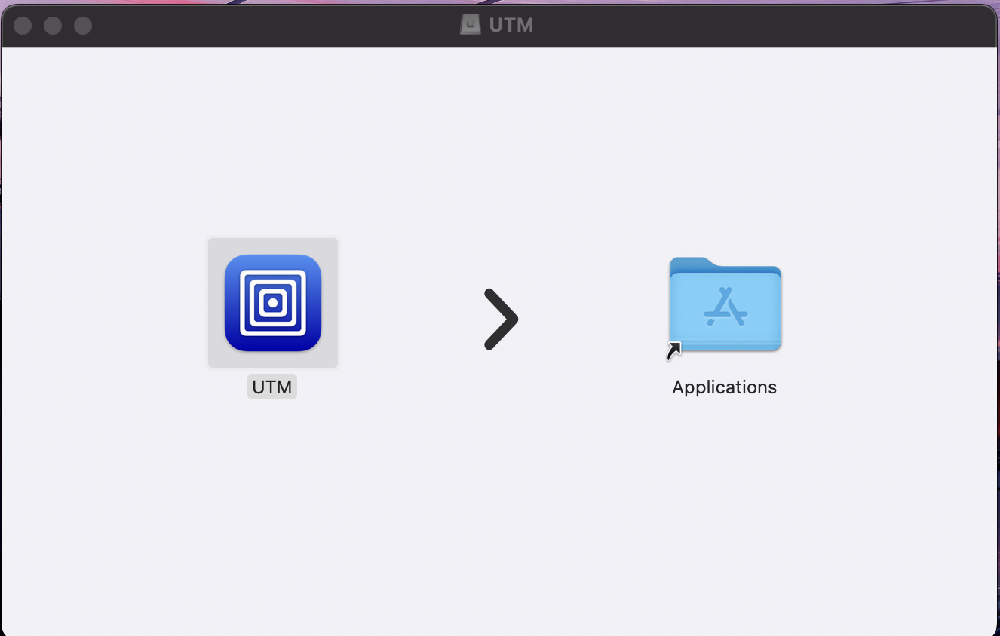{width=60% }

## Подключение образа Fedora 37

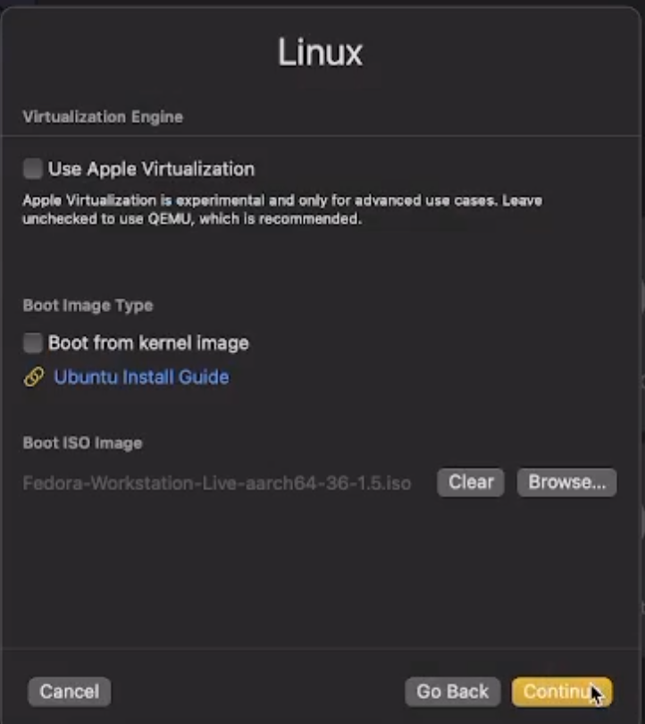{width=60% }

## Установка Fedora на жесткий диск

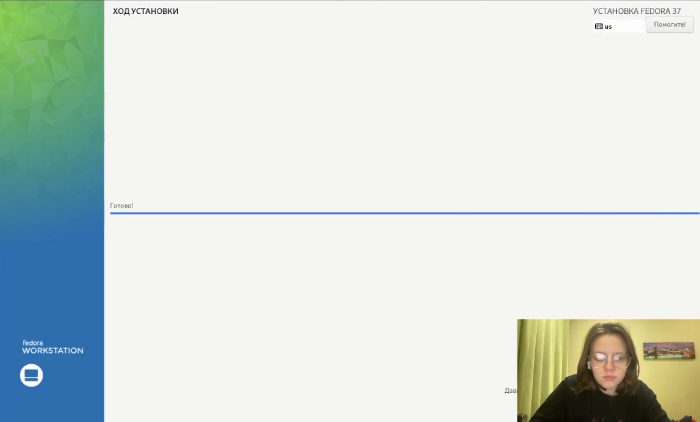{width=60% }

## Перезапуск виртуальной машины

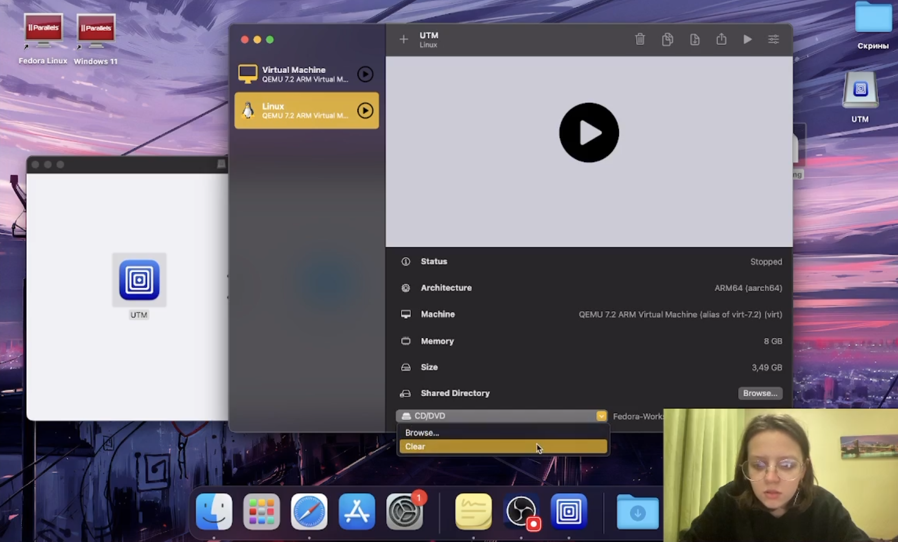{width=60% }

## Создание пользователя и установка пароля

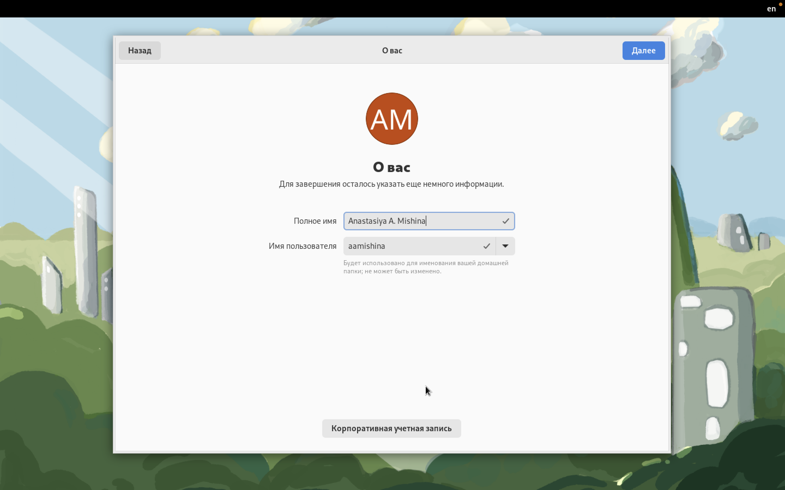{width=60% }

## Установка pandoc

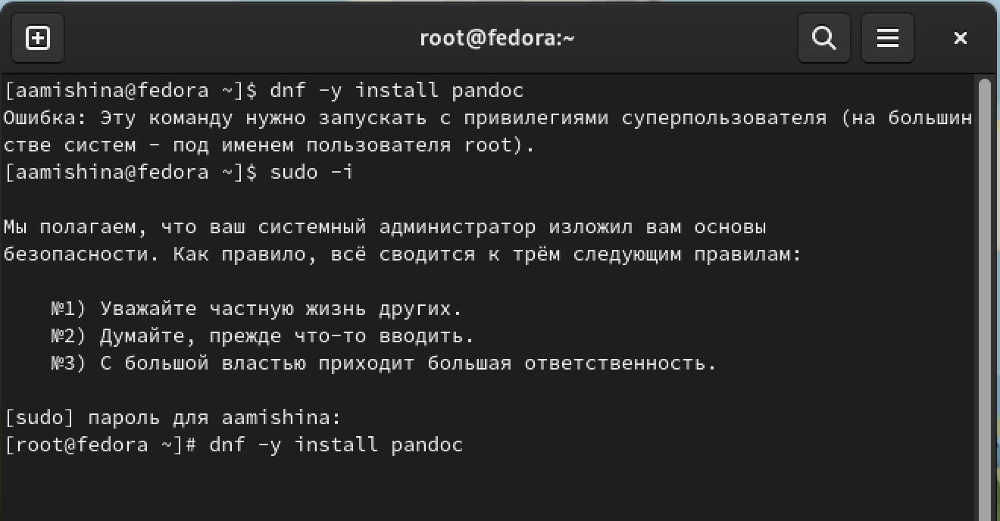{width=60% }

## Установка TexLive

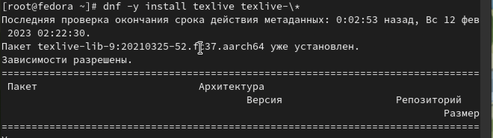{width=60% }

# Выполнение заданий самостоятельной работы (Информация о системе)

## Версия Линукса 
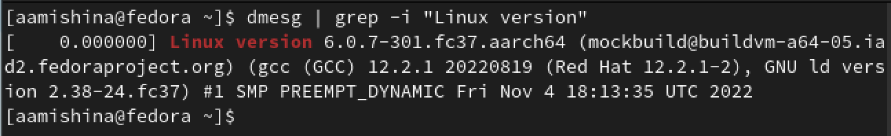{width=60% }

## Частота процессора

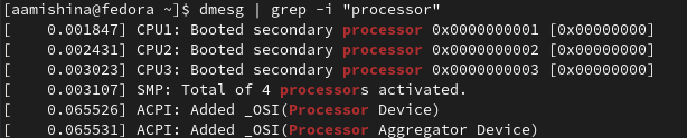{width=60% }

## Модель процессора

{width=60% }

## Модель процессора

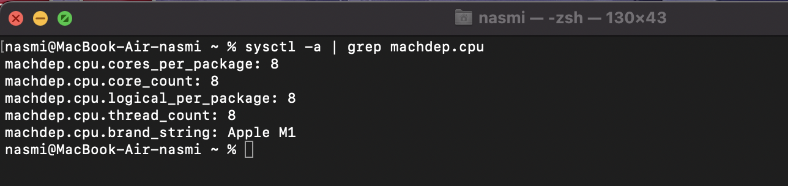{width=60% }

## Объем доступной оперативной памяти

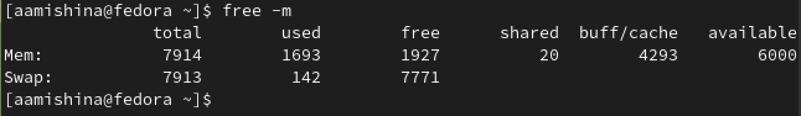{width=60% }

## Гипервизор

{width=60% }

## Тип файловой системы корневого раздела

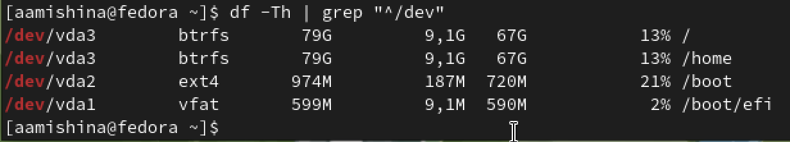{width=60% }

## Последовательность монтирования файловых систем

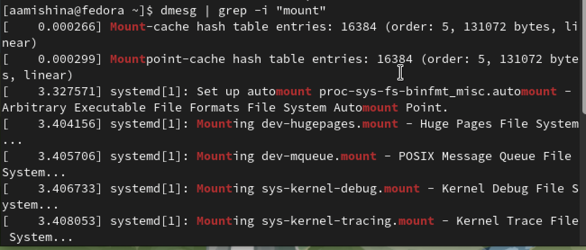{width=60% }

## Вывод

- В ходе выполнения данной лабораторной работы я приобрела практические навыки установки операционной системы на виртуальную машину, настроила минимально необходимые сервисы для дальнейшей работы. Разобралась с настройками UTM, что позволило виртуальной машине Fedora работать с лучшей производительностью. Также мне удалось составить отчет, прикрепив скриншоты, которые я делала во время выполнения задания.
