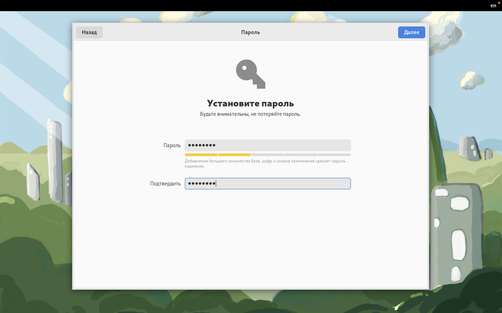

---
## Front matter
title: "Отчёт по лабораторной работе №1"
subtitle: "Дисциплина: Операционные системы"
author: "Мишина Анастасия Алексеевна"

## Generic options
lang: ru-RU
toc-title: "Содержание"

## Bibliography
bibliography: bib/cite.bib
csl: pandoc/csl/gost-r-7-0-5-2008-numeric.csl

## Pdf output format
toc: true # Table of contents
toc-depth: 2
lof: true # List of figures
lot: true # List of tables
fontsize: 14pt
linestretch: 1.5
papersize: a4
documentclass: scrreprt
## I18n polyglossia
polyglossia-lang:
  name: russian
  options:
	- spelling=modern
	- babelshorthands=true
polyglossia-otherlangs:
  name: english
## I18n babel
babel-lang: russian
babel-otherlangs: english
## Fonts
mainfont: PT Serif
romanfont: PT Serif
sansfont: PT Sans
monofont: PT Mono
mainfontoptions: Ligatures=TeX
romanfontoptions: Ligatures=TeX
sansfontoptions: Ligatures=TeX,Scale=MatchLowercase
monofontoptions: Scale=MatchLowercase,Scale=0.9
## Biblatex
biblatex: true
biblio-style: "gost-numeric"
biblatexoptions:
  - parentracker=true
  - backend=biber
  - hyperref=auto
  - language=auto
  - autolang=other*
  - citestyle=gost-numeric
## Pandoc-crossref LaTeX customization
figureTitle: "Рис."
tableTitle: "Таблица"
listingTitle: "Листинг"
lofTitle: "Список иллюстраций"
lotTitle: "Список таблиц"
lolTitle: "Листинги"
## Misc options
indent: true
header-includes:
  - \usepackage{indentfirst}
  - \usepackage{float} # keep figures where there are in the text
  - \floatplacement{figure}{H} # keep figures where there are in the text
---

# Цель работы

Целью данной работы является приобретение практических навыков установки операционной системы на виртуальную машину, настройки минимально необходимых для дальнейшей работы сервисов.

# Выполнение лабораторной работы

Так как я выполняла задание на макбуке и устанавливала соответственно не Virtual Box, а UTM, многие шаги либо отсутствуют в моей работе, либо отличаются.

В данной работе выполняется установка виртуальной машины UTM с последующей установкой на нее дистрибутива Fedora Linux. Заранее скачиваем .dmg файл и образ ОС.

Запускаем файл формата .dmg и устанавливаем виртуальную машину (рис. [-@fig:001]). 

{ #fig:001 width=90% }

Переходим к созданию виртуальной машины (рис. [-@fig:002]). Указываем имя виртуальной машины (Linux), выбираю тип операционной системы Linux и подключила образ Fedora 36 (Позже пришлось переустановить на Fedora 37) (рис. [-@fig:003]). Указываем размер основной памяти виртуальной машины - 8192 Мб (рис. [-@fig:004]). Выделяем машине 80 Гб (рис. [-@fig:005]). 

{ #fig:002 width=90% }

{ #fig:003 width=90% }

{ #fig:004 width=90% }

{ #fig:005 width=90% }

После загрузки системы должно было появиться окно установки, однако в моем случае этого не произошло. Благодаря Интернету, я выяснила, что мне было необходимо поменять параметры дисплея в настройках виртуальной машины (рис. [-@fig:006]).

{ #fig:006 width=90% }

Заходим в систему и выбираем установку на жесткий диск (рис. [-@fig:007]).

{ #fig:007 width=90% }

Выбираем язык установки (рис. [-@fig:008]), переходим в окно настроек образа ОС и настраиваем часовой пояс (рис. [-@fig:009]), раскладку клавиатуры (рис. [-@fig:010]). Настраиваем место установки (рис. [-@fig:011]).

{ #fig:008 width=90% }

{ #fig:009 width=90% }

{ #fig:010 width=90% }

{ #fig:011 width=90% }

Выбираем автоматическую установку Fedora, завершаем ее после процесса установки (рис. [-@fig:012]).

{ #fig:012 width=90% }

Закрываем окно установщика, выключаем систему и изымаем образ диска из дисковода (рис. [-@fig:013]).

{ #fig:013 width=90% }

Запускаем виртуальную машину, нас встречает окно, которое предлагает настроить Fedora Linux 37, создаем собственного пользователя системы (рис. [-@fig:014]), устанавливаем пароль (рис. [-@fig:015]). В последних версиях дистрибутива Fedora после установки системы пароль для пользователя root не задается. Получить повышенные права для обычного пользователя можно с помощью команды sudo.

{ #fig:014 width=90% }

{ #fig:015 width=90% }

Теперь установим программное обеспечение для создания документации. Устанваливаем pandoc (рис. [-@fig:016] с необходимыми расширениями (рис. [-@fig:017] и TexLive (рис. [-@fig:018]. Вне кадра пришлось установить дополнения для python, так как файл с разметкой markdown не преобразовывался.

{ #fig:016 width=90% }

{ #fig:017 width=90% }

{ #fig:018 width=90% }

# Выполнение заданий самостоятельной работы

В заданиях самостоятельной работы было необходимо посмотреть некоторую информацию о системе. Получить удалось не все данные, так как в моем ноутбуке установлен чип Apple M1.

Версия Линукса (рис. [-@fig:019]):

{ #fig:019 width=90% }

Частоту и модель процессора выяснить не удалось из-за наличия чипа M1 (рис. [-@fig:020]), (рис. [-@fig:021]). Модель процессора я смогла увидеть из своей ОС (рис. [-@fig:022]), но частоту не удалось узнать даже там. Я почитала и узнала, что доступ к этой информации получить невозможно и компания Apple скрывает ее намеренно.

{ #fig:020 width=90% }

{ #fig:021 width=90% }

{ #fig:022 width=90% }

Объем доступной оперативной памяти (рис. [-@fig:023]):

{ #fig:023 width=90% }

Тип обнаруженного гипервизора определить так же не удалось, причина все та же (рис. [-@fig:024]):

{ #fig:024 width=90% }

Тип файловой системы корневого раздела (рис. [-@fig:025]):

{ #fig:025 width=90% }

Последовательность монтирования файловых систем (рис. [-@fig:026]):

{ #fig:026 width=90% }

Контрольные вопросы:

1. Какую информацию содержит учётная запись пользователя?

* Имя пользователя (username)
* Идентификационный номер пользователя (UID)
* Идентификационный номер группы (GID)
* Пароль (password)
* Полное имя (ful name)
* Домашний каталог (home directory)
* Начальная оболочка (login shell)

2. Укажите команды терминала и приведите примеры:

 * для получения справки по команде: <команда> --help (cd -- help)
 * для перемещения по файловой системе: cd (cd work)
 * для просмотра содержимого каталога: ls (ls study)
 * для определения объёма каталога: du <каталог> (du study)
 * для создания / удаления каталогов / файлов: touch / rm (touch something.txt)
 * для задания определённых прав на файл / каталог: chmod <файл> (chmod 644 text.txt)
 * для просмотра истории команд: hisory

3. Что такое файловая система? Приведите примеры с краткой характеристикой.

Файловая система - порядок, определяющий способ организации, хранения и именования данных на носителях информации в компьютерах, а также в другом электронном оборудовании: цифровых фотоаппаратах, мобильных телефонах и т. п.

Файловая система определяет формат содержимого и способ физического хранения информации, которую принято группировать в виде файлов.

Конкретная файловая система определяет размер имен файлов (и каталогов), максимальный возможный размер файла и раздела, набор атрибутов файла. Некоторые файловые системы предоставляют сервисные возможности, например, разграничение доступа или шифрование файлов.

Примеры файловых систем:

* FAT – одна из старейших файловых систем, которая была разработана еще в 1977 году программистами компании Microsoft для гибких дисков. FAT – одна из старейших файловых систем, которая была разработана еще в 1977 году программистами компании Microsoft для гибких дисков.

* NTFS, или новая технология файловой системы была создана, чтоб устранить недостатки FAT32. Структура системы хранения данных имеет вид бинарного дерева. В отличие от иерархической, как у FAT32, доступ к информации осуществляется по запросу, а поиск ведется по названию файла. При этом система имеет каталог, отсортированный по названиям. Массив делится на 2 части и отсекается та, в которой данного файла не будет, оставшаяся часть также делиться на 2, и так далее до тех пор, пока не будет найден нужный файл.

4. Как посмотреть, какие файловые системы подмонтированы в ОС?

df (аббревиатура от disk free) — утилита в UNIX и UNIX-подобных системах, показывает список всех файловых систем по именам устройств, сообщает их размер, занятое и свободное пространство и точки монтирования.

Команда findmnt — это простая утилита командной строки, используемая для отображения списка смонтированных файловых систем или поиска файловой системы в /etc/fstab, /etc/mtab и /proc/self/mountinfo.

5. Как удалить зависший процесс?

Удалить зависший процесс можно с помощью команды killall (killall <название процесса>).

# Выводы

В ходе выполнения данной лабораторной работы я приобрела практические навыки установки операционной системы на виртуальную машину, настроила минимально необходимые сервисы для дальнейшей работы. Разобралась с настройками UTM, что позволило виртуальной машине Fedora работать с лучшей производительностью. Также мне удалось составить отчет, прикрепив скриншоты, которые я делала во время выполнения задания.
