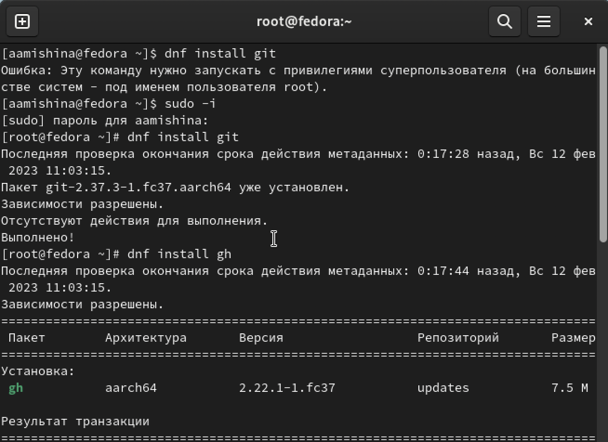
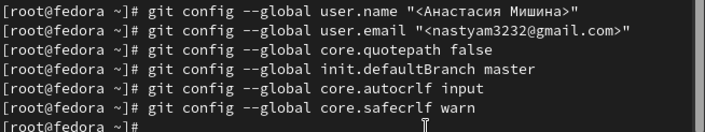
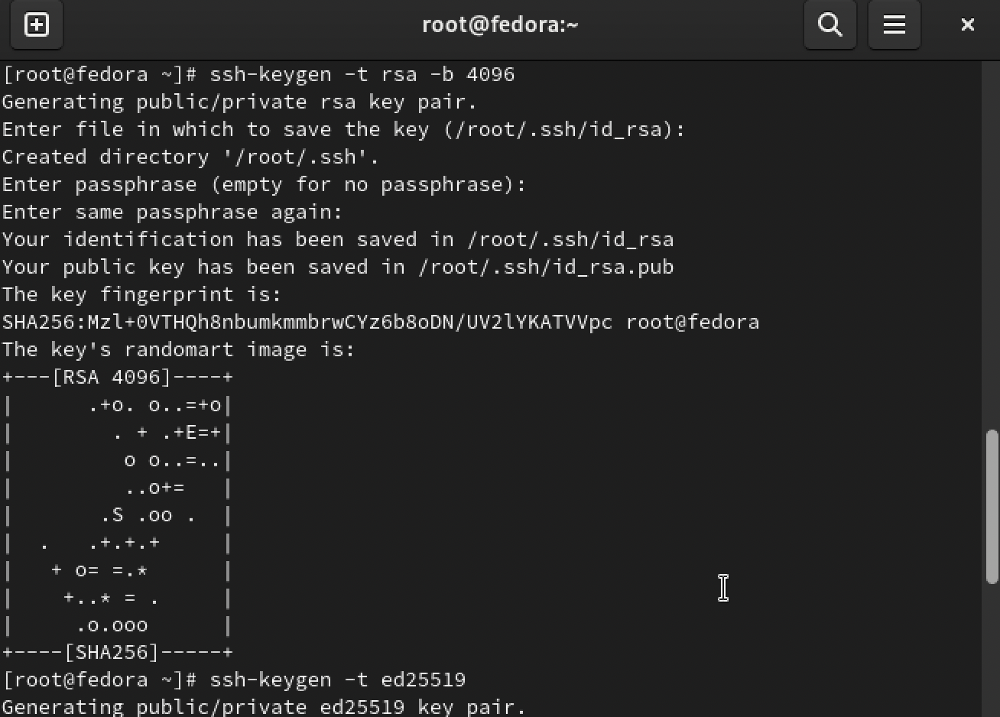
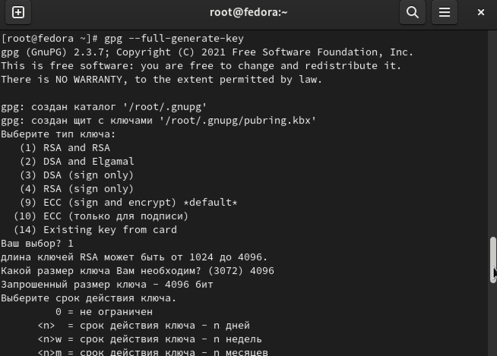
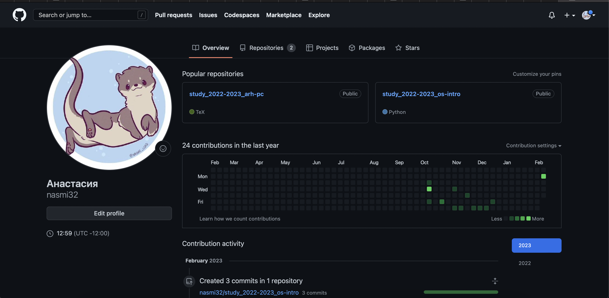
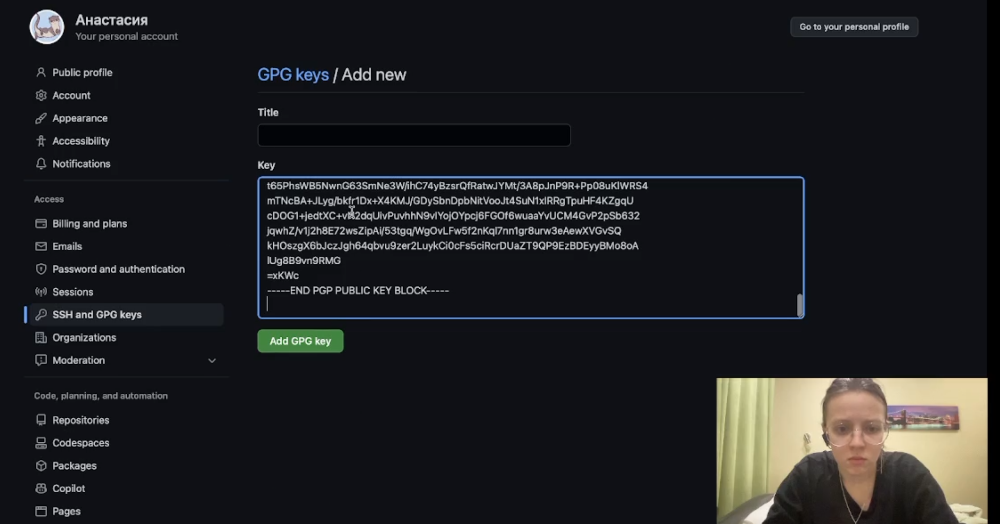
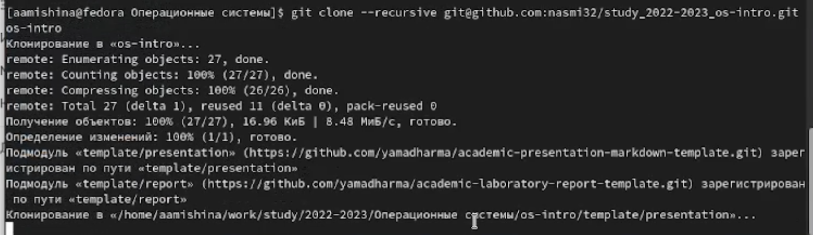
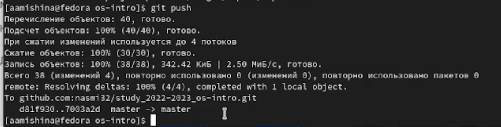

---
## Front matter
lang: ru-RU
title: Лабораторная работа №2
subtitle: Операционные системы
author:
  - Мишина А. А.
date: 17 февраля 2023

## i18n babel
babel-lang: russian
babel-otherlangs: english

## Formatting pdf
toc: false
toc-title: Содержание
slide_level: 2
aspectratio: 169
section-titles: true
theme: metropolis
header-includes:
 - \metroset{progressbar=frametitle,sectionpage=progressbar,numbering=fraction}
 - '\makeatletter'
 - '\beamer@ignorenonframefalse'
 - '\makeatother'
---

## Цели и задачи

- Целью данной работы является изучение идеологии и применение средств контроля версий. А также освоение умений по работе с git.

# Выполнение лабораторной работы

## Установка git

Делаем это с помощью команды "dnf install git", также ставим gh.

{width=60% }

## Базовая настройка git

{width=60%}

## Создание ключей ssh

{width=60% }

## Создание ключа gpg

{width=60% }

## Аккаунт на GitHub

{width=60% }

## Добавление ключа на наш аккаунт

{width=60% }

## Создание новой папки и клонирование репозитория 

{width=60% }

## git add ., git commit, git push

{width=100% }

## git add ., git commit, git push

{width=100% }

## git add ., git commit, git push

{width=60% }

## Вывод

- В ходе выполнения данной лабораторной работы я приобрела практические навыки по работе с git. Изучила идеологию и применение средств контроля версий. Также мне удалось составить отчет, прикрепив скриншоты, которые я делала во время выполнения задания.
