---
## Front matter
title: "Отчёт по лабораторной работе №2"
subtitle: "Дисциплина: Операционные системы"
author: "Мишина Анастасия Алексеевна"

## Generic options
lang: ru-RU
toc-title: "Содержание"

## Bibliography
bibliography: bib/cite.bib
csl: pandoc/csl/gost-r-7-0-5-2008-numeric.csl

## Pdf output format
toc: true # Table of contents
toc-depth: 2
lof: true # List of figures
lot: true # List of tables
fontsize: 14pt
linestretch: 1.5
papersize: a4
documentclass: scrreprt
## I18n polyglossia
polyglossia-lang:
  name: russian
  options:
	- spelling=modern
	- babelshorthands=true
polyglossia-otherlangs:
  name: english
## I18n babel
babel-lang: russian
babel-otherlangs: english
## Fonts
mainfont: PT Serif
romanfont: PT Serif
sansfont: PT Sans
monofont: PT Mono
mainfontoptions: Ligatures=TeX
romanfontoptions: Ligatures=TeX
sansfontoptions: Ligatures=TeX,Scale=MatchLowercase
monofontoptions: Scale=MatchLowercase,Scale=0.9
## Biblatex
biblatex: true
biblio-style: "gost-numeric"
biblatexoptions:
  - parentracker=true
  - backend=biber
  - hyperref=auto
  - language=auto
  - autolang=other*
  - citestyle=gost-numeric
## Pandoc-crossref LaTeX customization
figureTitle: "Рис."
tableTitle: "Таблица"
listingTitle: "Листинг"
lofTitle: "Список иллюстраций"
lotTitle: "Список таблиц"
lolTitle: "Листинги"
## Misc options
indent: true
header-includes:
  - \usepackage{indentfirst}
  - \usepackage{float} # keep figures where there are in the text
  - \floatplacement{figure}{H} # keep figures where there are in the text
---

# Цель работы

Целью данной работы является изучение идеологии и применение средств контроля версий. А также освоение умений по работе с git.

# Выполнение лабораторной работы

Для начала требовалось установить git. Делаем это с помощью команды "dnf install git", также ставим gh (рис. [-@fig:001]).

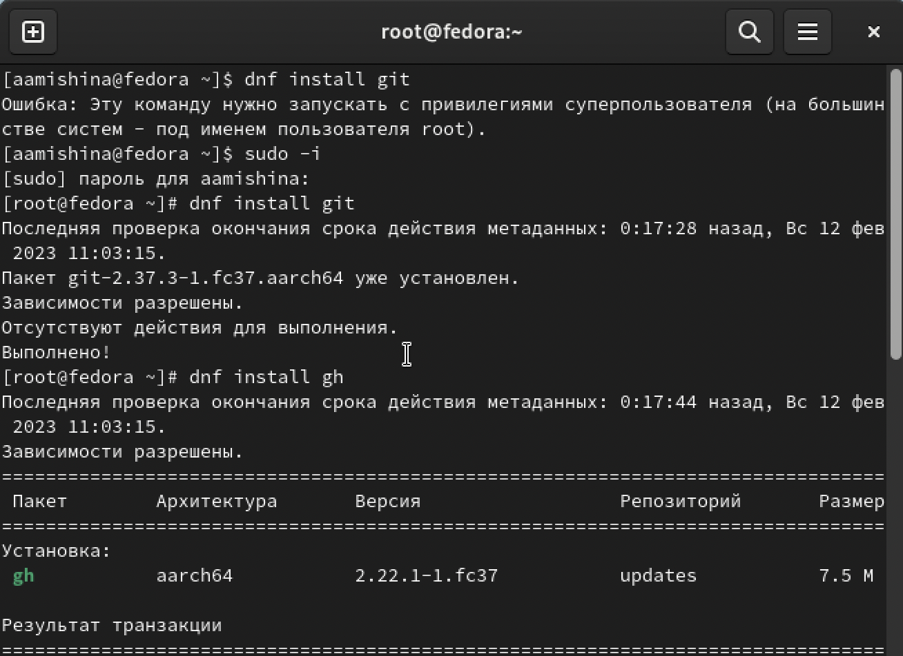{ #fig:001 width=90% }

Затем было необходимо провести базовую настройку git. Задаем имя и email владельца. Настраиваем UTF-8 в выводе сообщений. Задаем имя начальной ветки и работаем с параметрами autocrlf и safecrlf (рис. [-@fig:002])

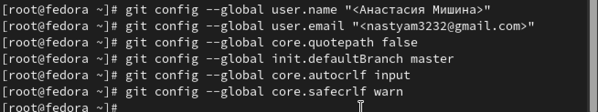{ #fig:002 width=90% }

Переходим к созданию ключей. Создаем SSH ключ по алгоритму rsa и размером 4096 бит с помощью команды "ssh-keygen -t rsa -b 4096". Затем по алгоритму ed25519, пользуясь иной командой "ssh-keygen -t ed25519" (рис. [-@fig:003]).

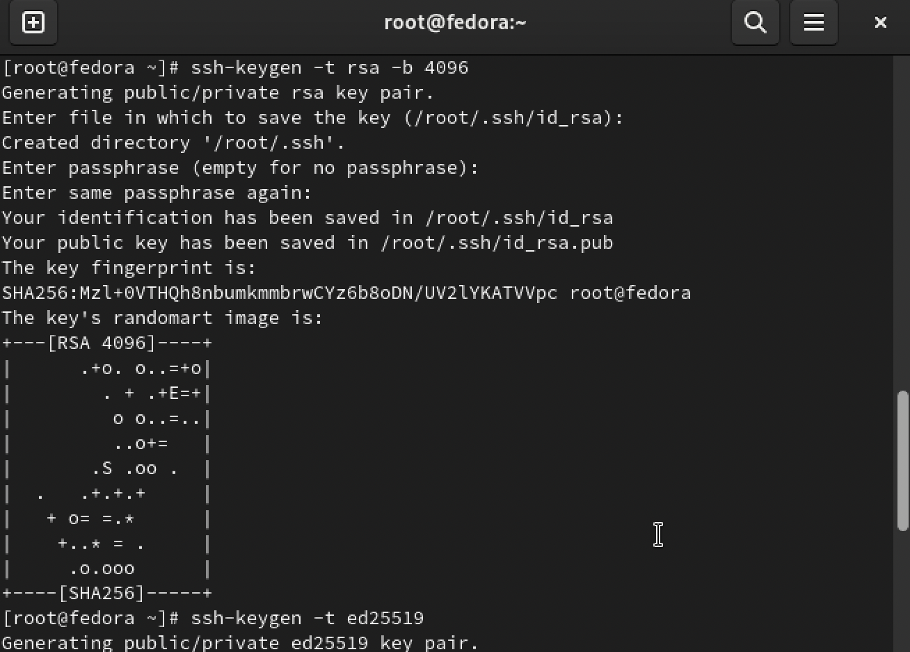{ #fig:003 width=90% }

Далее создаем ключи gpg, используя команду "gpg --full-generate-key". Выбираем опции, указанные в документации на ТУИСе (рис. [-@fig:004]).

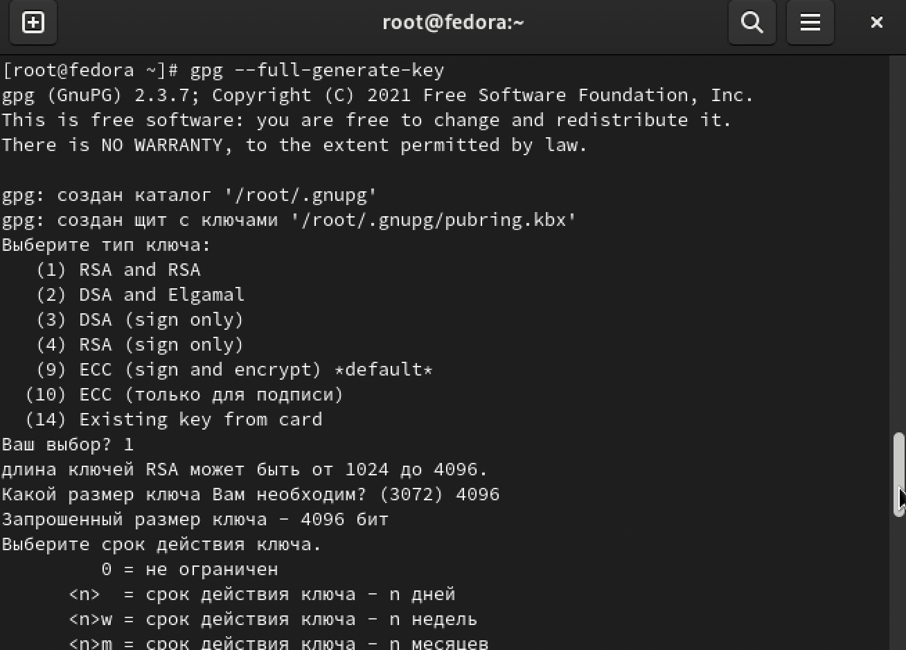{ #fig:004 width=90% }

Так как похожу лабораторную работу мы делали в предыдущем семестре, у меня уже есть аккаунт на GitHub, который был настроен ранее (рис. [-@fig:005]).

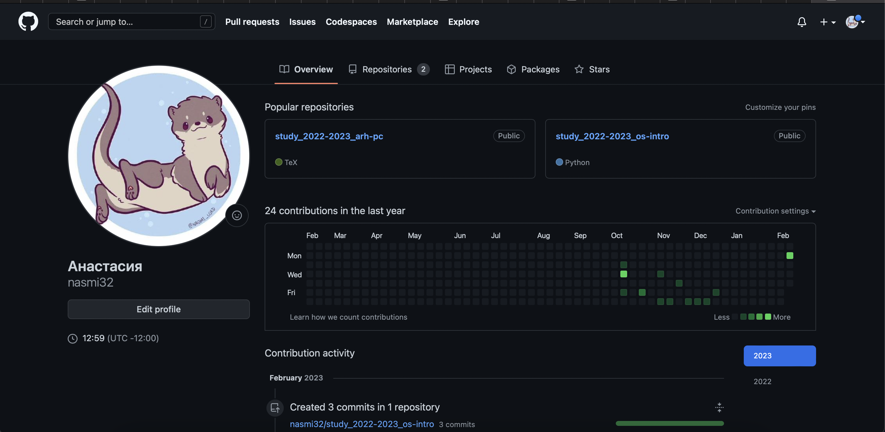{ #fig:005 width=90% }

Пришло время добавить ключ gpg на наш аккаунт в GitHub. Выводим список ключей (рис. [-@fig:006]) и копируем отпечаток приватного ключа (рис. [-@fig:007]).

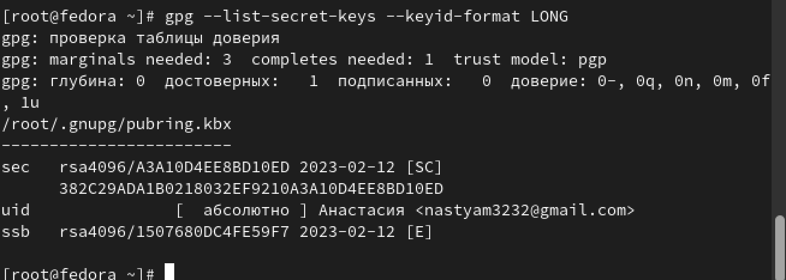{ #fig:006 width=90% }

{ #fig:007 width=90% }

Переходим в настройки GitHub, нажимаем на кнопку New GPG key и вставляем полученный ключ в поле ввода  (рис. [-@fig:008]).

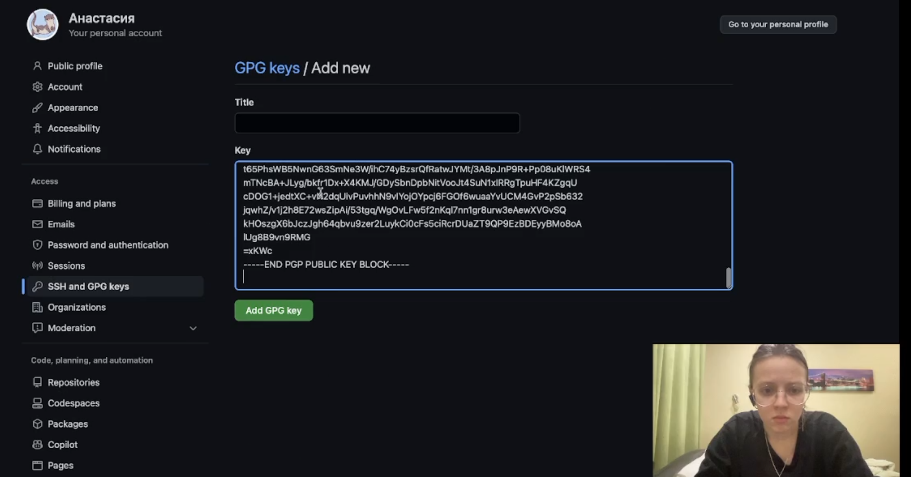{ #fig:008 width=90% }

Пришло время настроить автоматические подписи коммитов GIT. Используем введёный email и указываем Git применять его при подписи коммитов (рис. [-@fig:009]).

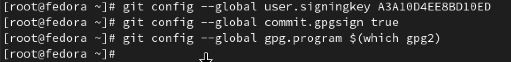{ #fig:009 width=90% }

Авторизуемся в gh (рис. [-@fig:010]).

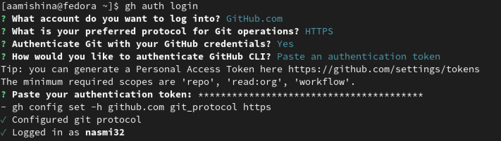{ #fig:010 width=90% }

Теперь создадим репозиторий курса на основе шаблона. Добавим новую папку "Операционные системы", создаем репозиторий на основе общего шаблона (рис. [-@fig:011]) и клонируем его (рис. [-@fig:012]).

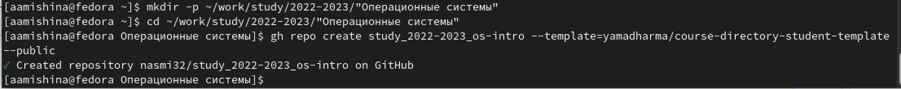{ #fig:011 width=100% }

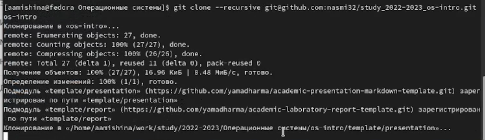{ #fig:012 width=100% }

Переходим к настройке каталога курса. Заходим в наш новый каталог "os-intro"  и удаляем лишние файлы, создаем необходимые каталоги  (рис. [-@fig:013]) и отправляем файлы на сервер  (рис. [-@fig:014]), (рис. [-@fig:015], (рис. [-@fig:016])).

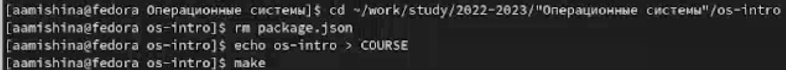{ #fig:013 width=100% }

{ #fig:014 width=90% }

{ #fig:015 width=100% }

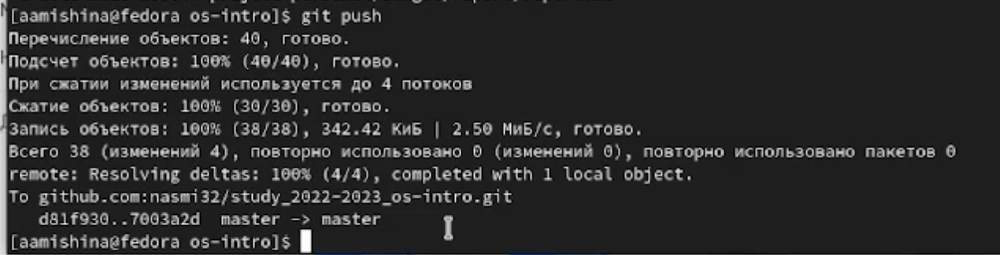{ #fig:016 width=90% }

# Выполнение заданий самостоятельной работы

Контрольные вопросы:

1. Что такое системы контроля версий (VCS) и для решения каких задач они предназначаются?

Система контроля версий (от англ. Version Control System, VCS) — программное обеспечение для облегчения работы с изменяющейся информацией.

VCS применяются при работе нескольких человек над одним проектом. Обычно основное дерево проекта хранится в локальном или удалённом репозитории, к которому настроен доступ для участников проекта. При внесении изменений в содержание проекта система контроля версий позволяет их фиксировать, совмещать изменения, произведённые разными участниками проекта, производить откат к любой более ранней версии проекта, если это требуется.

2. Объясните следующие понятия VCS и их отношения: хранилище, commit, история, рабочая копия.

* Хранилище (репозиторий) — место, где хранятся и поддерживаются какие-либо данные (файлы и история их изменений). Чаще всего данные в репозитории хранятся в виде файлов, доступных для дальнейшего распространения по сети.
* Commit - фиксация изменений файлов и добавление комментария.
* История - список изменений файлов или данных в проекте (репозитории).
* Рабочая копия - снимок одной версии проекта. Эти файлы извлекаются из сжатой базы данных (хранилища) в каталоге Git и помещаются на диск, для того чтобы их можно было использовать или редактировать. 

3. Что представляют собой и чем отличаются централизованные и децентрализованные VCS? Приведите примеры VCS каждого вида.

Централизованная VCS - клиент-серверная модель: один центральный репозиторий, с которым разработчики взаимодействуют по сети (CVS, Subversion(SVN)).

Децентрализованная VCS - в отличие от централизованной модели может существовать несколько экземпляров репозитория, которые время от времени синхронизируются между собой (GIT, Mercurial). 

4. Опишите действия с VCS при единоличной работе с хранилищем.

Разработчик работает с веткой master, также он может создавать новые ветки в проекте. После завершения внесения изменений он коммитит (commit) и пушит (push) их, то есть сохраняет изменения в репозитории.

5. Опишите порядок работы с общим хранилищем VCS.

Каждый разработчик какого-то определенного проекта работает над отдельной частью этого проекта в своей ветке. После завершения внесения изменений, он так же коммитит и пушит их на сервер. После окончания общей работы необходимо смерджить (merge), т.е. выполнить слияние веток, например, с главной веткой. Также разработчик имеет возможность работать с изменениями другого разработчика, если они работают на одной ветке.

6. Каковы основные задачи, решаемые инструментальным средством git?

Основные задачи:
* отслеживание истории изменений
* откат изменений
* возможность удобной совместной работы над проектом

7. Назовите и дайте краткую характеристику командам git.

Основные команды git:

* Создание основного дерева репозитория: git init

* Получение обновлений (изменений) текущего дерева из центрального репозитория: git pull

* Отправка всех произведённых изменений локального дерева в центральный репозиторий: git push

* Просмотр списка изменённых файлов в текущей директории: git status

* Просмотр текущих изменений: git diff

* Добавить все изменённые и/или созданные файлы и/или каталоги: git add .

* Добавить конкретные изменённые и/или созданные файлы и/или каталоги: git add 
имена_файлов

* Удалить файл и/или каталог из индекса репозитория (при этом файл и/или каталог остаётся в локальной директории): git rm имена_файлов

* Сохранить все добавленные изменения и все изменённые файлы: git commit -am 'Описание коммита'

* Сохранить добавленные изменения с внесением комментария через встроенный редактор: git commit

* Создание новой ветки, базирующейся на текущей: git checkout -b имя_ветки

* Переключение на некоторую ветку: git checkout имя_ветки
(при переключении на ветку, которой ещё нет в локальном репозитории, она будет создана и связана с удалённой)

* Отправка изменений конкретной ветки в центральный репозиторий: git push origin имя_ветки

* Слияние ветки с текущим деревом: git merge --no-ff имя_ветки

* Удаление локальной уже слитой с основным деревом ветки: git branch -d имя_ветки

* Принудительное удаление локальной ветки: git branch -D имя_ветки

* Удаление ветки с центрального репозитория: git push origin :имя_ветки

8. Отличие локальных и удаленных репозиториев.

Локальный репозиторий — расположен на одном компьютере, и работать с ним может только один человек.

Удаленный репозиторий – репозиторий, который считается общим, в который вы можете передать свои коммиты из локального репозитория, что бы остальные программисты могли их увидеть. Удаленных репозиториев может быть несколько, но обычно он бывает один.

9. Что такое и зачем могут быть нужны ветви (branches)?

Под веткой принято понимать независимую последовательность коммитов в хронологическом порядке. Однако конкретно в Git реализация ветки выполнена как указатель на последний коммит в рассматриваемой ветке. После создания ветки уже новый указатель ссылается на текущий коммит

Ветки используются для разработки одной части проекта отдельно от других. Они позволяют работать одновременно над разными версиями проекта.

10. Как и зачем можно игнорировать некоторые файлы при commit?

Во время работы над проектом так или иначе могут создаваться файлы, которые не требуется добавлять в последствии в репозиторий. Например, временные файлы, создаваемые редакторами, или объектные файлы, создаваемые компиляторами. Можно прописать шаблоны игнорируемых при добавлении в репозиторий типов файлов в файл .gitignore с помощью сервисов.

# Выводы

В ходе выполнения данной лабораторной работы я приобрела практические навыки по работе с git. Изучила идеологию и применение средств контроля версий. Также мне удалось составить отчет, прикрепив скриншоты, которые я делала во время выполнения задания.
