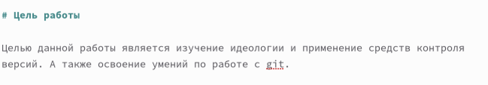
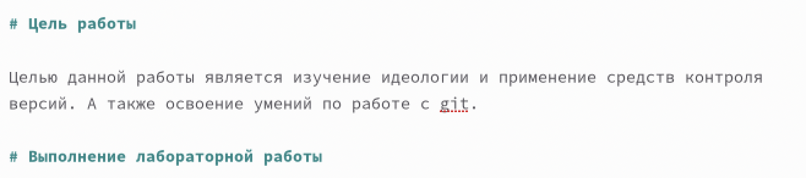
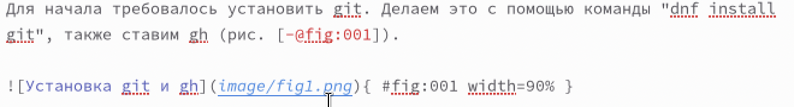
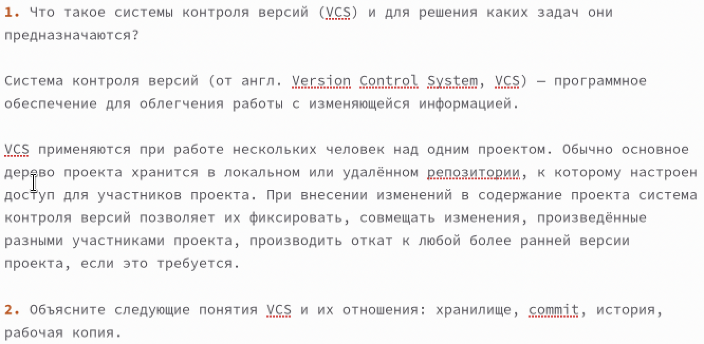
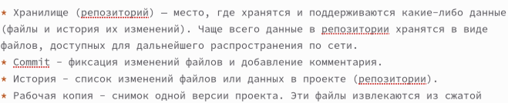
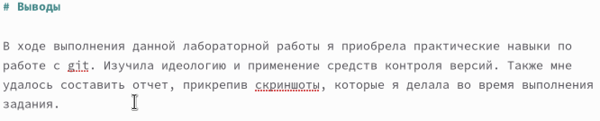

---
## Front matter
lang: ru-RU
title: Лабораторная работа №3
subtitle: Операционные системы
author:
  - Мишина А. А.
date: 24 февраля 2023

## i18n babel
babel-lang: russian
babel-otherlangs: english

## Formatting pdf
toc: false
toc-title: Содержание
slide_level: 2
aspectratio: 169
section-titles: true
theme: metropolis
header-includes:
 - \metroset{progressbar=frametitle,sectionpage=progressbar,numbering=fraction}
 - '\makeatletter'
 - '\beamer@ignorenonframefalse'
 - '\makeatother'
---

## О себе

- Мишина Анастасия Алексеевна
- Группа НПИбд-02-22

## Цели и задачи

- Научиться оформлять отчёты с помощью легковесного языка разметки Markdown.
- Выполнить отчет ко 2ой лабораторной работе с помощью языка разметки Markdown.

# Базовые сведения о Markdown

## Выделение текста

- Двойные звездочки позволяют задавать **полужирное начертание**. А для курсива используются *одинарные звездочки*. Если необходимо задать оба этих варианта шрифта, надо заключить текст в тройные звездочки ***текст***.

## Цитирование

Для цитирование используется символ символа >:

> The drought had lasted now for ten million years, and the reign of
the terrible lizards had long since ended. Here on the Equator, in
the continent which would one day be known as Africa, the battle
for existence had reached a new climax of ferocity, and the victor
was not yet in sight. In this barren and desiccated land, only the
small or the swift or the fierce could flourish, or even hope to
survive.

## Списки

Неупорядоченный (маркированный) список можно отформатировать с помощью звездочек или тире:

- List item 1
- List item 2
- List item 3

## Списки

Упорядоченный список можно создать с помощью соответствующих цифр:

1. First instruction
2. Second instruction
3. Third instruction

## Оформление кода

- С помощью ``` размечается код:

``` language
your code goes in here
```

# Выполнение лабораторной работы

## Описание цели

{width=90% }

## Использование заголовков

{width=90% }

## Прикрепление картинок

{width=90% }

## Использование списков

{width=90% }

## Использование списков

{width=90% }

## Описание выводов

{width=90% }

## Вывод

- В ходе выполнения данной лабораторной работы я научилась оформлять отчеты с помощью легковесного языка разметки Markdown.
