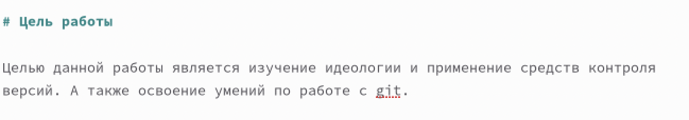
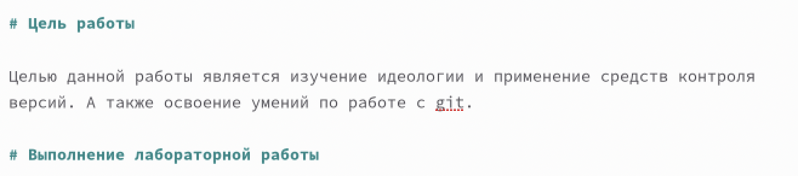
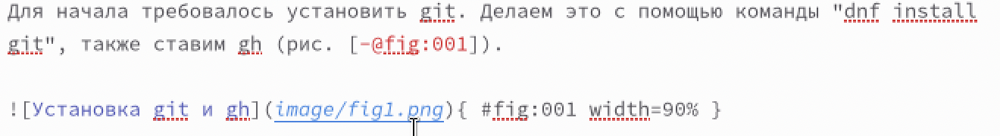
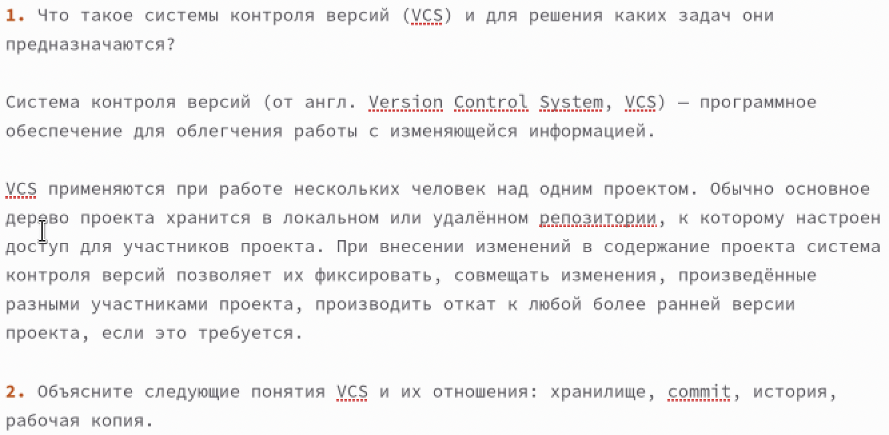
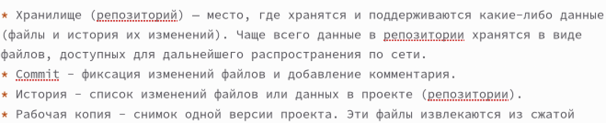
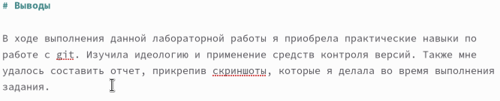

---
## Front matter
title: "Отчёт по лабораторной работе №3"
subtitle: "Дисциплина: Операционные системы"
author: "Мишина Анастасия Алексеевна"

## Generic options
lang: ru-RU
toc-title: "Содержание"

## Bibliography
bibliography: bib/cite.bib
csl: pandoc/csl/gost-r-7-0-5-2008-numeric.csl

## Pdf output format
toc: true # Table of contents
toc-depth: 2
lof: true # List of figures
lot: true # List of tables
fontsize: 14pt
linestretch: 1.5
papersize: a4
documentclass: scrreprt
## I18n polyglossia
polyglossia-lang:
  name: russian
  options:
	- spelling=modern
	- babelshorthands=true
polyglossia-otherlangs:
  name: english
## I18n babel
babel-lang: russian
babel-otherlangs: english
## Fonts
mainfont: PT Serif
romanfont: PT Serif
sansfont: PT Sans
monofont: PT Mono
mainfontoptions: Ligatures=TeX
romanfontoptions: Ligatures=TeX
sansfontoptions: Ligatures=TeX,Scale=MatchLowercase
monofontoptions: Scale=MatchLowercase,Scale=0.9
## Biblatex
biblatex: true
biblio-style: "gost-numeric"
biblatexoptions:
  - parentracker=true
  - backend=biber
  - hyperref=auto
  - language=auto
  - autolang=other*
  - citestyle=gost-numeric
## Pandoc-crossref LaTeX customization
figureTitle: "Рис."
tableTitle: "Таблица"
listingTitle: "Листинг"
lofTitle: "Список иллюстраций"
lotTitle: "Список таблиц"
lolTitle: "Листинги"
## Misc options
indent: true
header-includes:
  - \usepackage{indentfirst}
  - \usepackage{float} # keep figures where there are in the text
  - \floatplacement{figure}{H} # keep figures where there are in the text
---

# Цель работы

Научиться оформлять отчёты с помощью легковесного языка разметки Markdown.

# Задание

Выполнить отчет ко 2ой лабораторной работе с помощью языка разметки Markdown.

# Теоретическое введение (Базовые сведения о Markdown)

Для создания заголовков используется знак #.

Двойные звездочки позволяют задавать **полужирное начертание**. А для курсива используются *одинарные звездочки*. Если необходимо задать оба этих варианта шрифта, надо заключить текст в тройные звездочки ***текст***.

Для цитирование используется символ символа >:

> The drought had lasted now for ten million years, and the reign of
the terrible lizards had long since ended. Here on the Equator, in
the continent which would one day be known as Africa, the battle
for existence had reached a new climax of ferocity, and the victor
was not yet in sight. In this barren and desiccated land, only the
small or the swift or the fierce could flourish, or even hope to
survive.

Неупорядоченный (маркированный) список можно отформатировать с помощью звез-
дочек или тире:

- List item 1
- List item 2
- List item 3

Чтобы вложить один список в другой, добавьте отступ для элементов дочернего списка:

- List item 1
    - List item A
    - List item B
- List item 2

Упорядоченный список можно создать с помощью соответствующих цифр:

1. First instruction
2. Second instruction
3. Third instruction

Чтобы вложить один список в другой, добавьте отступ для элементов дочернего списка:

1. First instruction
    1. Sub-instruction
    1. Sub-instruction
2. Second instruction

Синтаксис Markdown для встроенной ссылки состоит из части [link text] , представ-
ляющей текст гиперссылки, и части (file-name.md) – URL-адреса или имени файла,
на который дается ссылка:

[link text](file-name.md)

С помощью ``` размечается код:

``` language
your code goes in here
```

# Выполнение лабораторной работы

Открываем файл report.md в папке lab2 и пишем отчет.

Начинаем с цели работы, которую берем в мануале на ТУИСе (рис. [-@fig:001]).

{ #fig:001 width=90% }

Переходим в описанию выполнения работы.

В отчете мы создаем разные заголовки (рис. [-@fig:002]).

{ #fig:002 width=90% }

Подкрепляем наши слова картинками, которые мы подключаем с помощью ссылок и подписываем (рис. [-@fig:003]).

{ #fig:003 width=90% }

При ответе на контрольные вопросы используем упорядоченный список (рис. [-@fig:004]).

{ #fig:004 width=90% }

Также применяем неупорядоченный список (рис. [-@fig:005]).

{ #fig:005 width=90% }

Описываем выводы к работе (рис. [-@fig:006]).

{ #fig:006 width=90% }

# Выводы

В ходе выполнения данной лабораторной работы я научилась оформлять отчеты с помощью легковесного языка разметки Markdown.
