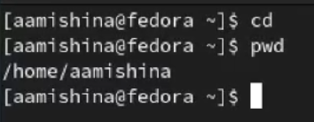
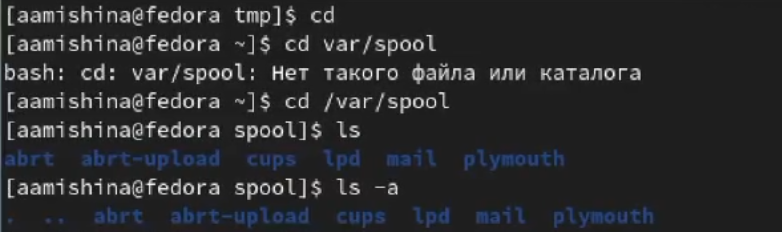
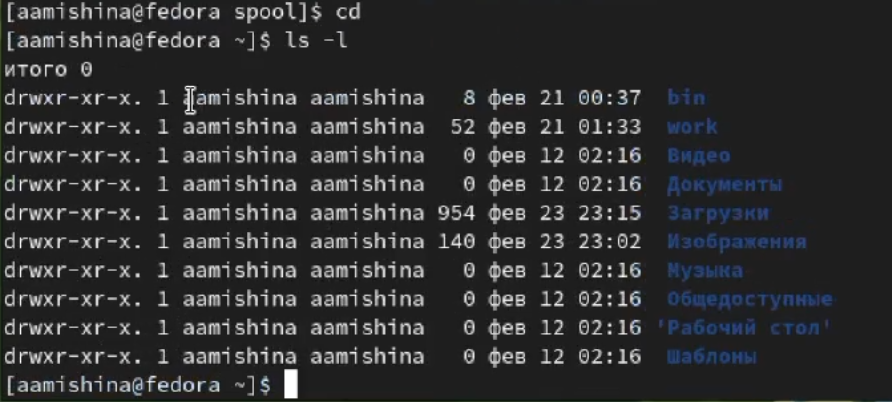
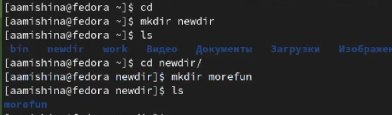
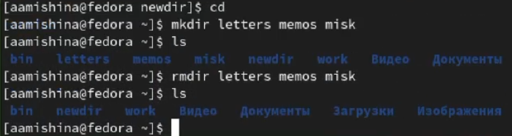
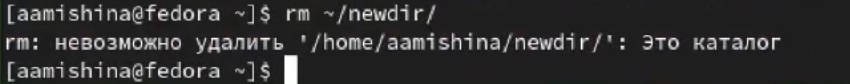
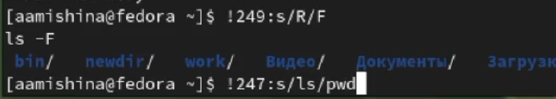

---
## Front matter
lang: ru-RU
title: Лабораторная работа №4
subtitle: Операционные системы
author:
  - Мишина А. А.
date: 4 марта 2023

## i18n babel
babel-lang: russian
babel-otherlangs: english

## Formatting pdf
toc: false
toc-title: Содержание
slide_level: 2
aspectratio: 169
section-titles: true
theme: metropolis
header-includes:
 - \metroset{progressbar=frametitle,sectionpage=progressbar,numbering=fraction}
 - '\makeatletter'
 - '\beamer@ignorenonframefalse'
 - '\makeatother'
---

## О себе

- Мишина Анастасия Алексеевна
- Группа НПИбд-02-22

## Цели и задачи

- Приобретение практических навыков взаимодействия пользователя с системой по-
средством командной строки.

# Выполнение лабораторной работы

## Домашний каталог

- Определение полного имени домашнего каталога.

{width=70% }

## Каталог /tmp

- Переходим в каталог /tmp. Выводим на экран содержимое каталога /tmp. Для этого используем команду ls с различными опциями.
ls - файлы и каталоги
ls -a - файлы и каталоги (со скрытыми)
ls -l - дополнительно показываются права доступа, владелец, время изменения файлов и тд.

## Каталог spool

- Есть ли в каталоге /var/spool подкаталог с именем cron?

{width=70% }

## Кто владелец?

- Переходим в домашний каталог и выводим на экран его содержимое.

{width=70% }

## Создание каталогов

- В домашнем каталоге создаем новый каталог с именем newdir. В каталоге ~/newdir создаем новый каталог с именем morefun.

{width=70% }

## Создание каталогов

- В домашнем каталоге создаем одной командой три новых каталога с именами
letters, memos, misk. Затем удаляем эти каталоги одной командой.

{width=70% }

## Удаление newdir

- Попробуем удалить каталог ~/newdir командой rm.

{width=70% }

## Удаление morefun

- Удалим каталог ~/newdir/morefun из домашнего каталога.

{width=70% }

## Команда man

- Опция ls для просмотра содержимого не только указанного каталога, но и подкаталогов, входящих в него.

{width=70% }

## Команда man

- Опция ls для сортировки по времени последнего изменения выводимого списка содержимого каталога с развернутным описанием файлов.

{width=70% }

## Использование man для cd

* -L. Переходить по символическим ссылкам. Данное поведение используется по умолчанию.

* -P. Разыменовывать символические ссылки. В данном случае, если осуществляется переход на символическую ссылку, которая указывает на директорию, то в результате команда cd изменит текущую рабочую директорию на директорию, указанную в качестве параметра (то есть ссылка будет разыменована).

* -P -e. Выйти с ошибкой, если директория, в которую осуществляется переход, не найдена.

## Использование man для pwd

* -L, --logical - брать директорию из переменной окружения, даже если она содержит символические ссылки;

* -P - отбрасывать все символические ссылки;

* --help - отобразить справку по утилите;

* --version - отобразить версию утилиты.

## Использование man для mkdir

* -m=MODE (--mode=MODE). Устанавливает права доступа для создаваемой директории. 

* -p (--parents). Создать все директории, которые указаны внутри пути. Если какая-либо директория существует, то предупреждение об этом не выводится.

* -v (--verbose). Выводить сообщение о каждой создаваемой директории.

* -Z. Установить контекст SELinux для создаваемой директории по умолчанию.

* --context[=CTX]. Установить контекст SELinux для создаваемой директории в значение CTX

* --help. Показать справку по команде mkdir

* --version. Показать версию утилиты mkdir

## Использование man для rmdir

* -p, --parents. Удалить каталог и его родителей

* -v, --verbose. Выводить диагностику для каждого обработанного каталога

## Использование man для rm

* -f или --force. Игнорировать несуществующие файлы и аргументы. Никогда не выдавать запросы на подтверждение удаления.

* -i. Выводить запрос на подтверждение удаления каждого файла.

* -I. Выдать один запрос на подтверждение удаления всех файлов, если удаляется больше трех файлов или используется рекурсивное удаление. Опция применяется, как более «щадящая» версия опции -i

* -r или -R или --recursive. Удаление директорий и их содержимого. Рекурсивное удаление.

* -d или --dir. Удалять пустые директории.

* -v или --verbose. Выводить информацию об удаляемых файлах.

## Модификация

{width=70% }

## Вывод

- В ходе выполнения данной лабораторной работы я приобрела практические навыки по взаимодействию пользователя с системой посредством командной строки. Также мне удалось составить отчет, прикрепив скриншоты, которые я делала во время выполнения задания.
