---
## Front matter
title: "Отчёт по лабораторной работе №4"
subtitle: "Дисциплина: Операционные системы"
author: "Мишина Анастасия Алексеевна"

## Generic options
lang: ru-RU
toc-title: "Содержание"

## Bibliography
bibliography: bib/cite.bib
csl: pandoc/csl/gost-r-7-0-5-2008-numeric.csl

## Pdf output format
toc: true # Table of contents
toc-depth: 2
lof: true # List of figures
lot: true # List of tables
fontsize: 14pt
linestretch: 1.5
papersize: a4
documentclass: scrreprt
## I18n polyglossia
polyglossia-lang:
  name: russian
  options:
	- spelling=modern
	- babelshorthands=true
polyglossia-otherlangs:
  name: english
## I18n babel
babel-lang: russian
babel-otherlangs: english
## Fonts
mainfont: PT Serif
romanfont: PT Serif
sansfont: PT Sans
monofont: PT Mono
mainfontoptions: Ligatures=TeX
romanfontoptions: Ligatures=TeX
sansfontoptions: Ligatures=TeX,Scale=MatchLowercase
monofontoptions: Scale=MatchLowercase,Scale=0.9
## Biblatex
biblatex: true
biblio-style: "gost-numeric"
biblatexoptions:
  - parentracker=true
  - backend=biber
  - hyperref=auto
  - language=auto
  - autolang=other*
  - citestyle=gost-numeric
## Pandoc-crossref LaTeX customization
figureTitle: "Рис."
tableTitle: "Таблица"
listingTitle: "Листинг"
lofTitle: "Список иллюстраций"
lotTitle: "Список таблиц"
lolTitle: "Листинги"
## Misc options
indent: true
header-includes:
  - \usepackage{indentfirst}
  - \usepackage{float} # keep figures where there are in the text
  - \floatplacement{figure}{H} # keep figures where there are in the text
---

# Цель работы

Приобретение практических навыков взаимодействия пользователя с системой по-
средством командной строки.

# Выполнение лабораторной работы

Для начала переходим в домашний каталог и узнаем его полное имя с помощью команды pwd (рис. [-@fig:001]).

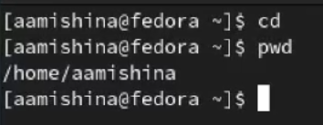{ #fig:001 width=90% }

Переходим в каталог /tmp и используем команду ls с разными опциями, чтобы посмотреть содержимое каталога. ls (рис. [-@fig:002]) - файлы и каталоги. ls -a (рис. [-@fig:003]) - файлы и каталоги (со скрытыми). ls -l (рис. [-@fig:004]) - дополнительно показываются права доступа, владелец, время изменения файлов и тд.

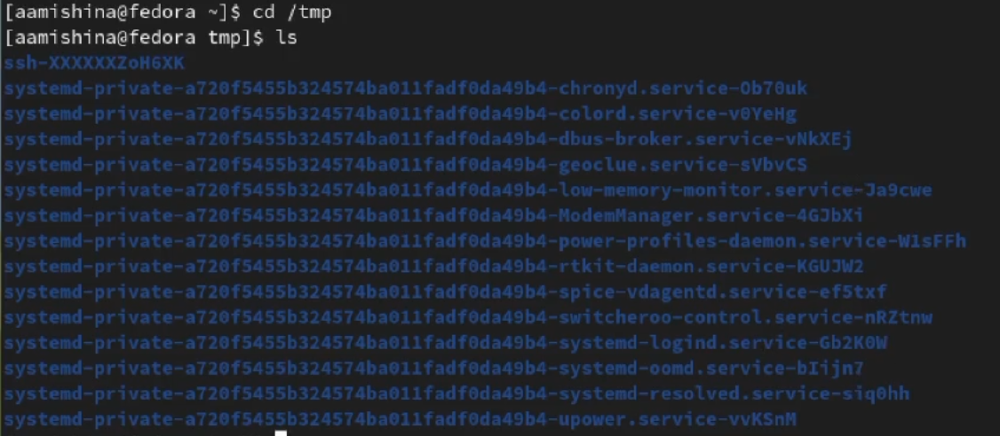{ #fig:002 width=90% }

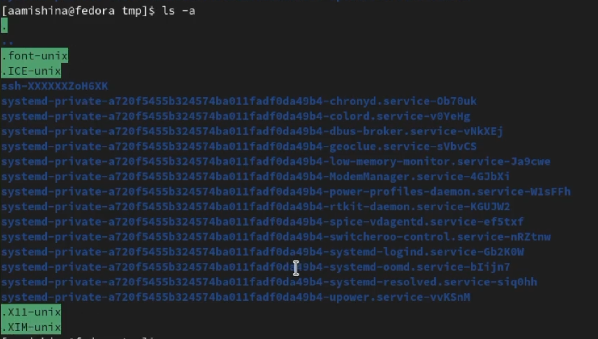{ #fig:003 width=90% }

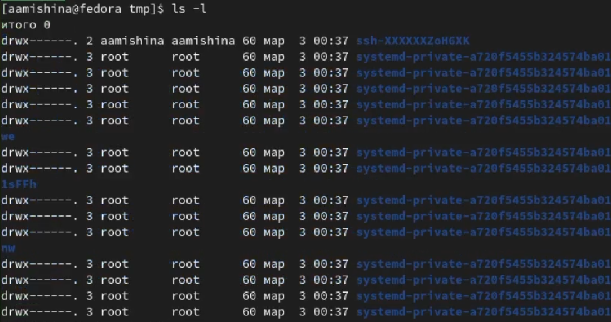{ #fig:004 width=90% }

Переходим в каталог /var/spool и пишем команду ls. Как видим нужного подкаталога cron нет (команда ls -a также не вывела его) (рис. [-@fig:005]).

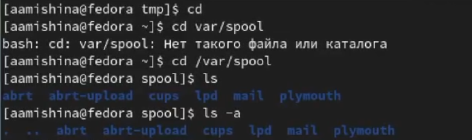{ #fig:005 width=90% }

Переходим обратно в домашний каталог и выводим все его содержимое. Как видно на скриншоте я являюсь владельцем всех файлов и подкаталогов (рис. [-@fig:006]).

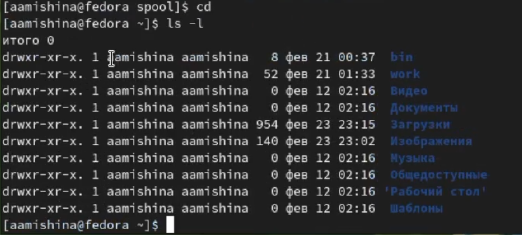{ #fig:006 width=90% }

В домашнем каталоге создаем каталог newdir. В нем создаем новый каталог morefun (рис. [-@fig:007]).

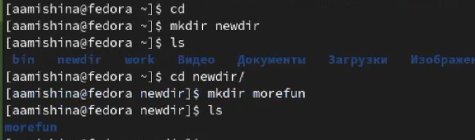{ #fig:007 width=90% }

В домашнем каталоге одной командой создаем новые каталоги (mkdir): letters, memos, misk. Затем удаляем их также одной командой (rmdir) (рис. [-@fig:008]).

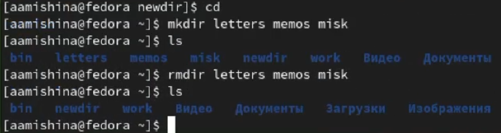{ #fig:008 width=90% }

Пробуем удалить newdir командой rm. Видим, что это не получается (рис. [-@fig:009]).

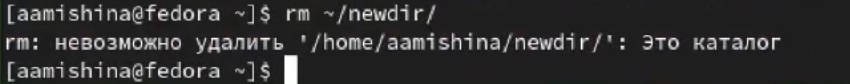{ #fig:009 width=90% }

Из домашнего каталога удаляем каталог morefun с помощью команды rmdir. Удостоверяемся в удалении каталога (рис. [-@fig:010]).

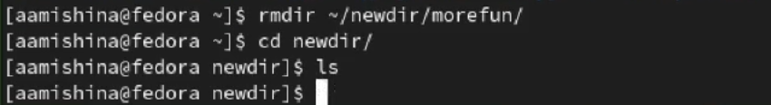{ #fig:010 width=90% }

Вводим команду man ls. Видим, что для просмотра содержимого не только в каталогах, но и в подкаталогах, входящих в каталог нужно использовать опцию -R (рис. [-@fig:011]). А для сортировки по времени последнего изменения нужна опция -t (рис. [-@fig:012]).

{ #fig:011 width=90% }

{ #fig:012 width=90% }

Проверим эти опции. ls -R (рис. [-@fig:013]. ls -t (рис. [-@fig:014].

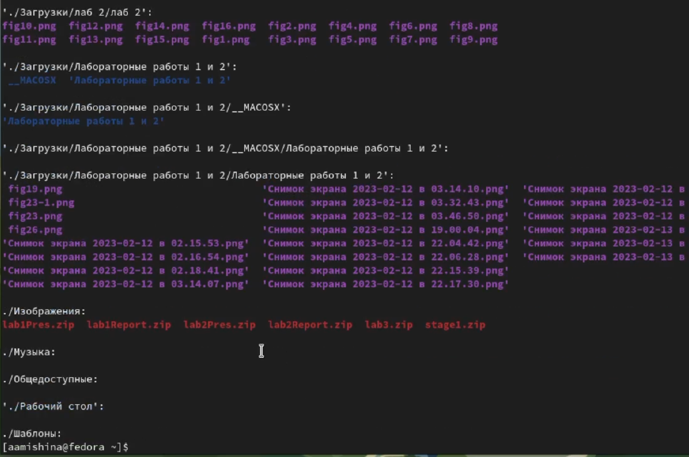{ #fig:013 width=90% }

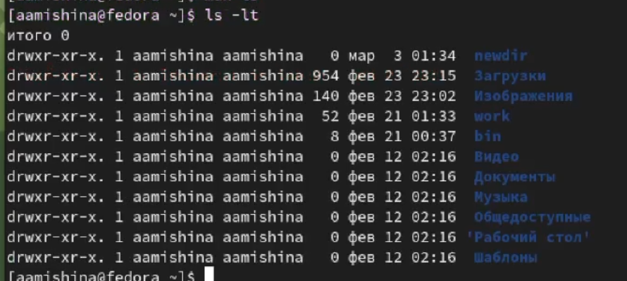{ #fig:014 width=90% }

Используем команду man для просмотра команд: cd, pwd, mkdir, rmdir, rm (рис. [-@fig:013]). cd - позволяет перемещаться между каталогами и подкаталогами. pwd - позволяет узнать путь до каталога. mkdir - функция для создания директории. rmdir - позволяет удалять директории. rm - функция для удаления файлов и каталогов, в которых есть файлы (с помощью дополнительной опции).

Опции cd:

* -L. Переходить по символическим ссылкам. Данное поведение используется по умолчанию.

* -P. Разыменовывать символические ссылки. В данном случае, если осуществляется переход на символическую ссылку, которая указывает на директорию, то в результате команда cd изменит текущую рабочую директорию на директорию, указанную в качестве параметра (то есть ссылка будет разыменована).

* -P -e. Выйти с ошибкой, если директория, в которую осуществляется переход, не найдена.

Опции pwd:

* -L, --logical - брать директорию из переменной окружения, даже если она содержит символические ссылки;

* -P - отбрасывать все символические ссылки;

* --help - отобразить справку по утилите;

* --version - отобразить версию утилиты.

Опции mkdir:

* -m=MODE (--mode=MODE). Устанавливает права доступа для создаваемой директории. 

* -p (--parents). Создать все директории, которые указаны внутри пути. Если какая-либо директория существует, то предупреждение об этом не выводится.

* -v (--verbose). Выводить сообщение о каждой создаваемой директории.

* -Z. Установить контекст SELinux для создаваемой директории по умолчанию.

* --context[=CTX]. Установить контекст SELinux для создаваемой директории в значение CTX

* --help. Показать справку по команде mkdir

* --version. Показать версию утилиты mkdir

Опции rmdir:

* -p, --parents. Удалить каталог и его родителей

* -v, --verbose. Выводить диагностику для каждого обработанного каталога

Опции rm:

* -f или --force. Игнорировать несуществующие файлы и аргументы. Никогда не выдавать запросы на подтверждение удаления.

* -i. Выводить запрос на подтверждение удаления каждого файла.

* -I. Выдать один запрос на подтверждение удаления всех файлов, если удаляется больше трех файлов или используется рекурсивное удаление. Опция применяется, как более «щадящая» версия опции -i

* -r или -R или --recursive. Удаление директорий и их содержимого. Рекурсивное удаление.

* -d или --dir. Удалять пустые директории.

* -v или --verbose. Выводить информацию об удаляемых файлах.

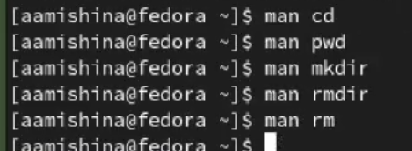{ #fig:015 width=90% }

Используем команду history. Видим список недавно использованных команд (рис. [-@fig:016]).

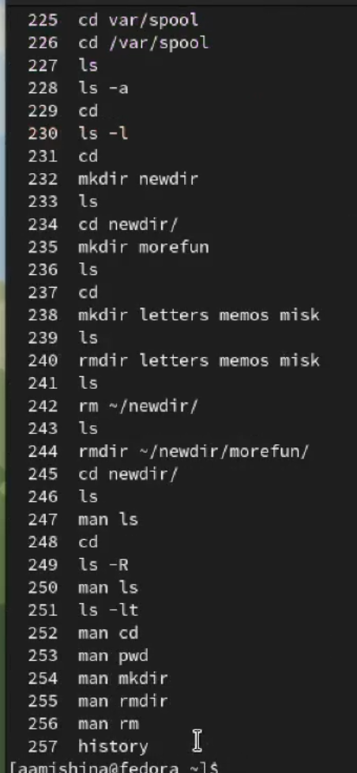{ #fig:016 width=90% }

Выполняем модификацию нескольких команд. В команде номер 249 меняем опцию -R на опцию -F (рис. [-@fig:017]). А в команде номер 247 меняем ls на pwd (рис. [-@fig:018]).

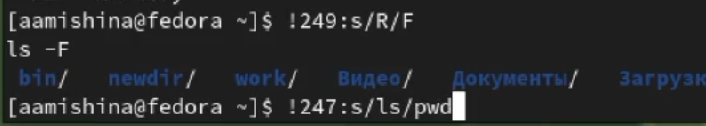{ #fig:017 width=90% }

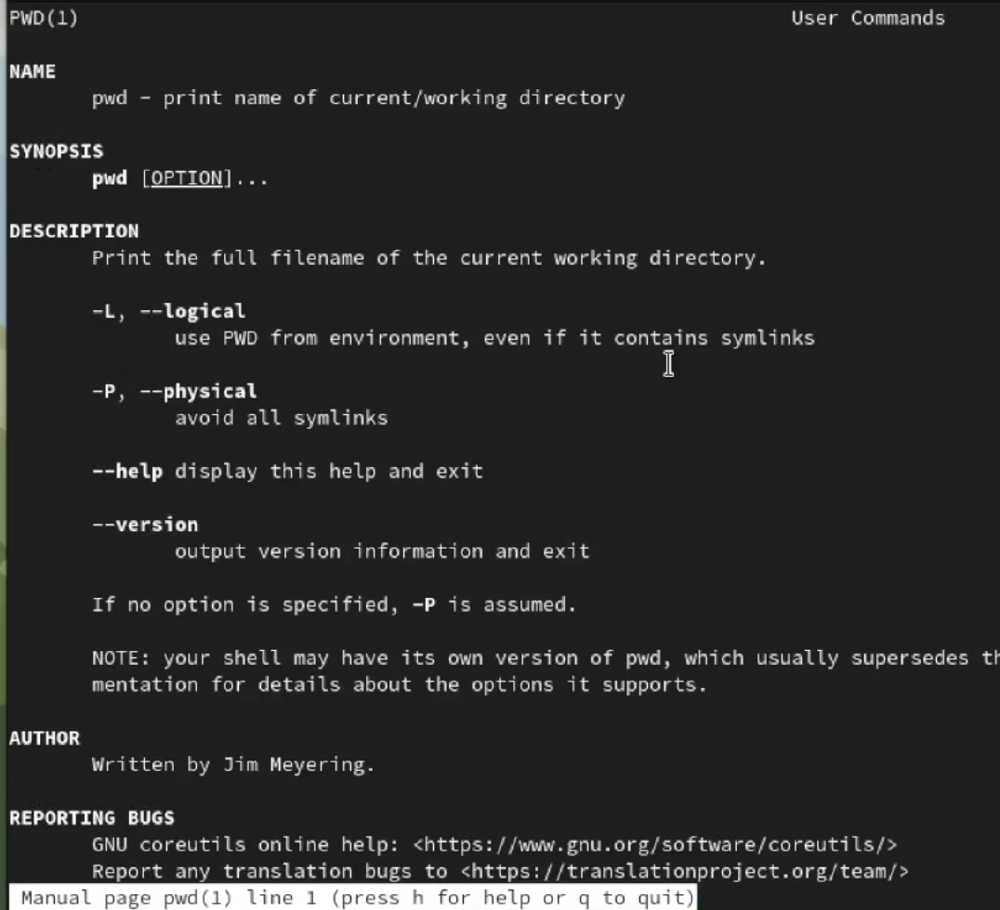{ #fig:018 width=90% }

# Выполнение заданий самостоятельной работы

Контрольные вопросы:

1. Что такое командная строка?

Это специальная программа, которая позволяет управлять компьютером путем ввода текстовых команд с клавиатуры.

2. При помощи какой команды можно определить абсолютный путь текущего каталога?
Приведите пример.

При помощи команды realpath. Например, если ввести realpath timeout, то выведется следующий путь: /home/mial/bin/timeout.

3. При помощи какой команды и каких опций можно определить только тип файлов
и их имена в текущем каталоге? Приведите примеры.

Только тип файлов и их имена в текущем каталоге можно определить с помощью команды ls -F.

4. Каким образом отобразить информацию о скрытых файлах? Приведите примеры.

Информацию о скрытых файлах можно отобразить с помощью команды ls -a. Пример есть в моих скриншотах к этой лабораторной работе.

5. При помощи каких команд можно удалить файл и каталог? Можно ли это сделать
одной и той же командой? Приведите примеры.

Удаление каталогов - rmdir. Удаление файлов - rm. Можно удалить каталог с файлами командой rm -r /имя каталога/.

6. Каким образом можно вывести информацию о последних выполненных пользователем командах? работы?

С помощью команды history.

7. Как воспользоваться историей команд для их модифицированного выполнения? При-
ведите примеры.

При выводе истории команд можно увидеть номера выполнения команд. Модифицировать можно следующим образом: !<номер команды>:s/<что меняем>/<на что меняем>.
Пример: !290:s/F/a.

8. Приведите примеры запуска нескольких команд в одной строке.

Это можно делать в таких командах, например, как: mkdir, rmdir, ls.

9. Дайте определение и приведите примера символов экранирования.

Экранирование - замена в тексте управляющих символов на соответствующие текстовые подстановки. Один из видов управляющих последовательностей. Пример символа: "".

10. Охарактеризуйте вывод информации на экран после выполнения команды ls с опцией
l.

После выполнения команды ls с опцией l выводится подробный список файлов, в котором отображается владелец, группа, дата создания, размер и т.д.

11. Что такое относительный путь к файлу? Приведите примеры использования относи-
тельного и абсолютного пути при выполнении какой-либо команды.

Относительный путь к файлу - это путь к файлу относительно текущей папки. При использовании команды pwd на экран выведется относительный путь текущей директории, а при команде realpath на экран выведется абсолютный путь текущей директории.

12. Как получить информацию об интересующей вас команде?

С помощью команды man.

13. Какая клавиша или комбинация клавиш служит для автоматического дополнения
вводимых команд?

Для автоматического дополнения вводимых команд служит клавиша man.

# Выводы

В ходе выполнения данной лабораторной работы я приобрела практические навыки по взаимодействию пользователя с системой посредством командной строки. Также мне удалось составить отчет, прикрепив скриншоты, которые я делала во время выполнения задания.
