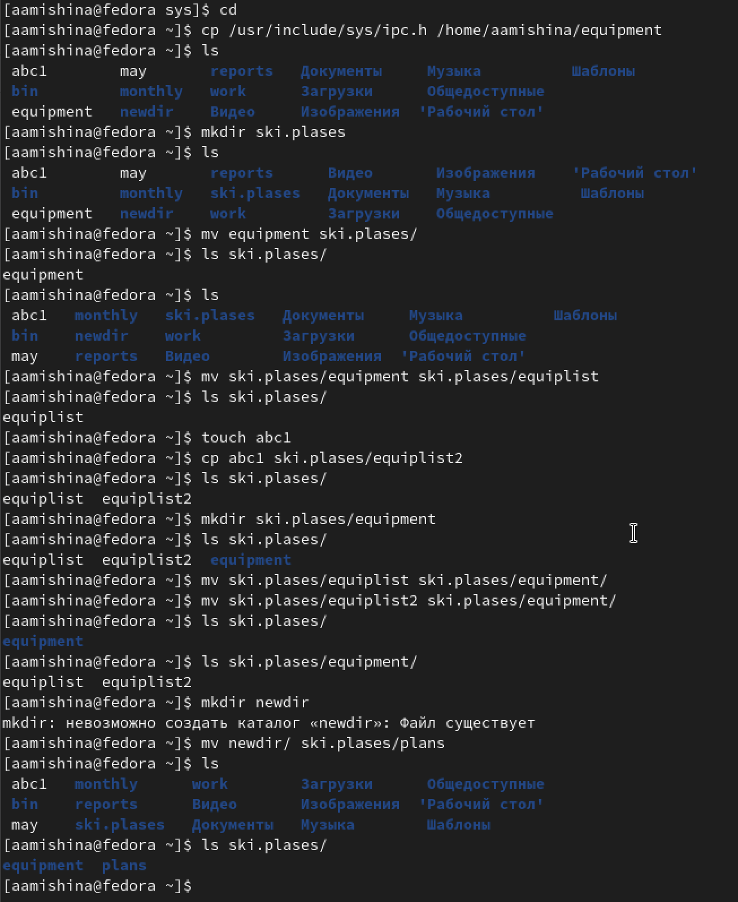
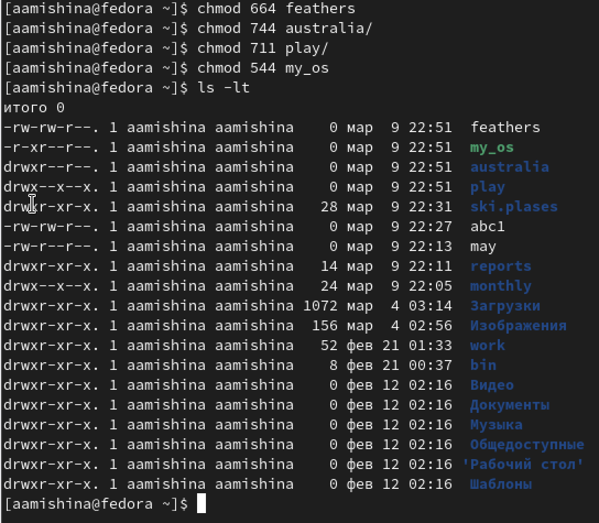

---
## Front matter
lang: ru-RU
title: Лабораторная работа №5
subtitle: Операционные системы
author:
  - Мишина А. А.
date: 10 марта 2023

## i18n babel
babel-lang: russian
babel-otherlangs: english

## Formatting pdf
toc: false
toc-title: Содержание
slide_level: 2
aspectratio: 169
section-titles: true
theme: metropolis
header-includes:
 - \metroset{progressbar=frametitle,sectionpage=progressbar,numbering=fraction}
 - '\makeatletter'
 - '\beamer@ignorenonframefalse'
 - '\makeatother'
---

## О себе

- Мишина Анастасия Алексеевна
- Группа НПИбд-02-22

## Цели и задачи

- Ознакомление с файловой системой Linux, её структурой, именами и содержанием
каталогов. Приобретение практических навыков по применению команд для работы
с файлами и каталогами, по управлению процессами (и работами), по проверке исполь-
зования диска и обслуживанию файловой системы.

# Выполнение лабораторной работы

## Первый этап

- Выполнение всех примеров, приведенных в первой части описания лабораторной работы (копирование файлов, каталогов, переименование, перемещение, права доступа).

## Второй этап

- Выполняем дейстивя, приведенные в этапе выполнения самой лабораторной работы. Фиксируем в отчете используемые команды и результаты их выполнения.

{width=30% }

## Третий этап (Права доступа)

- Создаем необходимые файлы и каталоги. Определяем опции команды chmod, предоставляем файлам и каталогам необходимые права доступа.

{ width=45% }

## Четвертый этап (закрепление навыков)

- Проделываем упражнения, приведенные в мануале ТУИСа, записываем в отчет по лабораторной работе №5 используемые команды.

## Пятый этап

- Читаем man по командам mount, fsck, mkfs, kill. Кратко характеризуем эти команды.

{ width=90% }

## Команда mount

- mount - утилита командной строки в UNIX-подобных ОС. Применяется для монтирования файловых систем (mount/dev/cdrom/mnt/cdrom).

## Команда fsck

- fsck (Проверка согласованности файловой системы) — это команда предназначена для проверки и исправления ошибок файловой системы Linux. Что гарантирует целостность и согласованность файловой системы (sudo fsck -p /dev/sdc).

## Команда mkfs

- mkfs -  используется для создания файловой системы Linux на некотором устройстве, обычно в разделе жёсткого диска (sudo mkfs -t ext4 /dev/sdb1).

## Команда kill

- kill - является встроенной командой командной оболочки, предназначенной для отправки системных сигналов определенным процессам. Команда принимает числовые идентификаторы процессов, а также числовые или текстовые идентификаторы сигналов. Чаще всего данная команда используется для принудительного завершения работы определенных процессов (kill 14371).

## Вывод

- В ходе выполнения данной лабораторной работы я ознакомилась с файловой системой Linux, её структурой, именами и содержанием каталогов. Приобрела практические навыки по применению команд для работы с файлами и каталогами, по управлению процессами (и работами), по проверке использования диска и обслуживанию файловой системы.
