---
## Front matter
title: "Отчёт по лабораторной работе №5"
subtitle: "Дисциплина: Операционные системы"
author: "Мишина Анастасия Алексеевна"

## Generic options
lang: ru-RU
toc-title: "Содержание"

## Bibliography
bibliography: bib/cite.bib
csl: pandoc/csl/gost-r-7-0-5-2008-numeric.csl

## Pdf output format
toc: true # Table of contents
toc-depth: 2
lof: true # List of figures
lot: true # List of tables
fontsize: 14pt
linestretch: 1.5
papersize: a4
documentclass: scrreprt
## I18n polyglossia
polyglossia-lang:
  name: russian
  options:
	- spelling=modern
	- babelshorthands=true
polyglossia-otherlangs:
  name: english
## I18n babel
babel-lang: russian
babel-otherlangs: english
## Fonts
mainfont: PT Serif
romanfont: PT Serif
sansfont: PT Sans
monofont: PT Mono
mainfontoptions: Ligatures=TeX
romanfontoptions: Ligatures=TeX
sansfontoptions: Ligatures=TeX,Scale=MatchLowercase
monofontoptions: Scale=MatchLowercase,Scale=0.9
## Biblatex
biblatex: true
biblio-style: "gost-numeric"
biblatexoptions:
  - parentracker=true
  - backend=biber
  - hyperref=auto
  - language=auto
  - autolang=other*
  - citestyle=gost-numeric
## Pandoc-crossref LaTeX customization
figureTitle: "Рис."
tableTitle: "Таблица"
listingTitle: "Листинг"
lofTitle: "Список иллюстраций"
lotTitle: "Список таблиц"
lolTitle: "Листинги"
## Misc options
indent: true
header-includes:
  - \usepackage{indentfirst}
  - \usepackage{float} # keep figures where there are in the text
  - \floatplacement{figure}{H} # keep figures where there are in the text
---

# Цель работы

Ознакомление с файловой системой Linux, её структурой, именами и содержанием
каталогов. Приобретение практических навыков по применению команд для работы
с файлами и каталогами, по управлению процессами (и работами), по проверке исполь-
зования диска и обслуживанию файловой системы.

# Выполнение лабораторной работы

1. Сначала выплоняем все примеры, приведённые в первой части описания лабораторной работы.

Копируем файл в текущем каталоге (abc1 в april и may) (рис. [-@fig:001]), несколько файлов в каталог (april, may в monthly) (рис. [-@fig:002]), копируем файлы в произвольном каталоге (monthly/may в june) (рис. [-@fig:003]), копируем каталоги к текущем каталоге (monthly в monthly.00), копируем каталоги в произвольном каталоге (monthly.00 в каталог /tmp) (рис. [-@fig:004]).

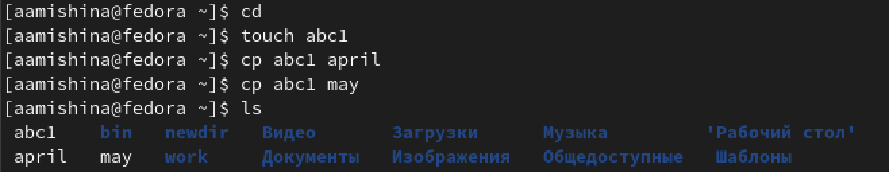{ #fig:001 width=90% }

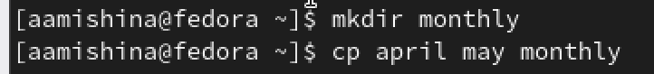{ #fig:002 width=90% }

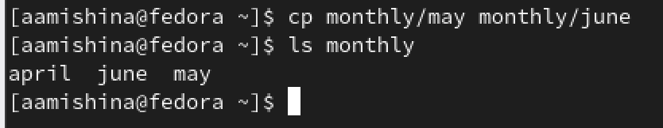{ #fig:003 width=90% }

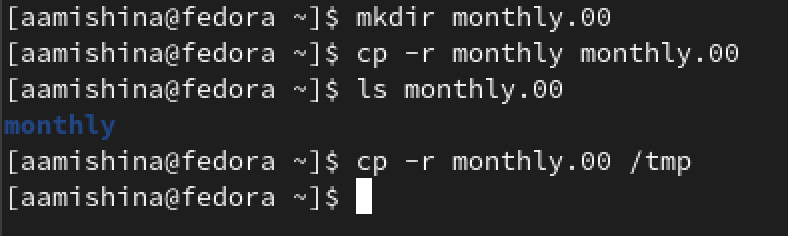{ #fig:004 width=90% }

Переименуем файлы в текущем каталоге (april на july), переместим файлы в другой каталог (july в monthly.00), переименуем каталоги в текущем каталоге (monthly.00 в monthly.01), переместим каталог в другой каталог (monthly.01 в reports) и переименуем каталог, не являющийся текущим (monthly.01 в monthly) (рис. [-@fig:005]).

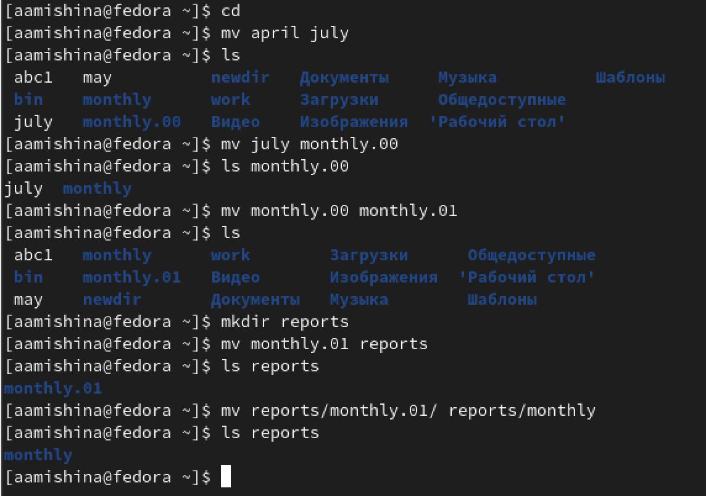{ #fig:005 width=90% }

Создаем файл may с правом выполнения для владельца, лишаем владельца права на выполнение (рис. [-@fig:006]). Создаем каталог monthly с запретом на чтение для членов группы и всех остальных пользователей (рис. [-@fig:007]). И создаем файл abc1 с правом записи для членов группы (рис. [-@fig:008]).

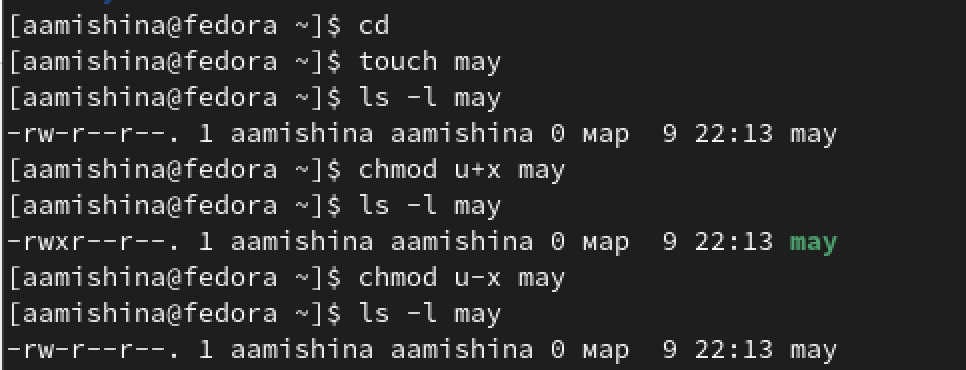{ #fig:006 width=90% }

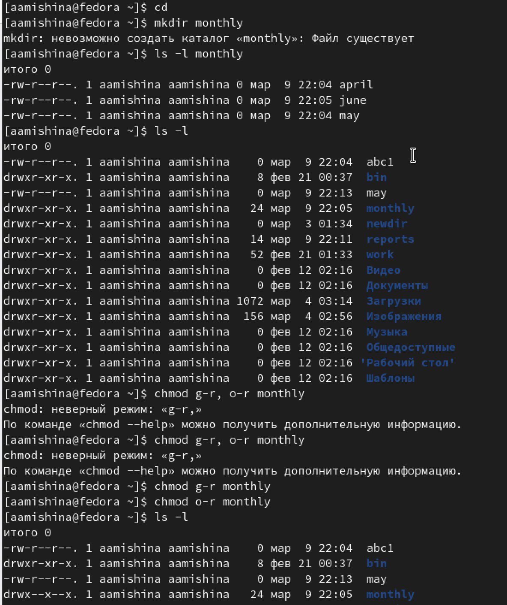{ #fig:007 width=90% }

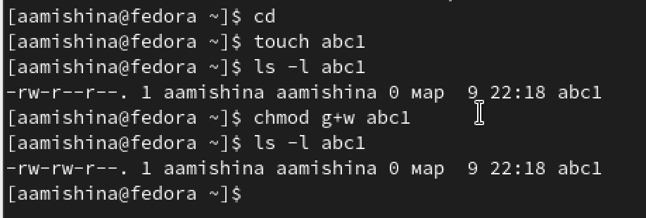{ #fig:008 width=90% }

2. Второй этап

Копируем файл /usr/include/sys/ipc.h в домашний каталог и называем его
equipment с помощью команды cp. В домашнем каталоге создаем директорию ~/ski.plases (mkdir ski.plases/). Перемещаем файл equipment в каталог ~/ski.plases (mv equipment ski.plases). Переименовываем файл ~/ski.plases/equipment в ~/ski.plases/equiplist с помощью команды mv. Создаем (touch) в домашнем каталоге файл abc1 и копируем (cp) его в каталог ~/ski.plases, называем его equiplist2. Создаем каталог (mkdir) с именем equipment в каталоге ~/ski.plases. Перемещаем файлы ~/ski.plases/equiplist и equiplist2 в каталог ~/ski.plases/equipment (mv). Создаем (mkdir) и перемещаем (mv) каталог ~/newdir в каталог ~/ski.plases и называем его plans (рис. [-@fig:009]).

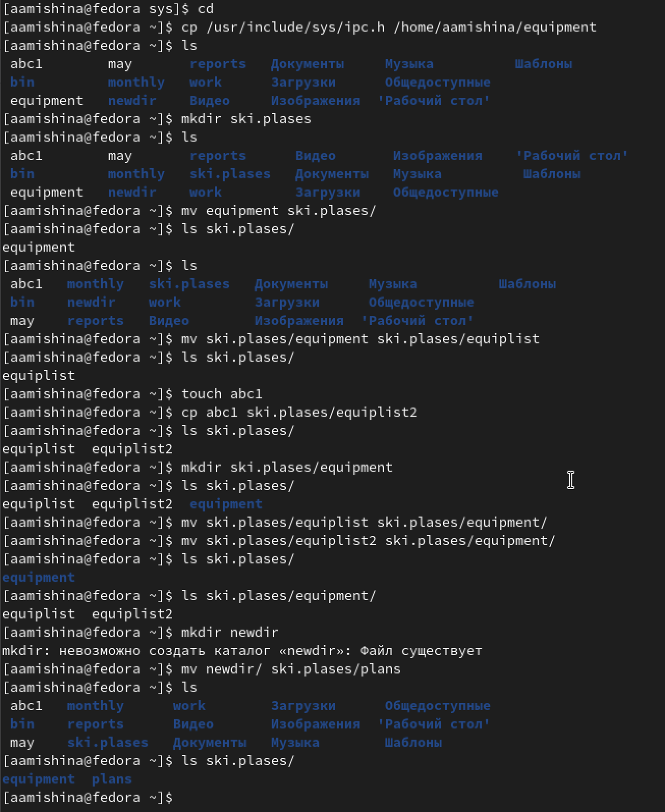{ #fig:009 width=90% }

3. Права доступа

Создаем директории australia и play, а также файлы my_os и feathers (рис. [-@fig:010]). Пользуемся таблицей, чтобы определить какие цифры нужны для разрешения прав доступа.

- 0 – полный запрет
- 1 – выполнение
- 2 – запись
- 3 – запись, выполнение
- 4 – чтение
- 5 – чтение, выполнение
- 6 – чтение, запись
- 7 – чтение, запись, выполнение

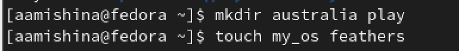{ #fig:010 width=90% }

Ставим необходимые права доступа для каждой директории и для каждого файла, проверяем успешность выполнения задания командой ls -lt (рис. [-@fig:011]).

- drwxr--r-- ... australia (744)

- drwx--x--x ... play (711)

- -r-xr--r-- ... my_os (544)

- -rw-rw-r-- ... feathers (664)

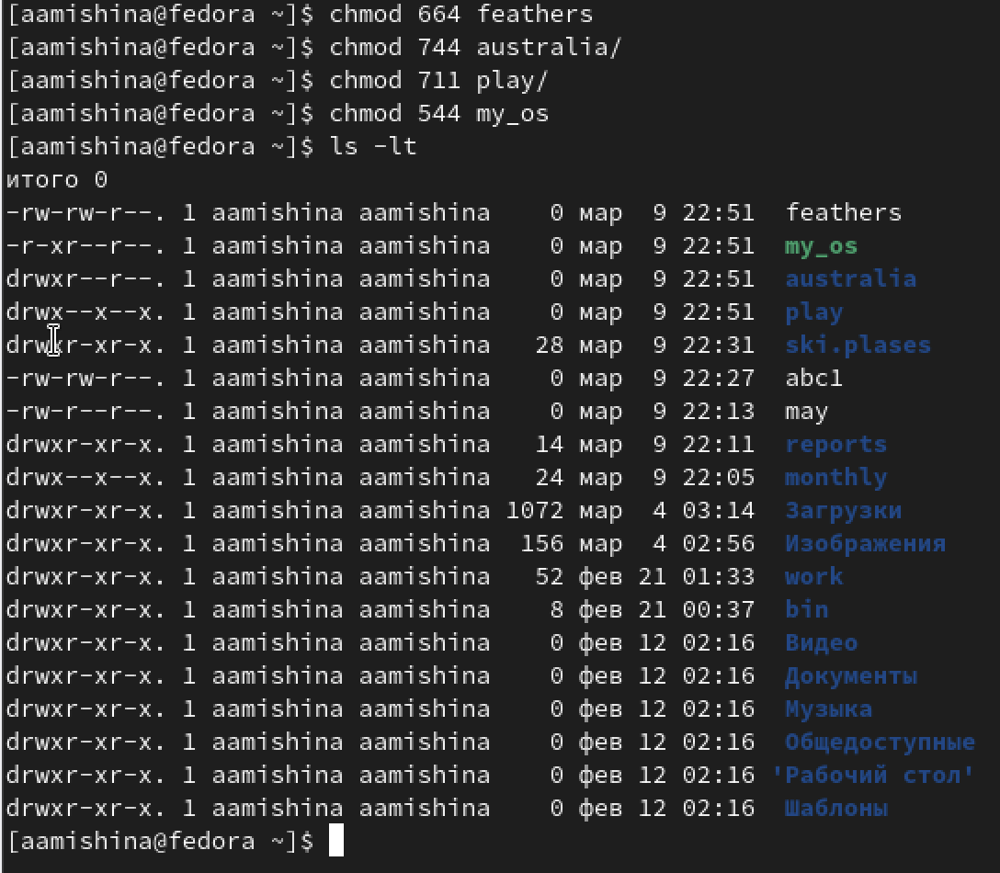{ #fig:011 width=90% }

4. Закрепление навыков

Просматриваем содержимое файла /etc/password (рис. [-@fig:012]).

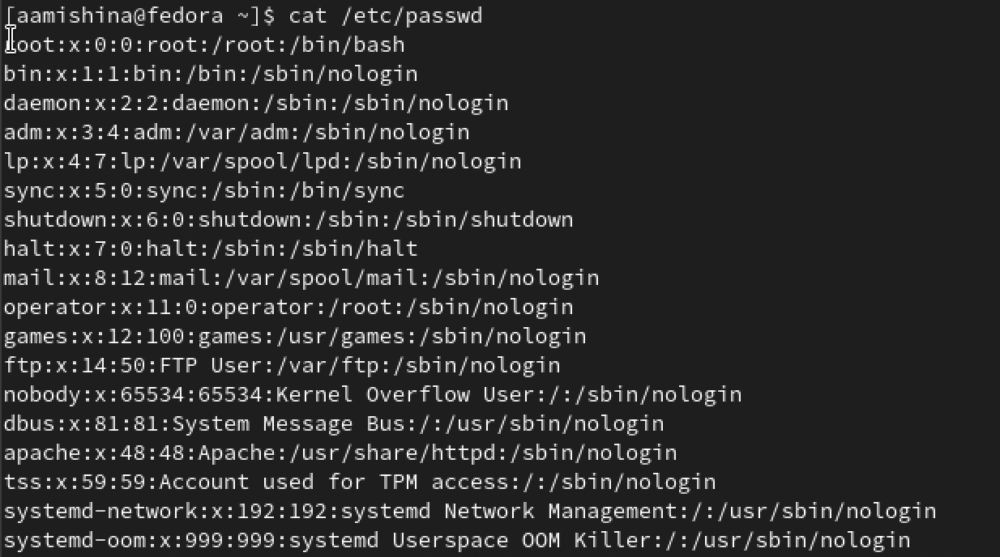{ #fig:012 width=90% }

Копируем файл ~/feathers в файл ~/file.old. Перемещаем файл ~/file.old в каталог ~/play. Копируем каталог ~/play в каталог ~/fun. Перемещаем каталог ~/fun в каталог ~/play и называем его games. Лишаем владельца файла ~/feathers права на чтение. При попытке просмотреть файл ~/feathers командой cat выпадает ошибка, так как мы запретили владельцу чтение файла. Копирование также запрещено, не возможно прочитать файл. Даем владельцу файла ~/feathers право на чтение (рис. [-@fig:013]).

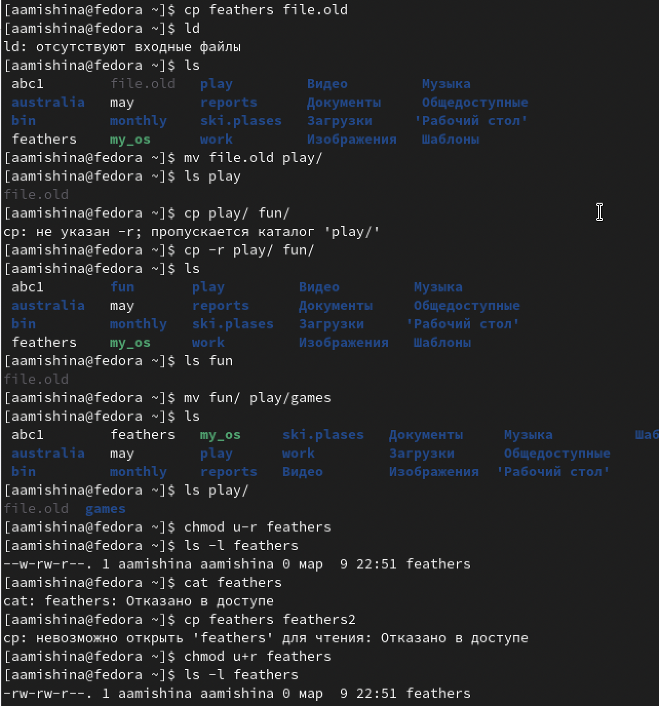{ #fig:013 width=90% }

Лишаем владельца каталога ~/play права на выполнение. Попытка перейти в каталог ~/play не удалась. Появилась ошибка - Отказано в доступе. Даем владельцу каталога ~/play право на выполнение (рис. [-@fig:014]).

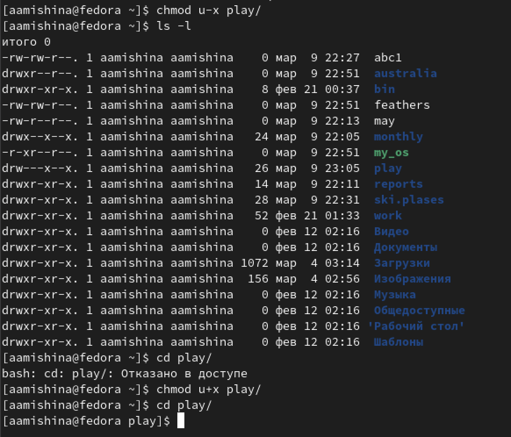{ #fig:014 width=90% }

5. Читем man по командам mount, fsck, mkfs, kill (рис. [-@fig:015]).

{ #fig:015 width=90% }

- mount - утилита командной строки в UNIX-подобных ОС. Применяется для монтирования файловых систем (mount/dev/cdrom/mnt/cdrom).

- fsck (Проверка согласованности файловой системы) — это команда предназначена для проверки и исправления ошибок файловой системы Linux. Что гарантирует целостность и согласованность файловой системы (sudo fsck -p /dev/sdc).

- mkfs -  используется для создания файловой системы Linux на некотором устройстве, обычно в разделе жёсткого диска (sudo mkfs -t ext4 /dev/sdb1).

- kill - является встроенной командой командной оболочки, предназначенной для отправки системных сигналов определенным процессам. Команда принимает числовые идентификаторы процессов, а также числовые или текстовые идентификаторы сигналов. Чаще всего данная команда используется для принудительного завершения работы определенных процессов (kill 14371).

# Выполнение заданий самостоятельной работы

Контрольные вопросы:

1. Дайте характеристику каждой файловой системе, существующей на жёстком диске компьютера, на котором вы выполняли лабораторную работу.

Современная версия FAT32 вышла в 1995 году. Она может работать с томами размером до 32 ГБ и файлами размером до 4 ГБ. При этом система не работает с накопителями объемом более 8 Тб. Поэтому сегодня FAT32 используется в основном только на флешках, картах памяти фотоаппаратов и музыкальных плееров.

Структура накопителя с FAT32 имеет три области:

- Служебный сектор, который зарезервирован системой.
- Таблица указателей для поиска файлов.
- Область записи данных.

Благодаря отсутствию шифрования, современных систем защиты информации и журнала данных, накопители с файловой системой FAT32 могут работать быстрее, но только с единичными файлами. Работа с массивом небольших файлов может затянуться надолго. Причиной является иерархическая структура, которая подразумевает многоуровневый доступ к файлам, в отличие от бинарного дерева, где доступ к файлам открывается напрямую, независимо от других. 

Ext4 — это результат эволюции Ext3, наиболее популярной файловой системы в Linux. Во многих аспектах Ext4 представляет собой больший шаг вперёд по сравнению с Ext3, чем Ext3 была по отношению к Ext2. Наиболее значительным усовершенствованием Ext3 по сравнению с Ext2 было журналирование, в то время как Ext4 предполагает изменения в важных структурах данных, таких как, например, предназначенных для хранения данных файлов.

2. Приведите общую структуру файловой системы и дайте характеристику каждой директории первого уровня этой структуры.

Файловая система Ext4 разделена на несколько групп блоков. Чтобы уменьшить узкое место производительности, вызванное фрагментацией диска, распределитель блоков пытается сохранить блоки данных каждого файла в одной и той же группе блоков, тем самым сокращая время поиска. Если взять в качестве примера блок данных размером 4 КБ, группа блоков может содержать 32768 блоков данных, то есть 128 МБ.

/ — root каталог. Содержит в себе всю иерархию системы;

/bin — здесь находятся двоичные исполняемые файлы. Основные общие команды, хранящиеся отдельно от других программ в системе (прим.: pwd, ls, cat, ps);

/boot — тут расположены файлы, используемые для загрузки системы (образ initrd, ядро vmlinuz);

/dev — в данной директории располагаются файлы устройств (драйверов). С помощью этих файлов можно взаимодействовать с устройствами. К примеру, если это жесткий диск, можно подключить его к файловой системе. В файл принтера же можно написать напрямую и отправить задание на печать;

/etc — в этой директории находятся файлы конфигураций программ. Эти файлы позволяют настраивать системы, сервисы, скрипты системных демонов;

/home — каталог, аналогичный каталогу Users в Windows. Содержит домашние каталоги учетных записей пользователей (кроме root). При создании нового пользователя здесь создается одноименный каталог с аналогичным именем и хранит личные файлы этого пользователя;

/lib — содержит системные библиотеки, с которыми работают программы и модули ядра;

/lost+found — содержит файлы, восстановленные после сбоя работы системы. Система проведет проверку после сбоя и найденные файлы можно будет посмотреть в данном каталоге;

/media — точка монтирования внешних носителей. Например, когда вы вставляете диск в дисковод, он будет автоматически смонтирован в директорию /media/cdrom;

/mnt — точка временного монтирования. Файловые системы подключаемых устройств обычно монтируются в этот каталог для временного использования;

/opt — тут расположены дополнительные (необязательные) приложения. Такие программы обычно не подчиняются принятой иерархии и хранят свои файлы в одном подкаталоге (бинарные, библиотеки, конфигурации);

/proc — содержит файлы, хранящие информацию о запущенных процессах и о состоянии ядра ОС;

/root — директория, которая содержит файлы и личные настройки суперпользователя;

/run — содержит файлы состояния приложений. Например, PID-файлы или UNIX-сокеты;

/sbin — аналогично /bin содержит бинарные файлы. Утилиты нужны для настройки и администрирования системы суперпользователем;

/srv — содержит файлы сервисов, предоставляемых сервером (прим. FTP или Apache HTTP);

/sys — содержит данные непосредственно о системе. Тут можно узнать информацию о ядре, драйверах и устройствах;

/tmp — содержит временные файлы. Данные файлы доступны всем пользователям на чтение и запись. Стоит отметить, что данный каталог очищается при перезагрузке;

/usr — содержит пользовательские приложения и утилиты второго уровня, используемые пользователями, а не системой. Содержимое доступно только для чтения (кроме root). Каталог имеет вторичную иерархию и похож на корневой;

/var — содержит переменные файлы. Имеет подкаталоги, отвечающие за отдельные переменные. Например, логи будут храниться в /var/log, кэш в /var/cache, очереди заданий в /var/spool/ и так далее.

3. Какая операция должна быть выполнена, чтобы содержимое некоторой файловой системы было доступно операционной системе?

Монтирование тома.

4. Назовите основные причины нарушения целостности файловой системы. Как устранить повреждения файловой системы?

Отсутствие синхронизации между образом файловой системы в памяти и ее данными на диске в случае аварийного останова может привести к появлению следующих ошибок:

- Один блок адресуется несколькими mode (принадлежит нескольким файлам).

- Блок помечен как свободный, но в то же время занят (на него ссылается onode).

- Блок помечен как занятый, но в то же время свободен (ни один inode на него не ссылается).

- Неправильное число ссылок в inode (недостаток или избыток ссылающихся записей в каталогах).

- Несовпадение между размером файла и суммарным размером адресуемых inode блоков.

- Недопустимые адресуемые блоки (например, расположенные за пределами файловой системы).

- "Потерянные" файлы (правильные inode, на которые не ссылаются записи каталогов).

- Недопустимые или неразмещенные номера inode в записях каталогов.

5. Как создаётся файловая система?

mkfs - позволяет создать файловую систему Linux.

6. Дайте характеристику командам для просмотра текстовых файлов.

Cat - выводит содержимое файла на стандартное устройство вывода

7. Приведите основные возможности команды cp в Linux.

cp - Копирует файлы и директории из одного места в другое. Она может:

- Скопировать несколько файлов
- Скопировать файл с подтверждением
- Показать информацию о копируемых файлах
- Скопировать директорию
- Скопировать только если файлы новее
- Не перезаписывать существующие файлы
- Скопировать только атрибуты
- Создать резервную копию для результирующих файлов, если они существуют
- Принудительно перезаписывать существующие файлы назначения

8. Приведите основные возможности команды mv в Linux

mv - Переместить (или переименовать) файлы или директории. Она может:

- Переместить файл
- Переименовать файл
- Переименовать директорию
- Создавать резервные копии существующих файлов

9. Что такое права доступа? Как они могут быть изменены?

Права доступа — совокупность правил, регламентирующих порядок и условия доступа субъекта к объектам информационной системы установленных правовыми документами или собственником, владельцем информации. Права доступа к файлу или каталогу можно изменить, воспользовавшись командой chmod. Сделать это может владелец файла (или каталога) или пользователь с правами администратора.

# Выводы

В ходе выполнения данной лабораторной работы я ознакомилась с файловой системой Linux, её структурой, именами и содержанием каталогов. Приобрела практические навыки по применению команд для работы с файлами и каталогами, по управлению процессами (и работами), по проверке использования диска и обслуживанию файловой системы.
