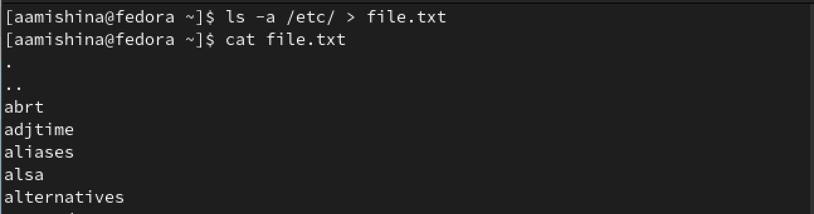
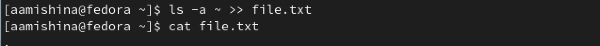
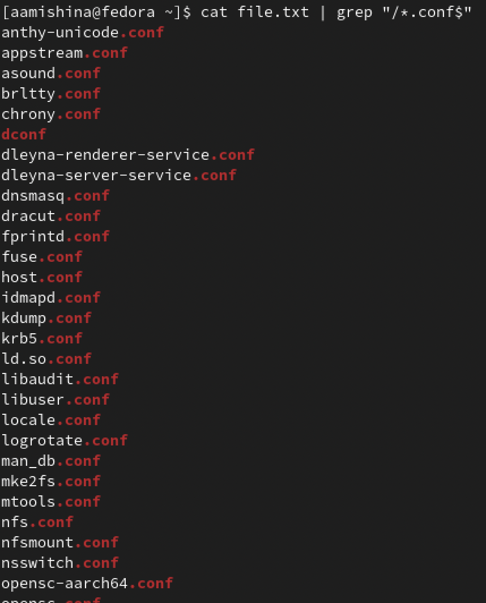
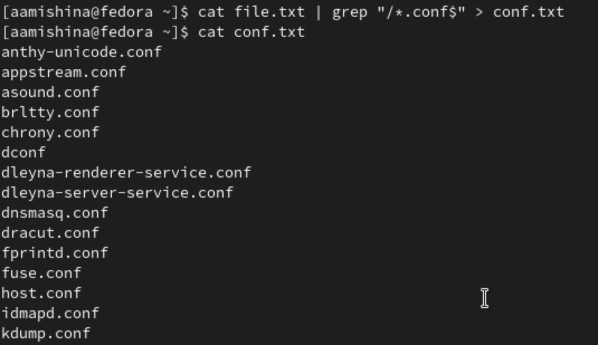
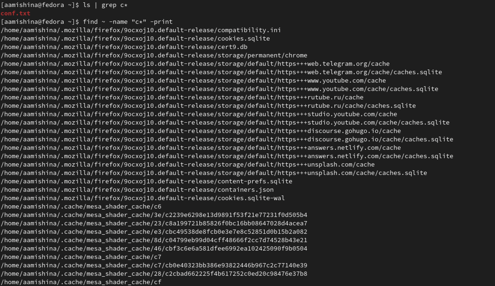
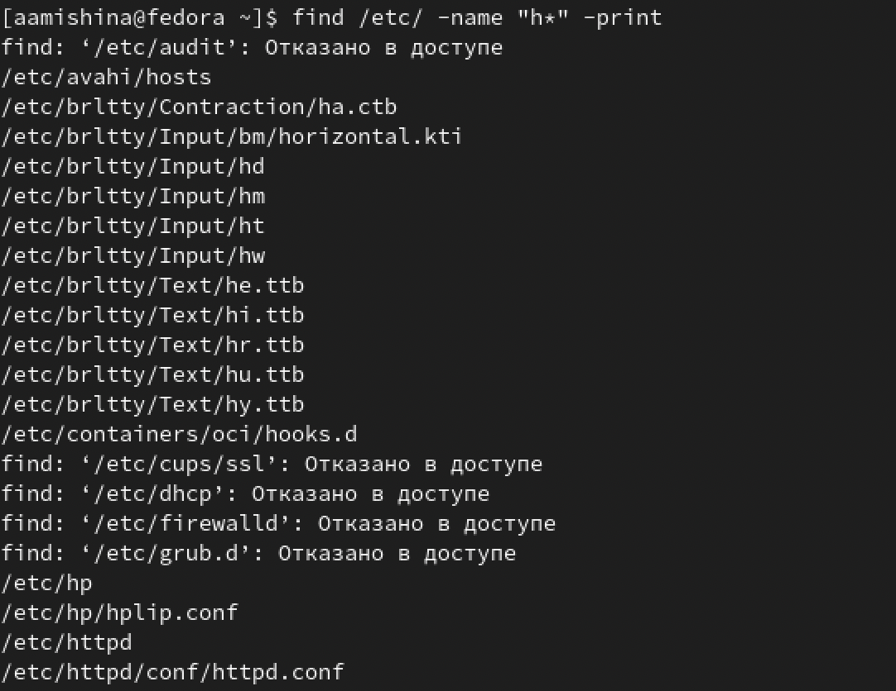
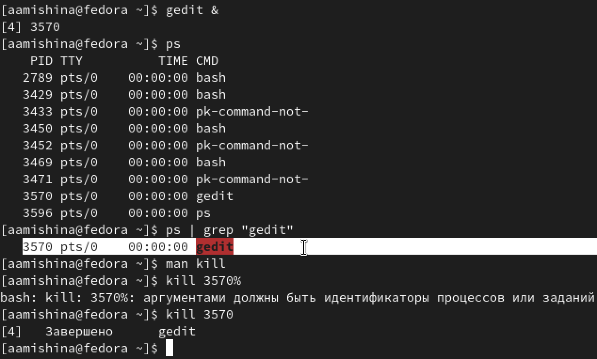
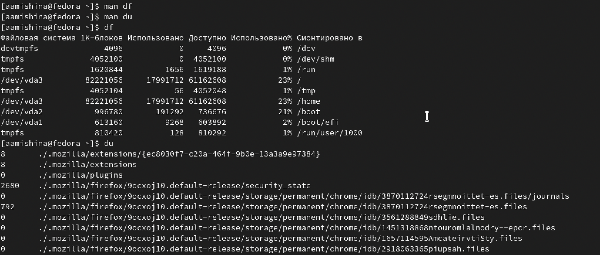
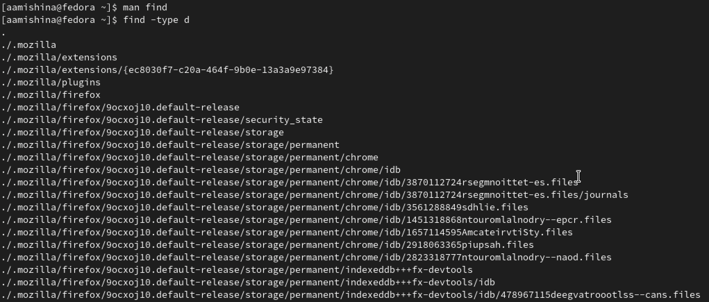

---
## Front matter
lang: ru-RU
title: Лабораторная работа №6
subtitle: Операционные системы
author:
  - Мишина А. А.
date: 16 марта 2023

## i18n babel
babel-lang: russian
babel-otherlangs: english

## Formatting pdf
toc: false
toc-title: Содержание
slide_level: 2
aspectratio: 169
section-titles: true
theme: metropolis
header-includes:
 - \metroset{progressbar=frametitle,sectionpage=progressbar,numbering=fraction}
 - '\makeatletter'
 - '\beamer@ignorenonframefalse'
 - '\makeatother'
---

## О себе

- Мишина Анастасия Алексеевна
- Группа НПИбд-02-22

## Цели и задачи

- Ознакомление с инструментами поиска файлов и фильтрации текстовых данных. Приобретение практических навыков: по управлению процессами (и заданиями), по проверке использования диска и обслуживанию файловых систем.

# Выполнение лабораторной работы

## Запись в файл

{ width=90% }

## Запись в файл

{ width=90% }

## Расширение .conf

{ width=40% }

## Расширение .conf

{ width=60% }

## Файлы домашнего каталога

{ width=60% }

## Файлы каталога /etc

{ width=50% }

## Запуск процесса

- Запускаем в фоновом режиме процесс, который будет записывать в файл ~/logfile
файлы, имена которых начинаются с log.

{ width=60% }

## Удаление файла

{ width=90% }

## Gedit

{ width=60% }

## Команды df и du

{ width=90% }

## Команда find

{ width=90% }

## Вывод

- В ходе выполнения данной лабораторной работы я ознакомилась с инструментами поиска файлов и фильтрации текстовых данных. Приобрела практические навыки: по управлению процессами (и заданиями), по проверке использования диска и обслуживанию файловых систем.
