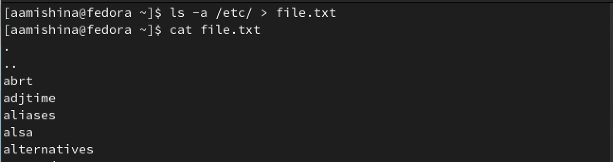
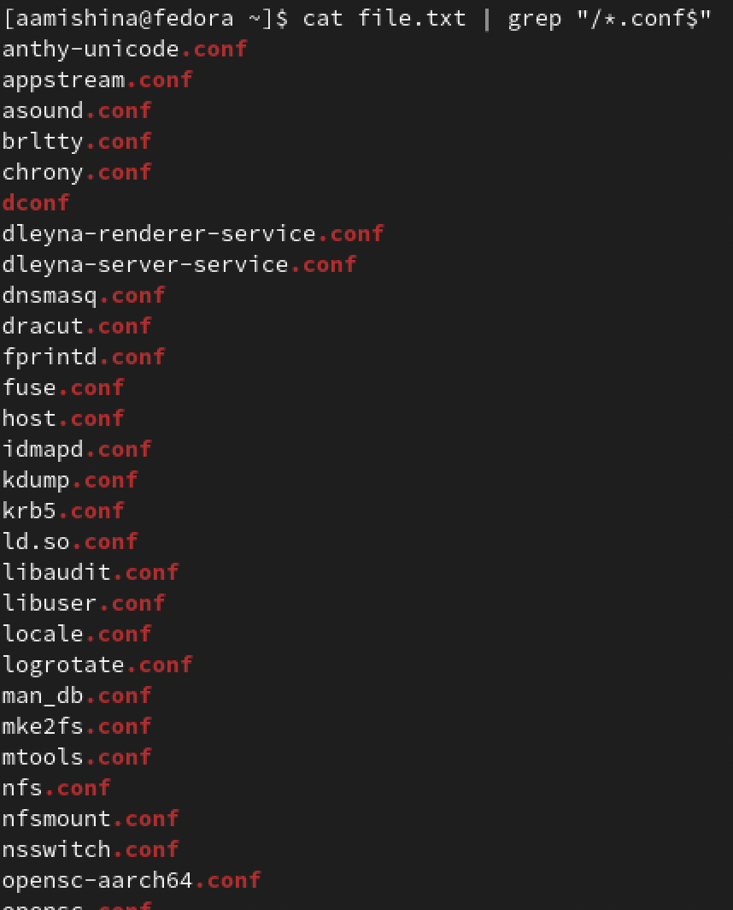
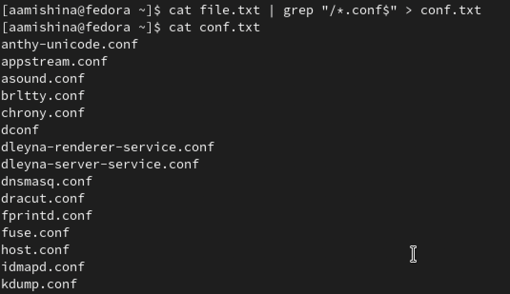
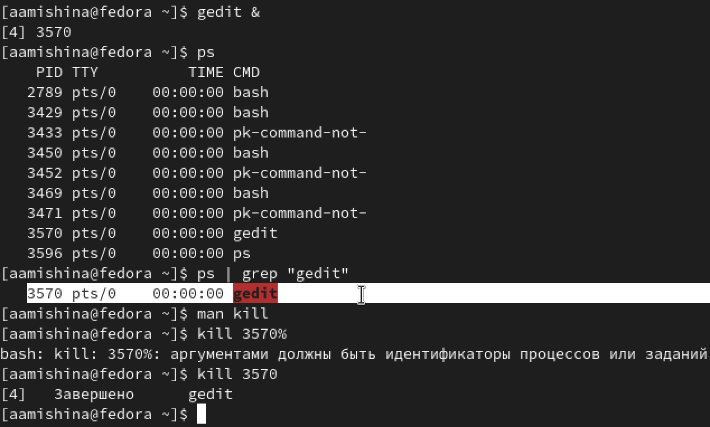
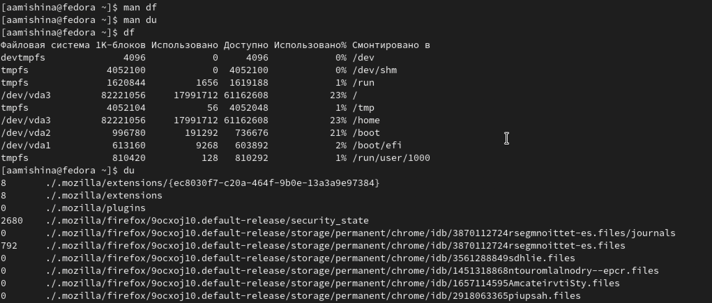
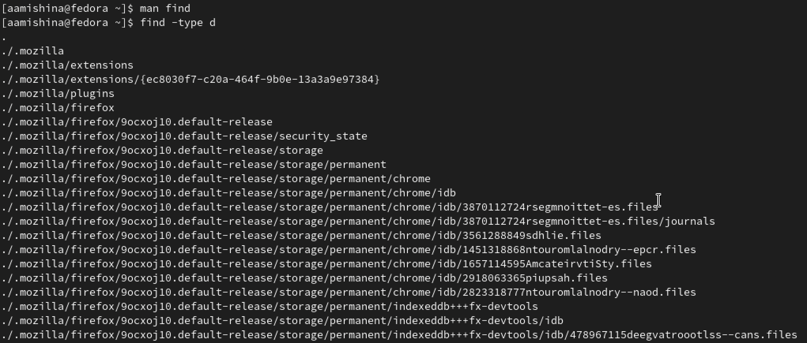

---
## Front matter
title: "Отчёт по лабораторной работе №6"
subtitle: "Дисциплина: Операционные системы"
author: "Мишина Анастасия Алексеевна"

## Generic options
lang: ru-RU
toc-title: "Содержание"

## Bibliography
bibliography: bib/cite.bib
csl: pandoc/csl/gost-r-7-0-5-2008-numeric.csl

## Pdf output format
toc: true # Table of contents
toc-depth: 2
lof: true # List of figures
lot: true # List of tables
fontsize: 14pt
linestretch: 1.5
papersize: a4
documentclass: scrreprt
## I18n polyglossia
polyglossia-lang:
  name: russian
  options:
	- spelling=modern
	- babelshorthands=true
polyglossia-otherlangs:
  name: english
## I18n babel
babel-lang: russian
babel-otherlangs: english
## Fonts
mainfont: PT Serif
romanfont: PT Serif
sansfont: PT Sans
monofont: PT Mono
mainfontoptions: Ligatures=TeX
romanfontoptions: Ligatures=TeX
sansfontoptions: Ligatures=TeX,Scale=MatchLowercase
monofontoptions: Scale=MatchLowercase,Scale=0.9
## Biblatex
biblatex: true
biblio-style: "gost-numeric"
biblatexoptions:
  - parentracker=true
  - backend=biber
  - hyperref=auto
  - language=auto
  - autolang=other*
  - citestyle=gost-numeric
## Pandoc-crossref LaTeX customization
figureTitle: "Рис."
tableTitle: "Таблица"
listingTitle: "Листинг"
lofTitle: "Список иллюстраций"
lotTitle: "Список таблиц"
lolTitle: "Листинги"
## Misc options
indent: true
header-includes:
  - \usepackage{indentfirst}
  - \usepackage{float} # keep figures where there are in the text
  - \floatplacement{figure}{H} # keep figures where there are in the text
---

# Цель работы

Ознакомление с инструментами поиска файлов и фильтрации текстовых данных. Приобретение практических навыков: по управлению процессами (и заданиями), по проверке использования диска и обслуживанию файловых систем.

# Выполнение лабораторной работы

1. Осуществляем вход в систему, используем соответствующее имя пользователя.
2. Записываем в файл file.txt названия файлов, содержащихся в каталоге /etc (рис. [-@fig:001]). Дописываем в этот же файл названия файлов, содержащихся в вашем домашнем каталоге (рис. [-@fig:002]).

{ #fig:001 width=90% }

{ #fig:002 width=90% }

3. Выводим имена всех файлов из file.txt, имеющих расширение .conf (рис. [-@fig:003]), после чего записываем их в новый текстовой файл conf.txt (рис. [-@fig:004]).

{ #fig:003 width=90% }

{ #fig:004 width=90% }

4. Выводим файлы в домашнем каталоге, которые имеют имена, начинающиеся с символа c? Ищем с помощью grep и find (рис. [-@fig:005]).

{ #fig:005 width=90% }

5. Выводим на экран имена файлов из каталога /etc, начинающиеся с символа h (рис. [-@fig:006]).

{ #fig:006 width=90% }

6. Запускаем в фоновом режиме процесс, который будет записывать в файл ~/logfile
файлы, имена которых начинаются с log (рис. [-@fig:007]).

{ #fig:007 width=90% }

7. Удаляем файл ~/logfile (рис. [-@fig:008]).

{ #fig:008 width=90% }

8. Запускаем из консоли в фоновом режиме редактор gedit. Определяем идентификатор процесса gedit, используя команду ps, конвейер и фильтр grep. Читаем справку (man) команды kill, после чего используем её для завершения процесса gedit (рис. [-@fig:009]). Также можно использовать команду pidof, чтобы найти идентификаторы процесса названных программ, таких как sshd, bash и т.д.

{ #fig:009 width=90% }

9. Выполняем команды df и du, предварительно получив более подробную информацию
об этих командах, с помощью команды man (рис. [-@fig:010]).

{ #fig:010 width=90% }

10. Воспользовавшись справкой команды find, выводим имена всех директорий, имеющихся в домашнем каталоге (рис. [-@fig:011]).

{ #fig:011 width=90% }

# Выполнение заданий самостоятельной работы

Контрольные вопросы:

1. Какие потоки ввода вывода вы знаете?

- stdin — стандартный поток ввода (по умолчанию: клавиатура), файловый дескриптор 0;
- stdout — стандартный поток вывода (по умолчанию: консоль), файловый дескриптор 1;
- stderr — стандартный поток вывод сообщений об ошибках (по умолчанию: консоль), файловый дескриптор 2.

2. Объясните разницу между операцией > и >>.
- Операция ">" - Перенаправление вывода.
- Операция ">>" - Перенаправление вывода в режиме добавления.

3. Что такое конвейер?

Конвейер (pipe) служит для объединения простых команд или утилит в цепочки, в которых результат работы предыдущей команды передаётся последующей.

4. Что такое процесс? Чем это понятие отличается от программы?

Процесс - это исполняемая программа. Процесс выполняется один за другим. Главное отличие между программой и процессом заключается в том, что Программа - это набор инструкций, который позволяет ЦПУ выполнять определенную задачу, в то время как процесс - это исполняемая программа.  

5. Что такое PID и GID?

Идентификатор процесса (PID).
Каждому новому процессу ядро  присваивает уникальный идентификационный номер. В любой момент времени идентификатор процесса является уникальным, хотя после завершения процесса он может использоваться снова для другого процесса. Некоторые идентификаторы зарезервированы системой для особых процессов. Так, процесс с идентификатором 1 - это процесс инициализации init, являющийся предком всех других процессов в системе.

GID - это идентификационный номер группы данного процесса. EGID связан с GID
также, как EUID с UID.

6. Что такое задачи и какая команда позволяет ими управлять?

Запущенные фоном программы называются задачами (jobs). Ими можно управлять
с помощью команды jobs, которая выводит список запущенных в данный момент задач.

7. Найдите информацию об утилитах top и htop. Каковы их функции?

top - интерактивный просмотрщик процессов.
Программа top динамически выводит в режиме реального времени информации о работающей системе, т.е. о фактической активности процессов. По умолчанию она выдает задачи, наиболее загружающие процессор сервера, и обновляет список каждые две секунды.

Htop – основанный на ncurses просмотрщик процессов подобный top, htop, atop интерактивные просмоторщики процессов, но позволяющий прокручивать список процессов вертикально и горизонтально, чтобы видеть их полные параметры запуска. Управление процессами (остановка, изменение приоритета) может выполняться без ручного ввода их идентификаторов.

8. Назовите и дайте характеристику команде поиска файлов. Приведите примеры использования этой команды.

Команда find используется для поиска и отображения на экран имён файлов, соответствующих заданной строке символов. Формат команды: find путь [-опции].
Путь определяет каталог, начиная с которого по всем подкаталогам будет вестись поиск: find ~ -name "f*" -print

9. Можно ли по контексту (содержанию) найти файл? Если да, то как?

Можно с помощью команды grep. Например команда grep begin найдёт все файлы, в которых есть слово begin.

10. Как определить объем свободной памяти на жёстком диске?

С помощью команды df

11. Как определить объем вашего домашнего каталога?

С помощью команды df ~

12. Как удалить зависший процесс?

С помощью команды kill <PID процесса>

# Выводы

В ходе выполнения данной лабораторной работы я ознакомилась с инструментами поиска файлов и фильтрации текстовых данных. Приобрела практические навыки: по управлению процессами (и заданиями), по проверке использования диска и обслуживанию файловых систем.
