---
## Front matter
lang: ru-RU
title: Лабораторная работа №7
subtitle: Операционные системы
author:
  - Мишина А. А.
date: 21 марта 2023

## i18n babel
babel-lang: russian
babel-otherlangs: english

## Formatting pdf
toc: false
toc-title: Содержание
slide_level: 2
aspectratio: 169
section-titles: true
theme: metropolis
header-includes:
 - \metroset{progressbar=frametitle,sectionpage=progressbar,numbering=fraction}
 - '\makeatletter'
 - '\beamer@ignorenonframefalse'
 - '\makeatother'
---

## О себе

- Мишина Анастасия Алексеевна
- Группа НПИбд-02-22

## Цели и задачи

- Освоение основных возможностей командной оболочки Midnight Commander. Приобретение навыков практической работы по просмотру каталогов и файлов; манипуляций с ними.

# Выполнение лабораторной работы

## Ознакомление

- Изучили команду mc с помощью команды man. Запустили mc.

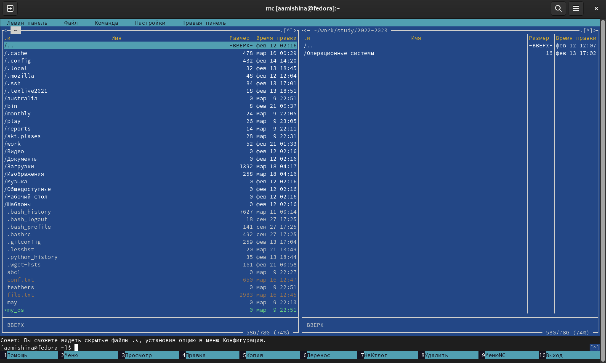{ width=60% }

## Операции с управляющими клавишами

- Копируем файл file.txt (F5)

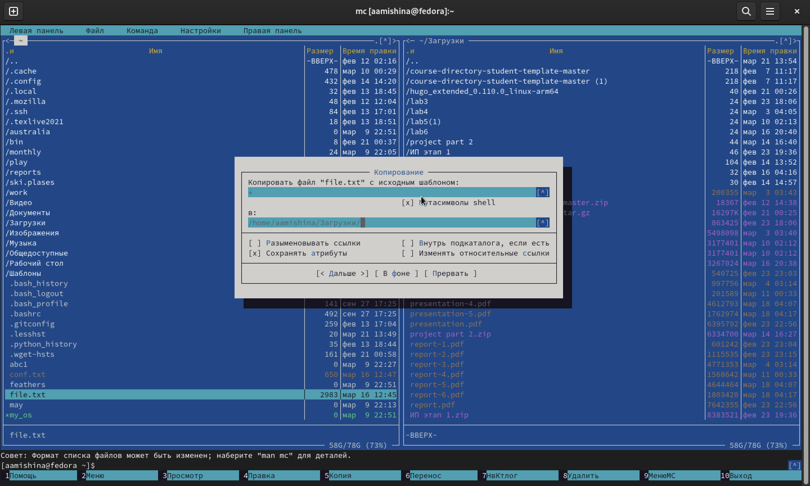{ width=60% }

## Операции с управляющими клавишами

- Cоздаем директорию testlab7 (F7)
 
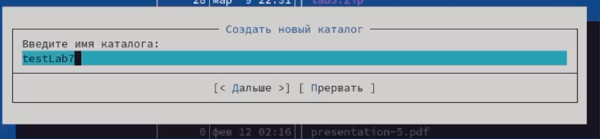{ width=90% }

## Подменю "файл"

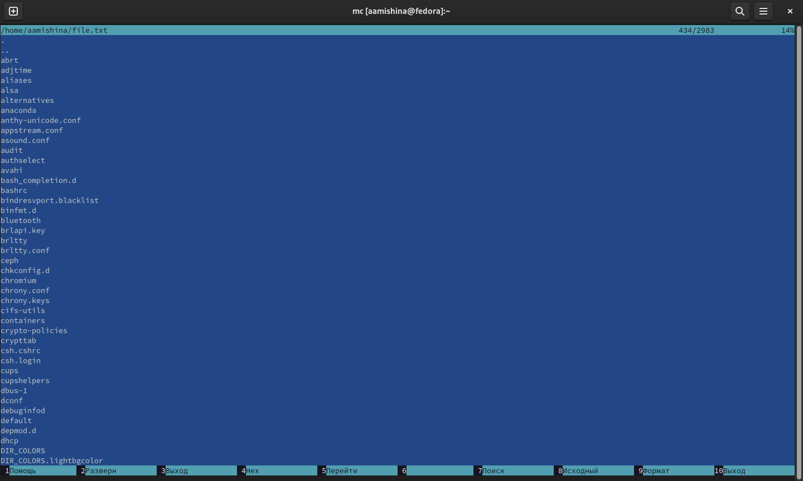{ width=60% }

## Подменю "файл"

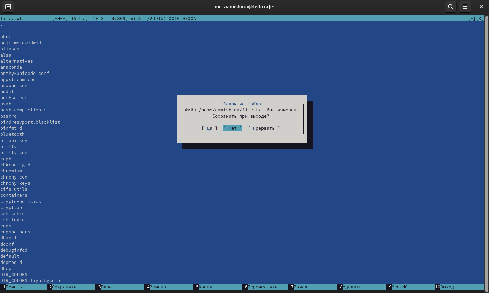{ width=60% }

## Подменю "файл"

{ width=90% }

## Подменю "файл"

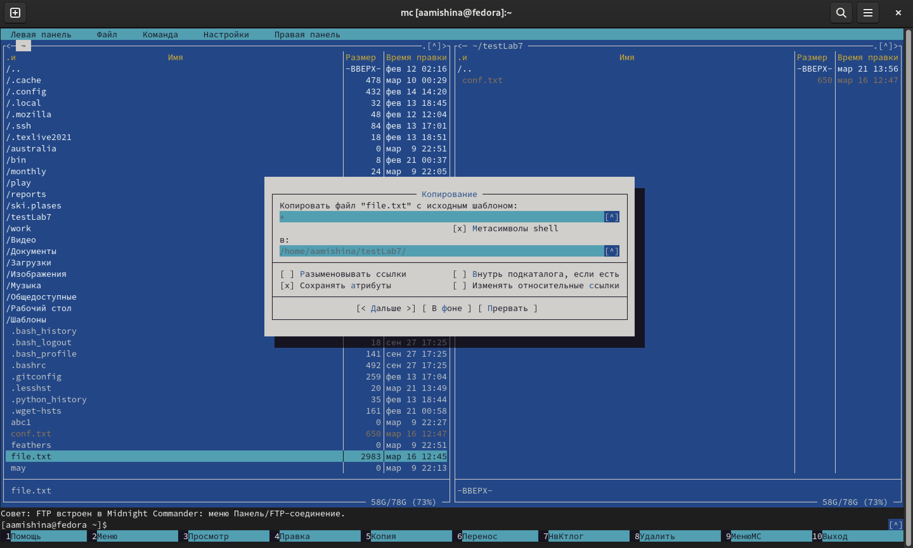{ width=60% }

## Подменю "команда"

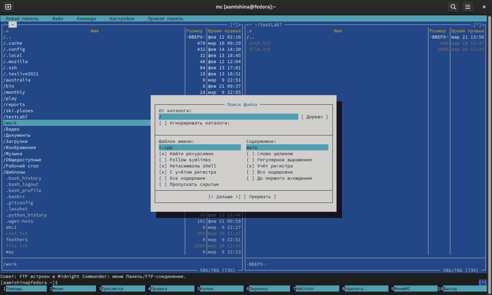{ width=60% }

## Подменю "команда"

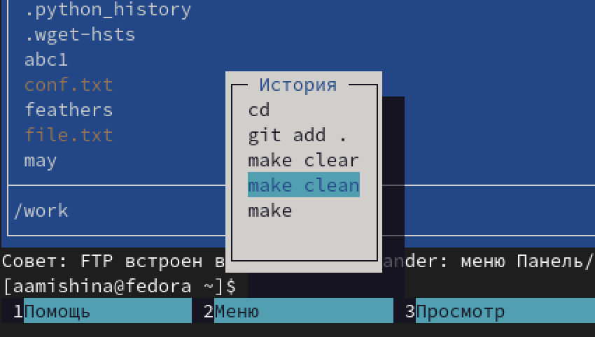{ width=60% }

## Подменю "команда"

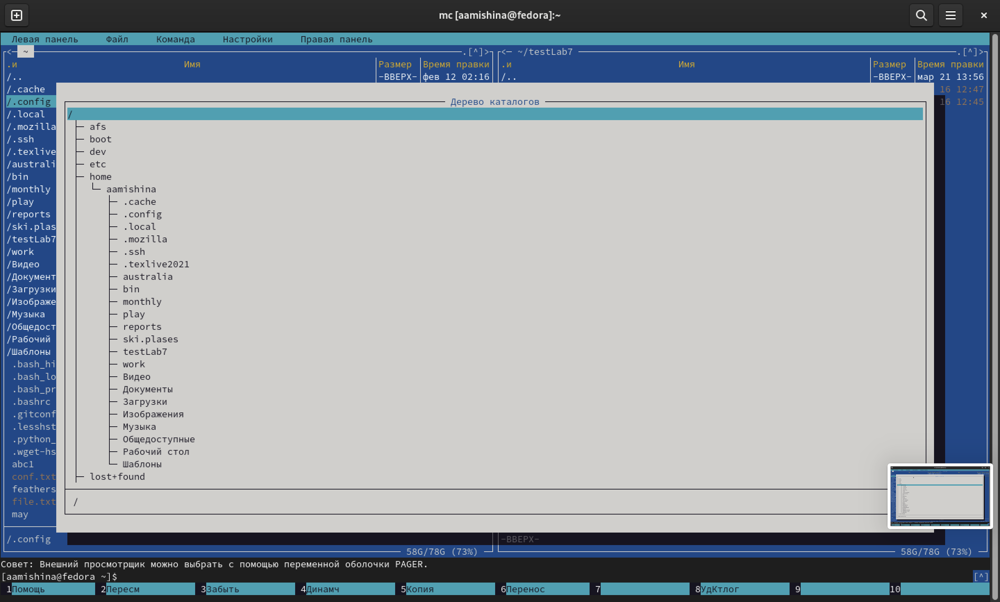{ width=60% }

## Подменю "команда"

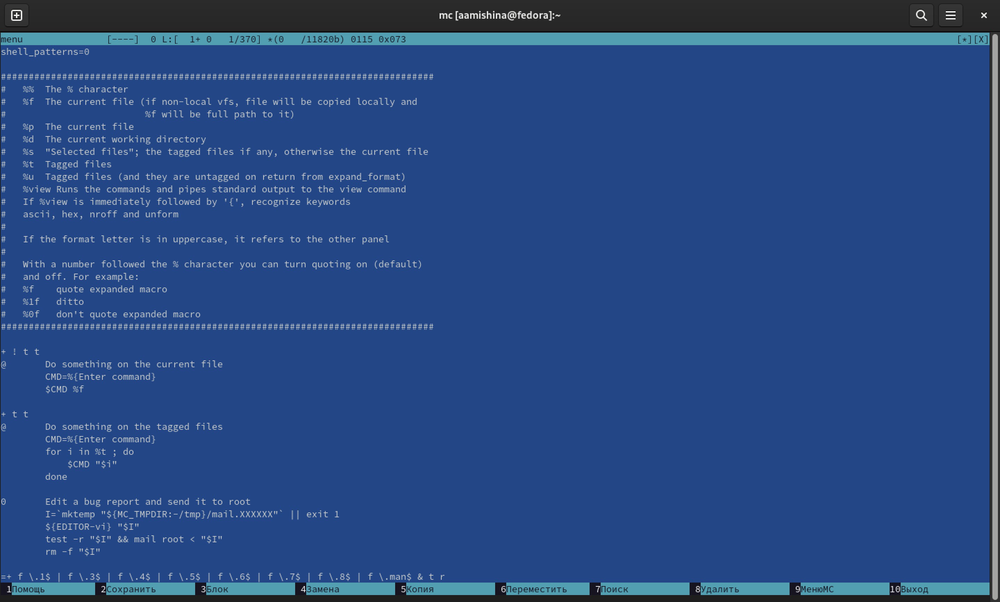{ width=60% }

## Подменю "команда"

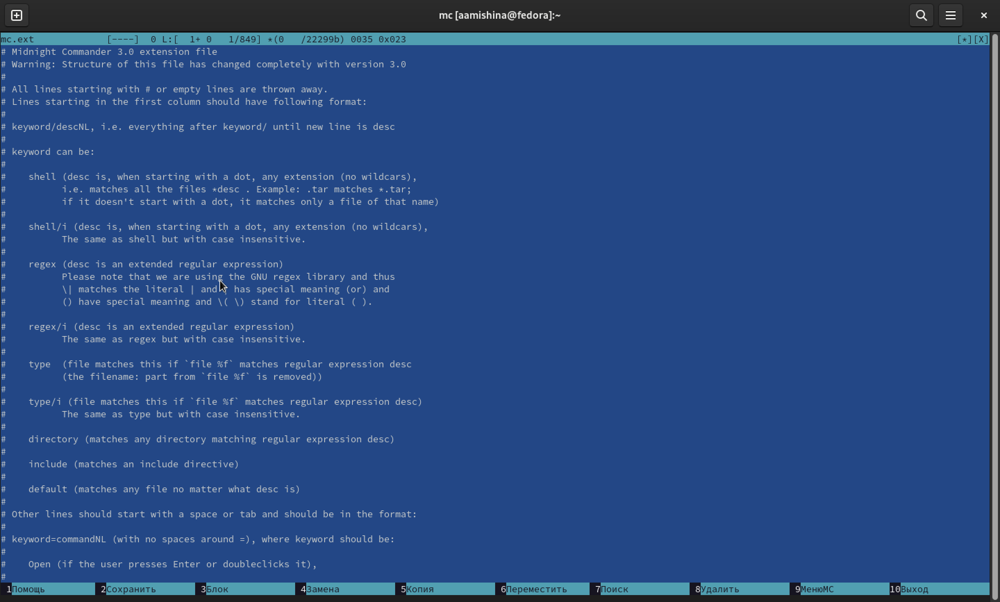{ width=60% }

## Подменю "настройки"

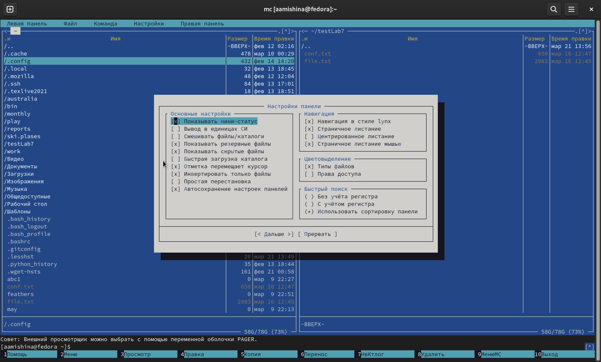{ width=60% }

## Задание по встроенному редактору mc

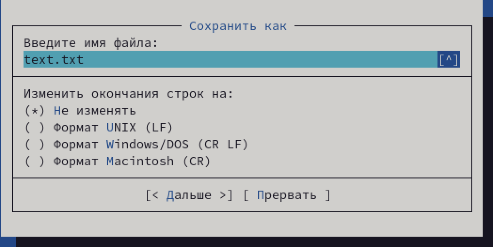{ width=90% }

## Задание по встроенному редактору mc

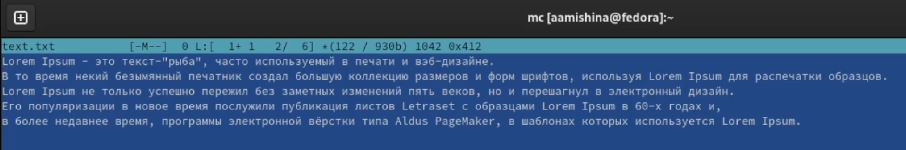{ width=90% }

## Задание по встроенному редактору mc

- Удаляем строку текста (ctrl+y). Выделяем фрагмент текста (F3) и копируем его на новую строку (F5). Затем выделяем фрагмент текста (F3) и переносим его на новую строку (F6). Сохраняем файл (F2). Отменяем последнее действие (ctrl+u). Переходим в конец файла (ctrl+End) и пишем некоторый текст. Переходим в начало файла (ctrl+Home) и пишем некоторый текст. Сохраняем и закрываем файл (F10).

## Задание по встроенному редактору mc

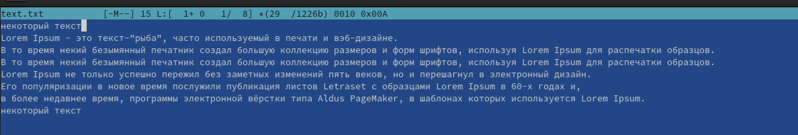{ width=90% }

## Задание по встроенному редактору mc

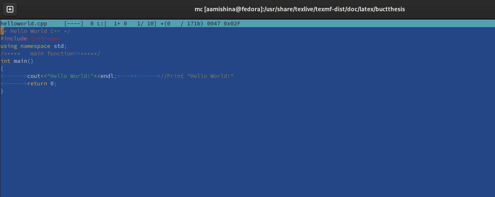{ width=90% }

## Задание по встроенному редактору mc

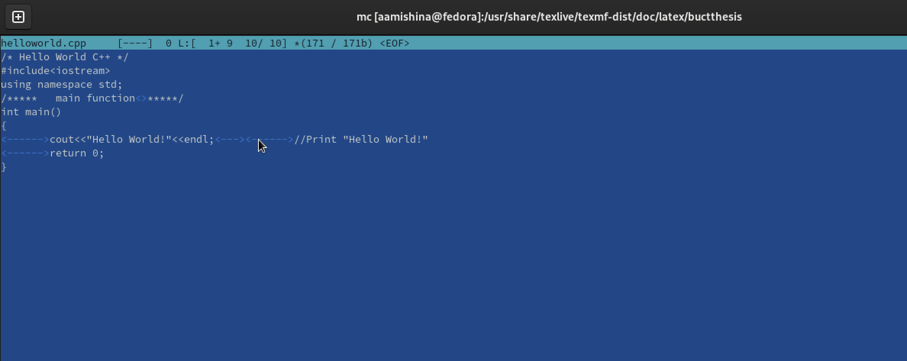{ width=90% }

## Вывод

- В ходе выполнения данной лабораторной работы я освоила основные возможности командной оболочки Midnight Commander. Приобрела навыки практической работы по просмотру каталогов и файлов; манипуляций с ними.
