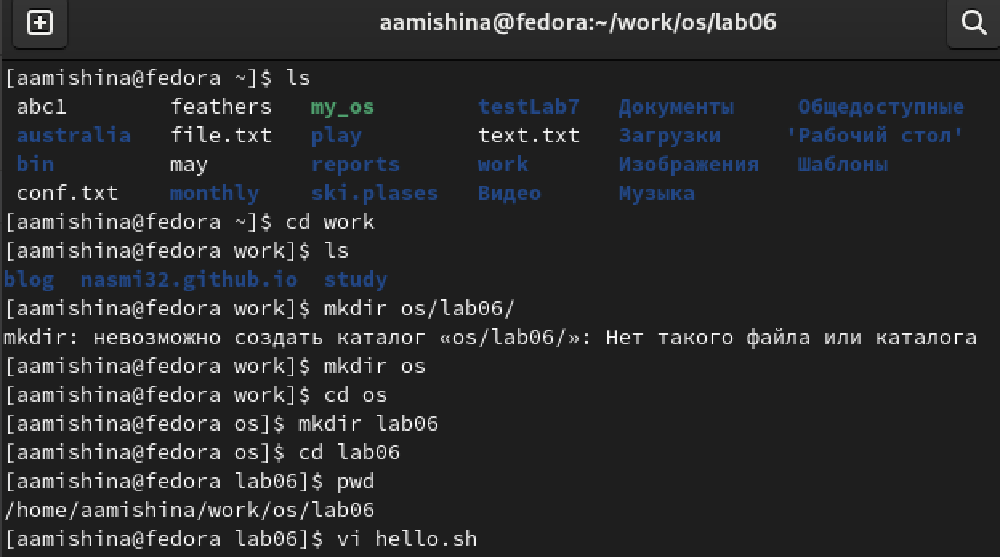
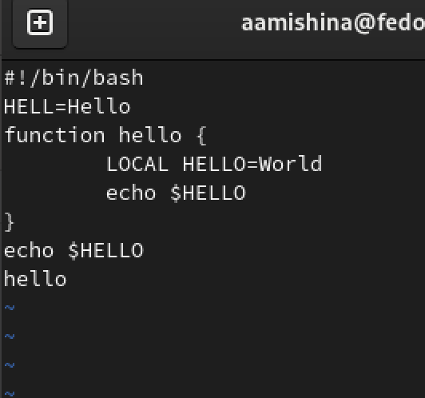
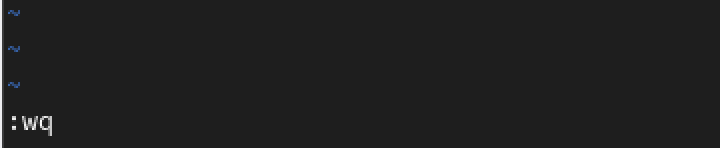
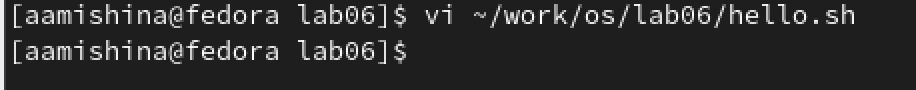
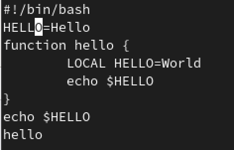
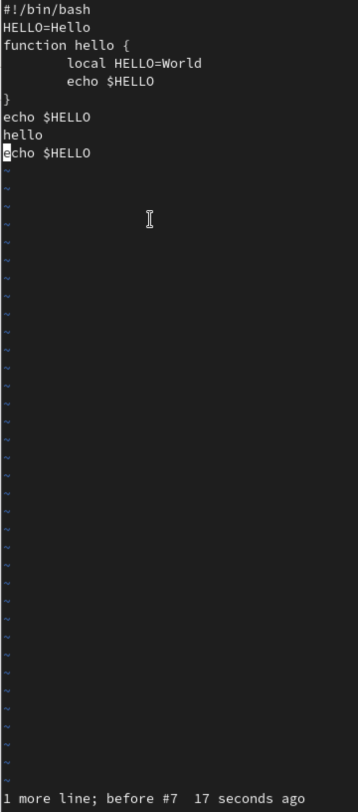

---
## Front matter
lang: ru-RU
title: Лабораторная работа №8
subtitle: Операционные системы
author:
  - Мишина А. А.
date: 29 марта 2023

## i18n babel
babel-lang: russian
babel-otherlangs: english

## Formatting pdf
toc: false
toc-title: Содержание
slide_level: 2
aspectratio: 169
section-titles: true
theme: metropolis
header-includes:
 - \metroset{progressbar=frametitle,sectionpage=progressbar,numbering=fraction}
 - '\makeatletter'
 - '\beamer@ignorenonframefalse'
 - '\makeatother'
---

## О себе

- Мишина Анастасия Алексеевна
- Группа НПИбд-02-22

## Цели и задачи

- Познакомиться с операционной системой Linux. Получить практические навыки работы с редактором vi, установленным по умолчанию практически во всех дистрибутивах.

# Выполнение лабораторной работы

# Задание 1

## Начало работы

{ width=60% }

## Ввод текста

{width=30% }

## Завершение ввода текста

{ width=90% }

## Исполняемый файл

{ width=90% }

# Задание 2

## Вызов редактора

{ width=90% }

## Редактирование

- Устанавливаем курсор в конце слова HELL, входим в режим вставки (i) и заменяем на слово HELLO 

{width=60% }

## Редактирование

- Затем ставим курсор на четвертую строку, удаляем слово LOCAL (x). Переходим в командный режим и набираем local, выходим из режима. Устанавливаем курсор на последней строке файла и пишем строку "$HELLO". Удаляем строку (dd). Вводим команду для отмены изменений (u). Аналогично предыдущей работы с редактором vi нажимаем на двоеточие, записываем изменения и выходим из vi

## Редактирование

{ width=20% }

## Вывод

- В ходе выполнения данной лабораторной работы я познакомилась с операционной системой Linux. Получила практические навыки работы с редактором vi, установленным по умолчанию практически во всех дистрибутивах.
