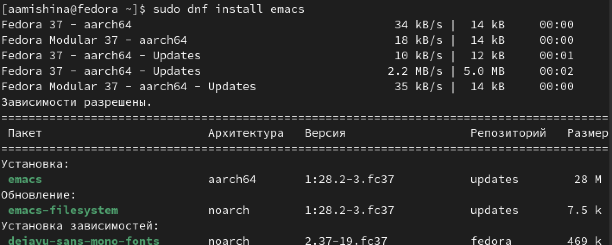
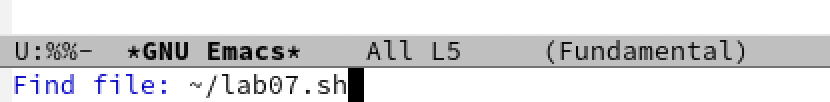
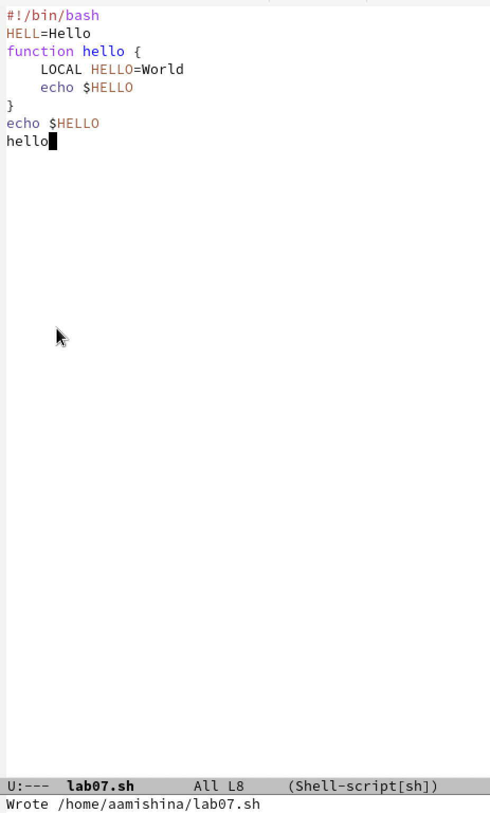
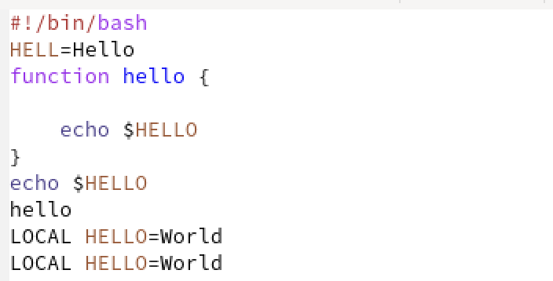
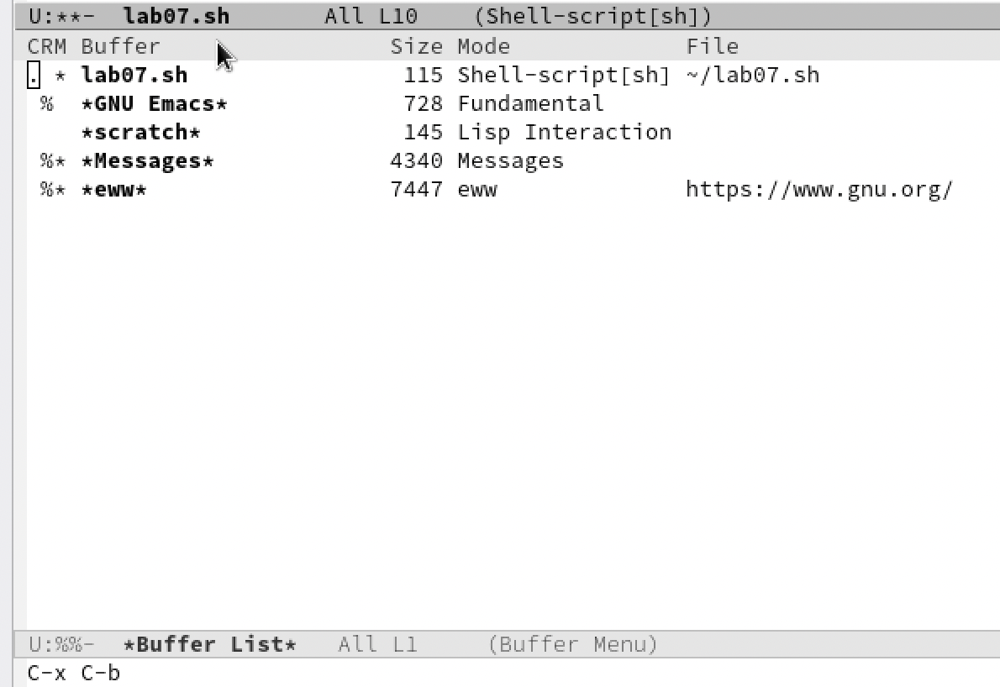
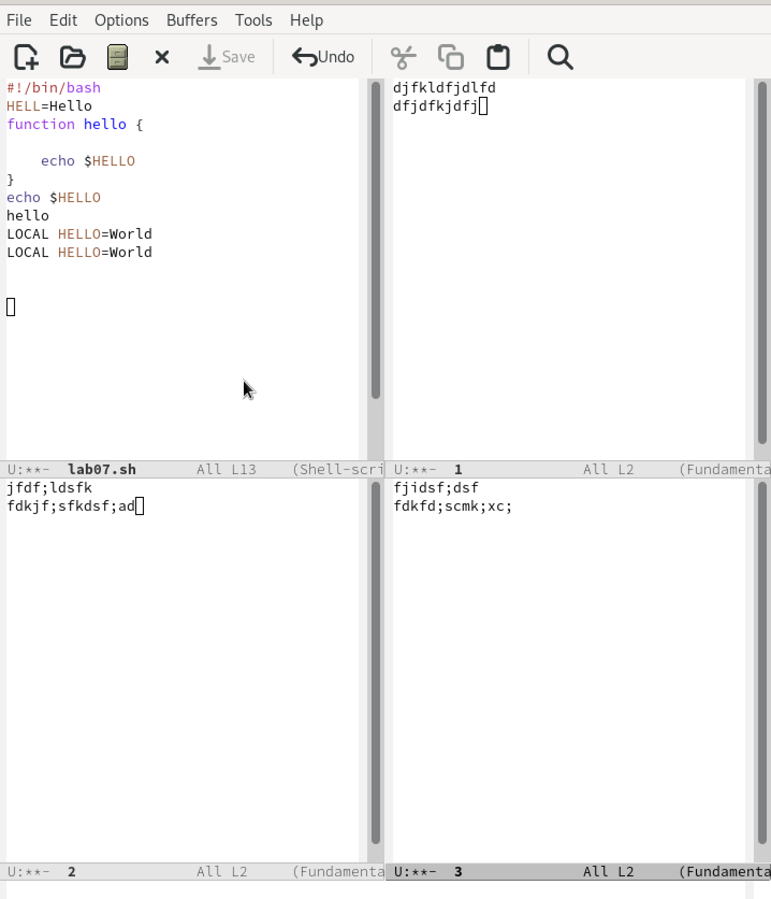
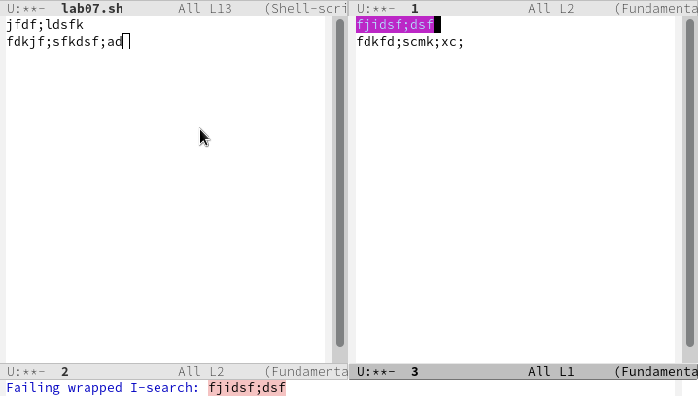
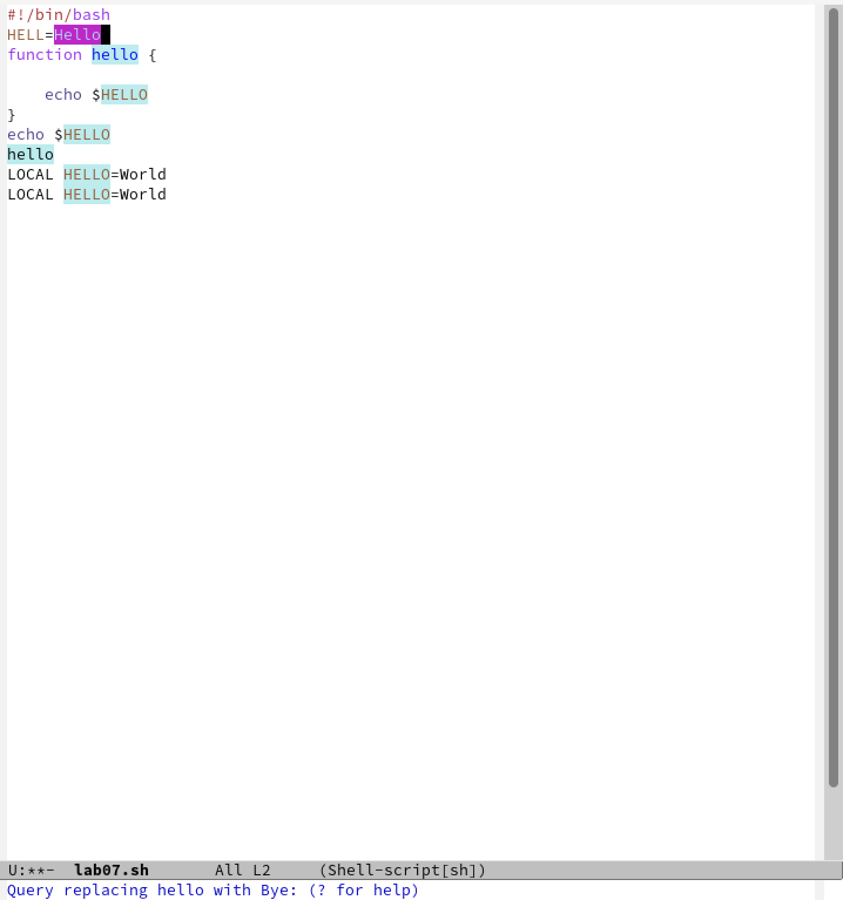
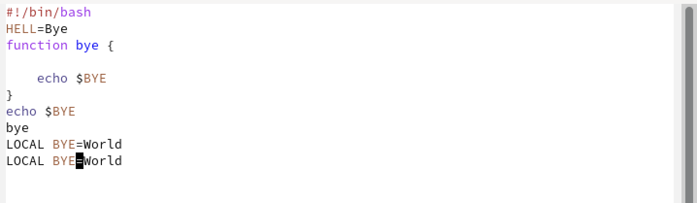
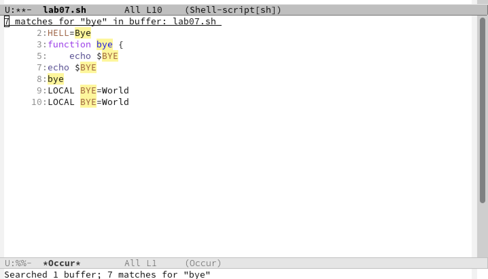

---
## Front matter
lang: ru-RU
title: Лабораторная работа №9
subtitle: Операционные системы
author:
  - Мишина А. А.
date: 6 апреля 2023

## i18n babel
babel-lang: russian
babel-otherlangs: english

## Formatting pdf
toc: false
toc-title: Содержание
slide_level: 2
aspectratio: 169
section-titles: true
theme: metropolis
header-includes:
 - \metroset{progressbar=frametitle,sectionpage=progressbar,numbering=fraction}
 - '\makeatletter'
 - '\beamer@ignorenonframefalse'
 - '\makeatother'
---

## О себе

- Мишина Анастасия Алексеевна
- Группа НПИбд-02-22

## Цели и задачи

- Познакомиться с операционной системой Linux. Получить практические навыки работы с редактором Emacs.

# Выполнение лабораторной работы

## Начало работы

{ width=70% }

## Создаем файл

- воспользовавшись комбинацией клавиш C+x, C+f.

{ width=90% }

## Вводим текст и сохраняем файл

- Сохраняем файл, применив комбинацию клавиш C+x C+s.

{ width=25% }

## Редактирование текста

- Вырезаем целую строку (C+k);
- Вставляем эту строку в конец файла (C+y);
- Выделяем область текста (C+space);
- Копируем область в буфер обмена(M+w);
- Вставляем скопированную область в конец файла(C+y);
- Вновь выделяем эту область (C+space) и вырезаю ее (C+w);
- Отменяем последнее действие (C+/).

## Редактирование текста

{ width=90% }

## Перемещение курсора

- Перемещаем курсор в начало строки (C+a);
- Перемещаем курсор в конец строки (C+e);
- Перемещаем курсор в начало буфера (M+<);
- Перемещаем курсор в конец буфера (M+>).

## Управление буферами

- Выводим список активных буферов на экран с помощью сочетания клавиш C+x C+b.

{ width=60% }

## Управление окнами

- Делим фрейм на 4 части с мощью сочетаний клавиш C+x 2 (разделить по горизонтали) и C+x 3 (разделить по вертикали).

{ width=30% }

## Выполнением поиск

- Нажимаем C+s и выполняем поиск нескольких слов в тексте файла. Переключаемся между результатами с помощью сочетания клавиш C+s.

{ width=60% }

## Замена текста

- Выходим из режима поиска, нажав C+g. Переходим в режим поиска и замены, воспользовавшись сочетанием клавиш M+%, вводим текст, который следует заменить, затем вводим текст для замены и подтверждаем замену, нажав !

## Замена текста

{ width=40% }

## Замена текста

{ width=90% }

## Другой режим поиска (M+s o)

- Информация о найденных элементах появилась в другом окне, отобразилась информация о количестве найденных элементов и о строках, в которых они располагаются.

{ width=60% }

## Вывод

- В ходе выполнения лабораторной работы я познакомилась с операционной системой Linux, а также получила практические навыки работы с редактором Emacs.
