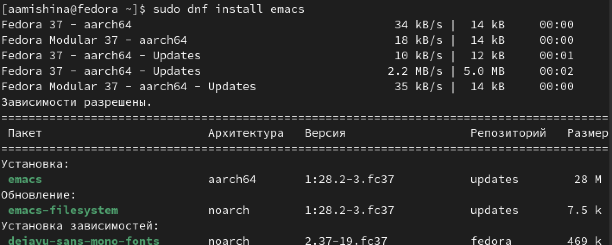
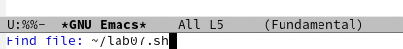
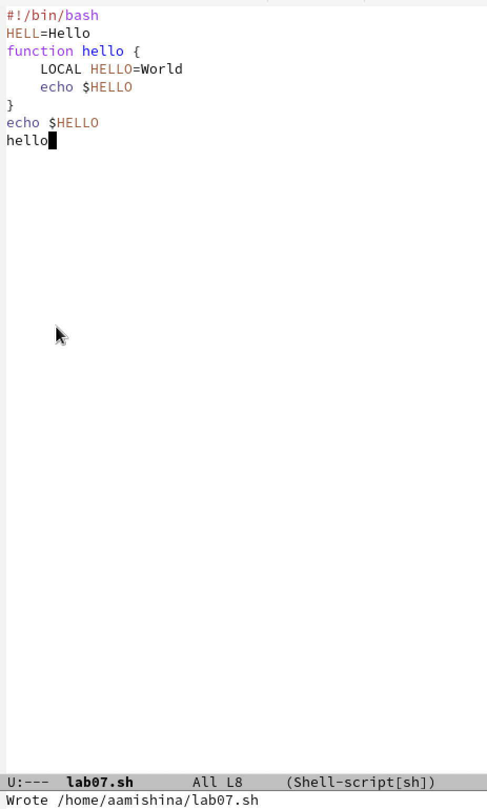
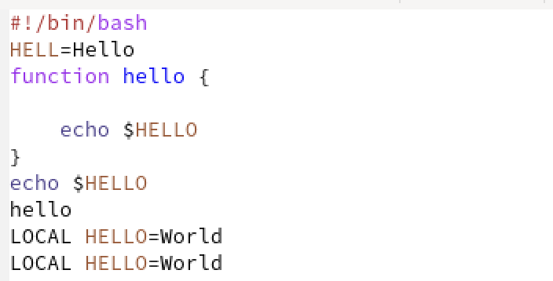
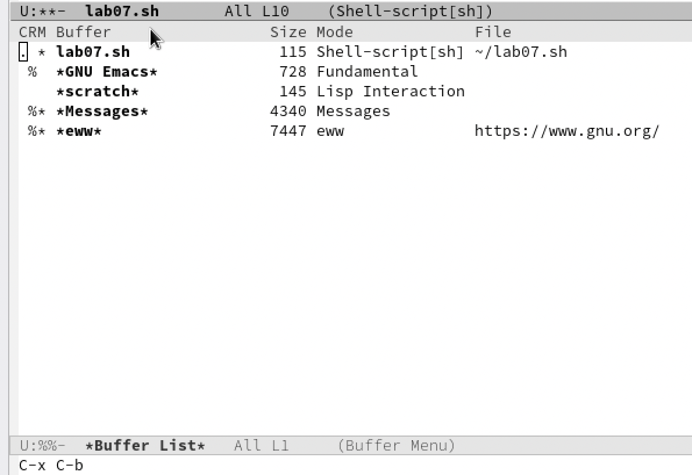
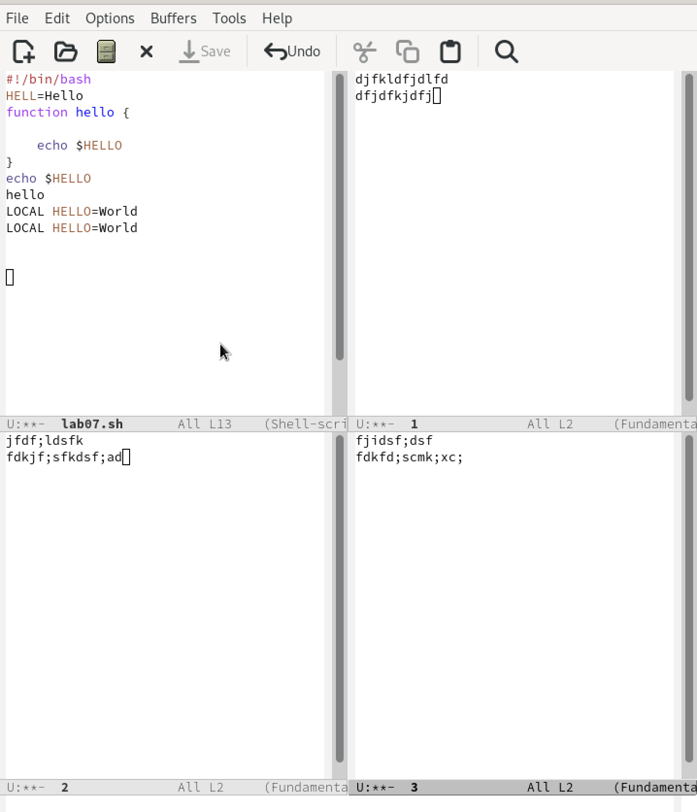
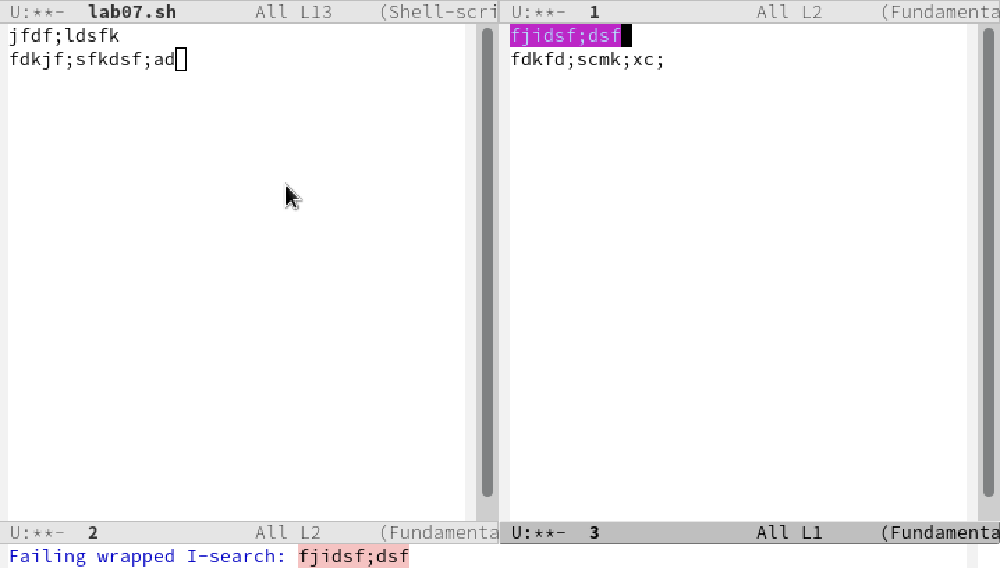
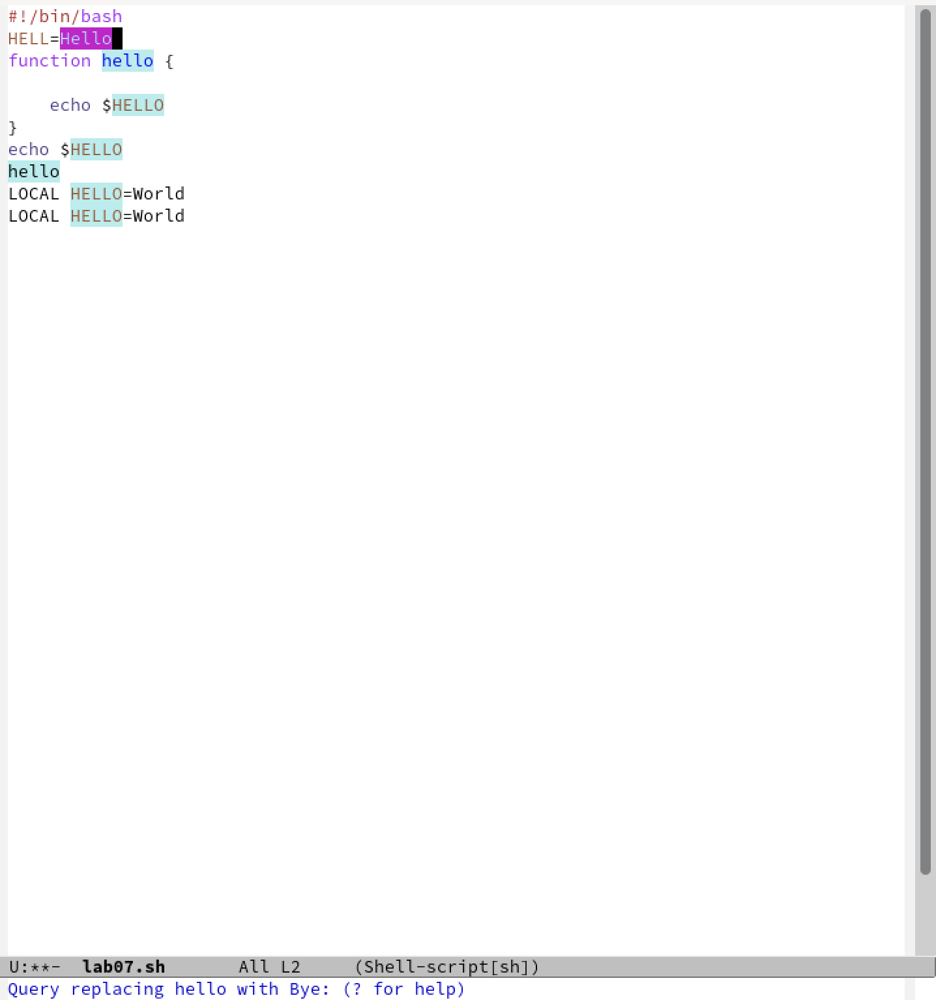
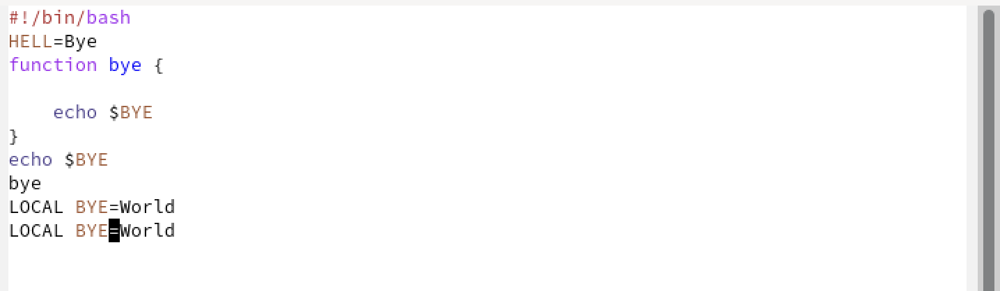
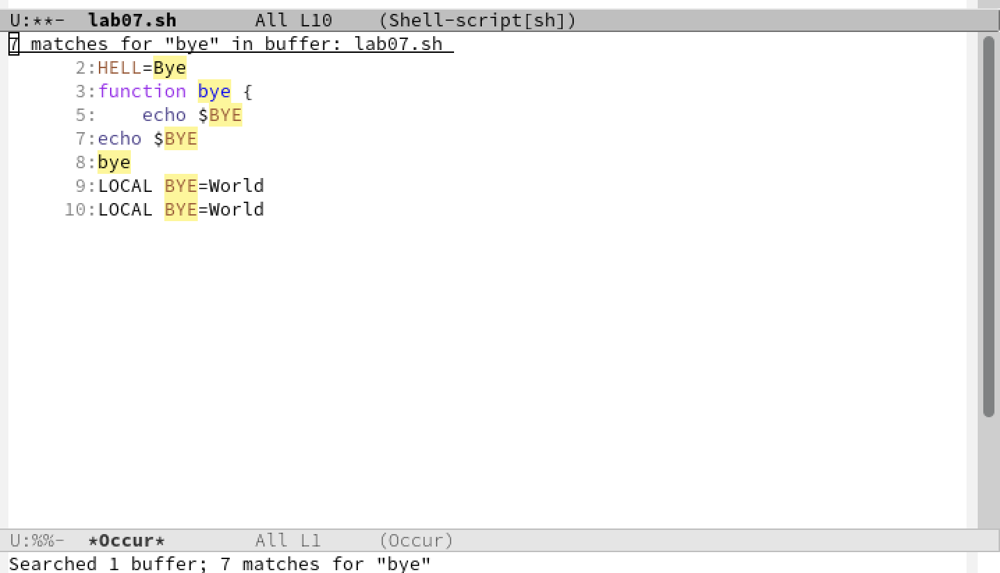

---
## Front matter
title: "Отчёт по лабораторной работе №9"
subtitle: "Дисциплина: Операционные системы"
author: "Мишина Анастасия Алексеевна"

## Generic options
lang: ru-RU
toc-title: "Содержание"

## Bibliography
bibliography: bib/cite.bib
csl: pandoc/csl/gost-r-7-0-5-2008-numeric.csl

## Pdf output format
toc: true # Table of contents
toc-depth: 2
lof: true # List of figures
lot: true # List of tables
fontsize: 14pt
linestretch: 1.5
papersize: a4
documentclass: scrreprt
## I18n polyglossia
polyglossia-lang:
  name: russian
  options:
	- spelling=modern
	- babelshorthands=true
polyglossia-otherlangs:
  name: english
## I18n babel
babel-lang: russian
babel-otherlangs: english
## Fonts
mainfont: PT Serif
romanfont: PT Serif
sansfont: PT Sans
monofont: PT Mono
mainfontoptions: Ligatures=TeX
romanfontoptions: Ligatures=TeX
sansfontoptions: Ligatures=TeX,Scale=MatchLowercase
monofontoptions: Scale=MatchLowercase,Scale=0.9
## Biblatex
biblatex: true
biblio-style: "gost-numeric"
biblatexoptions:
  - parentracker=true
  - backend=biber
  - hyperref=auto
  - language=auto
  - autolang=other*
  - citestyle=gost-numeric
## Pandoc-crossref LaTeX customization
figureTitle: "Рис."
tableTitle: "Таблица"
listingTitle: "Листинг"
lofTitle: "Список иллюстраций"
lotTitle: "Список таблиц"
lolTitle: "Листинги"
## Misc options
indent: true
header-includes:
  - \usepackage{indentfirst}
  - \usepackage{float} # keep figures where there are in the text
  - \floatplacement{figure}{H} # keep figures where there are in the text
---

# Цель работы

Познакомиться с операционной системой Linux. Получить практические навыки работы с редактором Emacs.

# Выполнение лабораторной работы

1. Устанавливаем и открываем emacs (рис. [-@fig:001]). 

{ #fig:001 width=90% }

2. Создаем файл lab07.sh (рис. [-@fig:002]), воспользовавшись комбинацией клавиш C+x, C+f.

{ #fig:002 width=90% }

Далее будем использовать следующие сокращения: C – Ctrl, S – Shift, M – Meta, X – Shift+x (S+x), % - Shift+x (S+x) и т.д.

3. Набираем текст, представленный в задании (рис. [-@fig:003]).

{ #fig:003 width=70% }

4. Сохраняем файл, применив комбинацию клавиш C+x C+s.

5. С помощью различных комбинаций клавиш выполняем стандартные процедуры редактирования текста (рис. [-@fig:004]).
	
Вырезаем целую строку (C+k);

Вставляем эту строку в конец файла (C+y);
	
Выделяем область текста (C+space);

Копируем область в буфер обмена(M+w);

Вставляем скопированную область в конец файла(C+y);

Вновь выделяем эту область (C+space) и вырезаю ее (C+w);

Отменяем последнее действие (C+/).

{ #fig:004 width=90% }

6. Используем команды по перемещению курсора:

Перемещаем курсор в начало строки (C+a);

Перемещаем курсор в конец строки (C+e);

Перемещаем курсор в начало буфера (M+<);

Перемещаем курсор в конец буфера (M+>).

7. Управляем буферами: 

Выводим список активных буферов на экран с помощью сочетания клавиш C+x C+b (рис. [-@fig:005]).

{ #fig:005 width=90% }

Перемещаемся во вновь открытое окно со списком открытых буферов с помощью сочетания клавиш C+x o, а затем переключаемся на другой буфер. Закрываем это окно сочетанием клавиш C+x 0. Вновь переключаемся между буферами, но уже не выводя их на экран с помощью сочетания клавиш C+x b.

8. Управляем окнами:

Делим фрейм на 4 части с мощью сочетаний клавиш C+x 2 (разделить по горизонтали) и C+x 3 (разделить по вертикали). В каждом из 4 окон открываем новый файл(буфер) и вводим там некоторый текст (рис. [-@fig:006]).

{ #fig:006 width=90% }

9. Выполняем поиск:

Переключаемся в режим поиска, нажимая C+s и выполняем поиск нескольких слов в тексте файла. Переключаемся между результатами с помощью сочетания клавиш C+s (рис. [-@fig:007]).

{ #fig:007 width=90% }

Выходим из режима поиска, нажав C+g. Переходим в режим поиска и замены, воспользовавшись сочетанием клавиш M+%, вводим текст, который следует заменить, затем вводим текст для замены и подтверждаем замену, нажав ! (рис. [-@fig:008]), (рис. [-@fig:009]).

{ #fig:008 width=90% }

{ #fig:009 width=90% }

Нажимаем сочетание клавиш M+s o и пробуем другой режим поиска. Можно увидеть, как отличается этот режим поиска от используемого в выше: информация о найденных элементах появилась в другом окне, отобразилась информация о количестве найденных элементов и о строках, в которых они располагаются (рис. [-@fig:010]).

{ #fig:010 width=90% }

# Выполнение заданий самостоятельной работы

Контрольные вопросы:

1.	Кратко охарактеризуйте редактор emacs.

Emacs это мощный экранный редактор текста, написанный на языке высокого уровня Elisp.

2.	Какие особенности данного редактора могут сделать его сложным для освоения новичком?

Сложности могут возникнуть в запоминании большого количества сложный комбинаций клавиш, используемых emacs, а также на клавиатуре для IBM PC совместимых ПК клавиши Meta нет, но вместо неё можно использовать Alt или Esc.

3.	Своими словами опишите, что такое буфер и окно в терминологии emacs’а.

Буфер — объект, представляющий какой-либо текст.

Окно — прямоугольная область фрейма, отображающая один из буферов.

4.	Можно ли открыть больше 10 буферов в одном окне?

Да, можно.

5.	Какие буферы создаются по умолчанию при запуске emacs?

По умолчанию при открытии Emacs создает два буфера — scratch и Messages.

6.	Какие клавиши вы нажмёте, чтобы ввести следующую комбинацию C-c | и C-c C-|?

Ctrl+C Shift+\ и Ctrl+C Ctrl+Shift+\.

7.	Как поделить текущее окно на две части?

Ctrl+2 разделить по горизонтали.
Ctrl+3 разделить по вертикали.

8.	В каком файле хранятся настройки редактора emacs?

В файле .emacs хранятся настройки редактора emacs

9.	Какую функцию выполняет клавиша <– и можно ли её переназначить?

Backspace – стереть символ. Ее можно переобозначить.

10.	Какой редактор вам показался удобнее в работе vi или emacs? Поясните почему.

Для работы с маленькими файлами вполне удобно использовать vi, однако emacs несколько удобнее и имеет более расширенный функционал.

# Выводы

В ходе выполнения лабораторной работы я познакомилась с операционной системой Linux, а также получила практические навыки работы с редактором Emacs.
