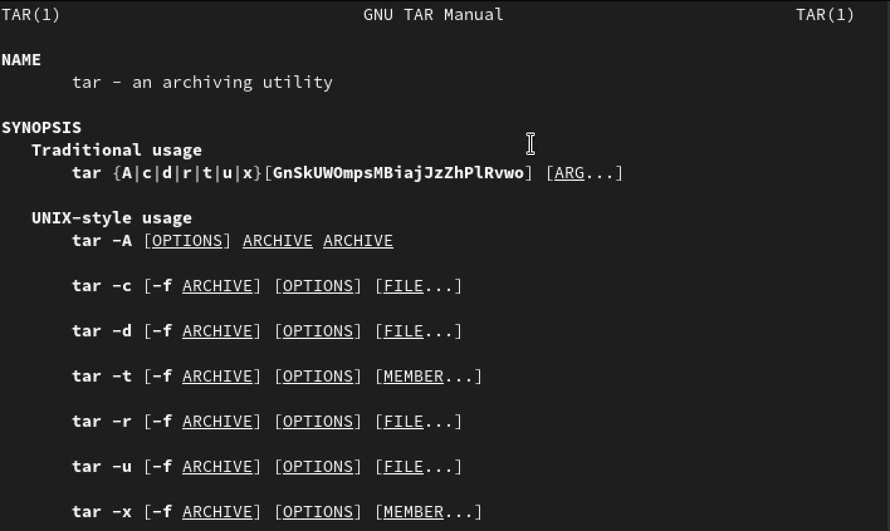
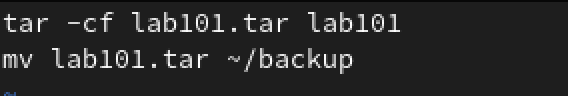
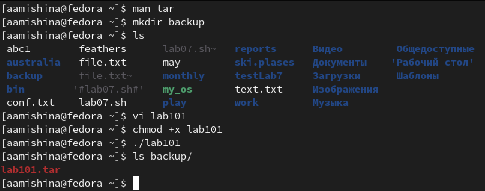
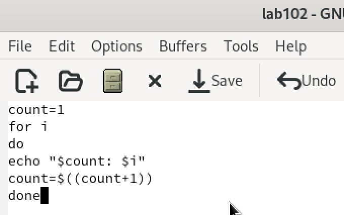
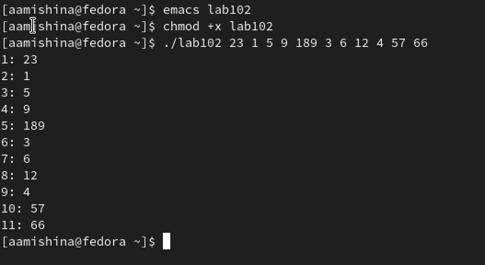
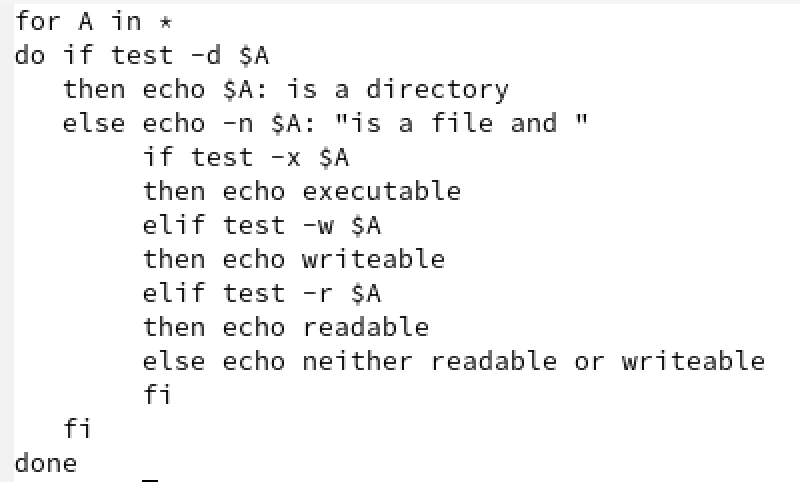
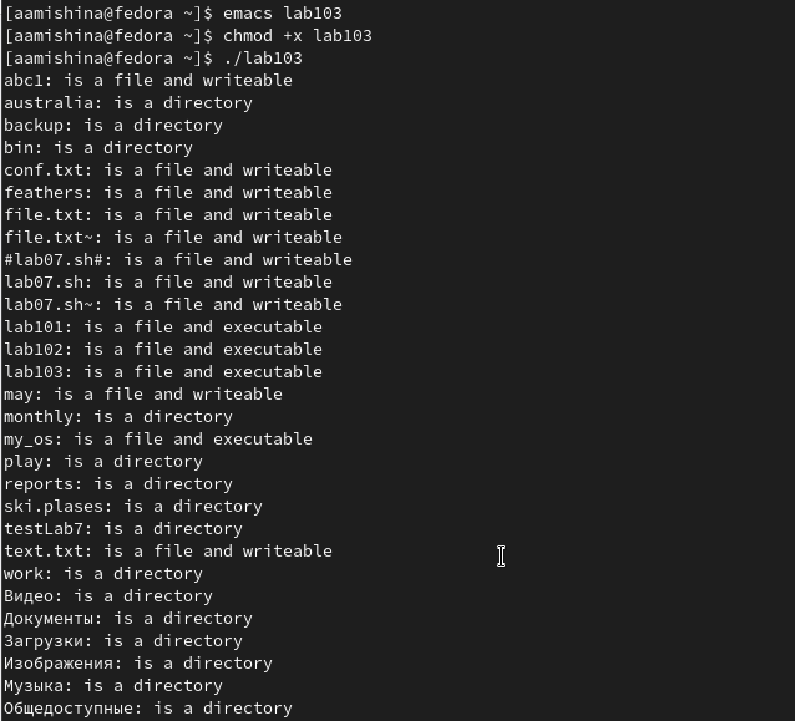
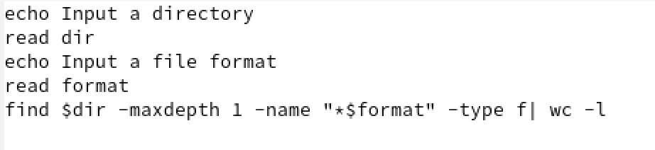
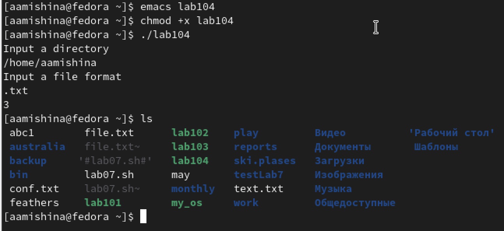

---
## Front matter
lang: ru-RU
title: Лабораторная работа №10
subtitle: Операционные системы
author:
  - Мишина А. А.
date: 15 апреля 2023

## i18n babel
babel-lang: russian
babel-otherlangs: english

## Formatting pdf
toc: false
toc-title: Содержание
slide_level: 2
aspectratio: 169
section-titles: true
theme: metropolis
header-includes:
 - \metroset{progressbar=frametitle,sectionpage=progressbar,numbering=fraction}
 - '\makeatletter'
 - '\beamer@ignorenonframefalse'
 - '\makeatother'
---

## О себе

- Мишина Анастасия Алексеевна
- Группа НПИбд-02-22

## Цели и задачи

- Изучить основы программирования в оболочке ОС UNIX/Linux. Научиться писать небольшие командные файлы.

# Выполнение лабораторной работы

## Начало работы

- Просматриваю справку tar. Создаю директорию backup. 

{ width=50% }

## Скрипт 1

- При запуске будет делает резервную копию самого себя в резервную директорию backup. При этом архивирую файл архиватором tar.

{ width=60% }

## Скрипт 1

- Добавляю право на исполнения файла, выполняю его и проверяю корректность выполнения. 

{ width=60% }

## Скрипт 2
 - Пишу скрипт, обрабатывающий произвольное число аргументов командной строки. В моем случае скрипт последовательно выводит все значения переданных аргументов.
 
 { width=60% }

## Скрипт 2

{ #fig:005 width=60% }

## Скрипт 3

- Командный файл, аналог команды ls, который выводит информацию о нужном каталоге: о правах доступа к файлам этого каталога. Скрипт определяет подкаталог или файл и выводит сообщение о правах доступа к файлам.

{ width=50% }

## Скрипт 3

{ #fig:007 width=40% }

## Скрипт 4

- Пишу скрипт, который считывает тип файлов ((.txt, .doc, .jpg, .pdf и т.д.), а также путь к некоторой директории. И определяет количество файлов данного типа в заданной директории. Я указываю опцию -maxdepth 1, чтобы файлы необходимого типа искались только в заданном каталоге, а в его подкаталогах нет.

## Скрипт 4

{ width=90% }

## Скрипт 4

{ #fig:009 width=60% }

## Вывод

- В ходе лабораторной работы я изучила основы программирования в оболочке ОС Linux, а также научилась писать небольшие командные файлы.
