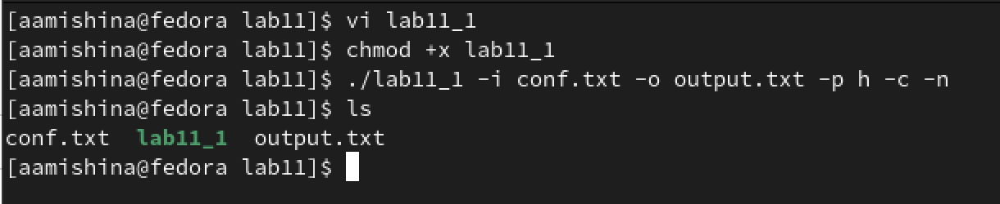

---
## Front matter
lang: ru-RU
title: Лабораторная работа №11
subtitle: Операционные системы
author:
  - Мишина А. А.
date: 20 апреля 2023

## i18n babel
babel-lang: russian
babel-otherlangs: english

## Formatting pdf
toc: false
toc-title: Содержание
slide_level: 2
aspectratio: 169
section-titles: true
theme: metropolis
header-includes:
 - \metroset{progressbar=frametitle,sectionpage=progressbar,numbering=fraction}
 - '\makeatletter'
 - '\beamer@ignorenonframefalse'
 - '\makeatother'
---

## О себе

- Мишина Анастасия Алексеевна
- Группа НПИбд-02-22

## Цели и задачи

- Изучить основы программирования в оболочке ОС UNIX. Научится писать более
сложные командные файлы с использованием логических управляющих конструкций
и циклов.

# Выполнение лабораторной работы

## Скрипт 1

- Используя команды getopts и grep я написала первый командный файл, который анализирует командную строку с несколькими ключами, а затем в указанном файле ищет нужные строки, определяемые также ключом и выводит их в указанный файл.

{ width=50% }

## Скрипт 1

- Добавляю право на исполнения файла, выполняю его и проверяю корректность выполнения. 

{ width=60% }

## Программа на с++

- Вводит число и сравнивается с нулем. Затем программа завершается, передавая информацию о коде завершения в оболочку, с помощью функции exit(n), где n – код.

{ width=40% }

## Скрипт 2

{ width=30% }

## Скрипт 2

{ width=60% }

## Скрипт 3

-Создает n файлов последовательно пронумерованных (1.tmp, 2.tmp, 3.tmp, 4.tmp и т.д. до n), где n задается как аргумент командной строки. Также этот файл умеет удалять все подобные файлы, если они имеются.

{ width=60% }

## Скрипт 3

{ width=60% }

## Скрипт 4

- С помощью команды tar запаковывает в архив все файлы в указанной директории, модифицировала его так, чтобы он запаковывал только те файлы, которые изменялись менее недели тому назад, используя команду find

{ width=60% }

## Скрипт 4

{ width=60% }

## Вывод

- В ходе выполнения лабораторной работы я изучила основы программирования в командной оболочке OC UNIX, а также научилась писать более сложные командные файлы с использованием логических управляющих конструкций и циклов.
