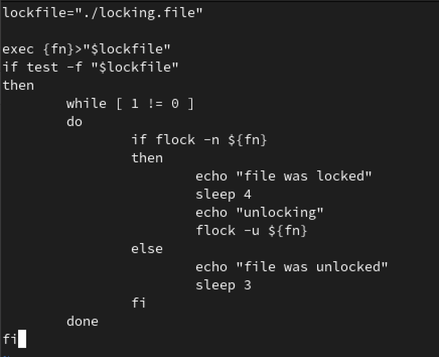
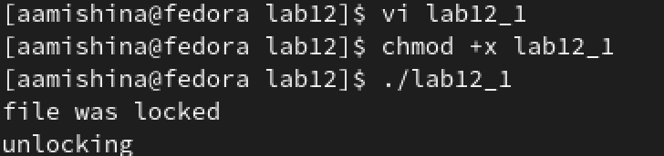
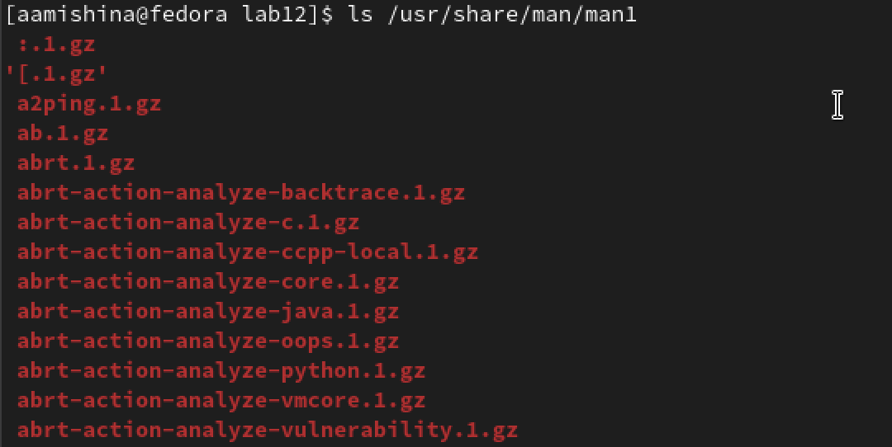
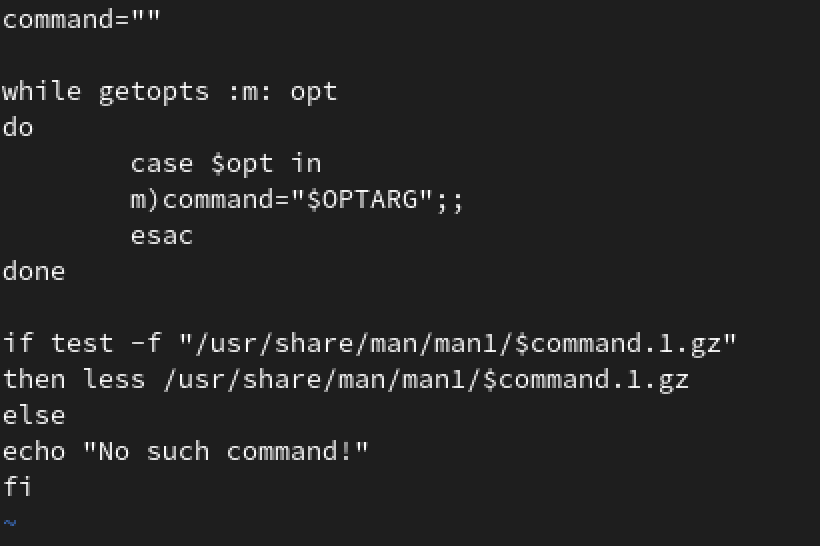
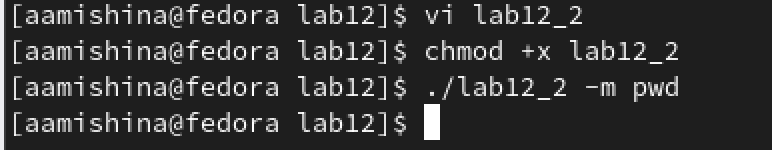
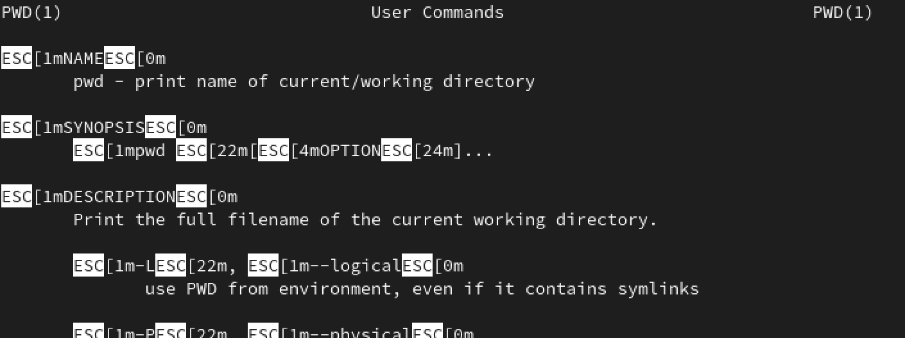
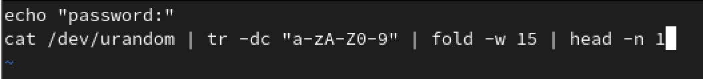
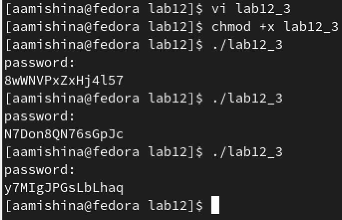

---
## Front matter
lang: ru-RU
title: Лабораторная работа №12
subtitle: Операционные системы
author:
  - Мишина А. А.
date: 24 апреля 2023

## i18n babel
babel-lang: russian
babel-otherlangs: english

## Formatting pdf
toc: false
toc-title: Содержание
slide_level: 2
aspectratio: 169
section-titles: true
theme: metropolis
header-includes:
 - \metroset{progressbar=frametitle,sectionpage=progressbar,numbering=fraction}
 - '\makeatletter'
 - '\beamer@ignorenonframefalse'
 - '\makeatother'
---

## О себе

- Мишина Анастасия Алексеевна
- Группа НПИбд-02-22

## Цели и задачи

- Изучить основы программирования в оболочке ОС UNIX. Научиться писать более
сложные командные файлы с использованием логических управляющих конструкций
и циклов.

# Выполнение лабораторной работы

## Скрипт 1

- Я написала командный файл, реализующий упрощенный механизм семафоров. 

{ width=50% }

## Скрипт 1

{ width=60% }

## Справка

{ width=60% }

## Скрипт 2

{ width=60% }

## Скрипт 2

{ width=60% }

## Скрипт 2

{ width=60% }

## Скрипт 3

- Я написала командный файл, который генерировал случайную последовательность букв латинского алфавита.

{ width=60% }

## Скрипт 3

{ width=60% }

## Вывод

- В ходе выполнения лабораторной работы я изучила основы программирования в оболочке ОС UNIX, а также научилась писать более сложные командные файлы с использованием логических управляющих конструкций и циклов. 
