---
## Front matter
lang: ru-RU
title: Лабораторная работа №13
subtitle: Операционные системы
author:
  - Мишина А. А.
date: 6 мая 2023

## i18n babel
babel-lang: russian
babel-otherlangs: english

## Formatting pdf
toc: false
toc-title: Содержание
slide_level: 2
aspectratio: 169
section-titles: true
theme: metropolis
header-includes:
 - \metroset{progressbar=frametitle,sectionpage=progressbar,numbering=fraction}
 - '\makeatletter'
 - '\beamer@ignorenonframefalse'
 - '\makeatother'
---

## О себе

- Мишина Анастасия Алексеевна
- Группа НПИбд-02-22

## Цели и задачи

- Приобрести простейшие навыки разработки, анализа, тестирования и отладки приложений в ОС типа UNIX/Linux на примере создания на языке программирования
С калькулятора с простейшими функциями.

# Выполнение лабораторной работы

## Создание поддиректории

{ width=70% }

## Создание и заполнение файлов

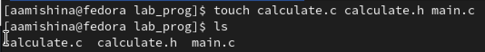{ width=70% }

## Файлы

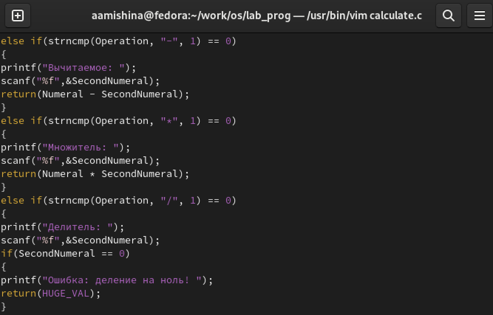{ width=70% }

## Файлы

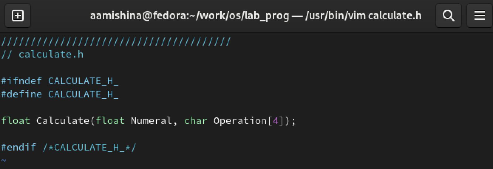{ width=70% }

## Файлы

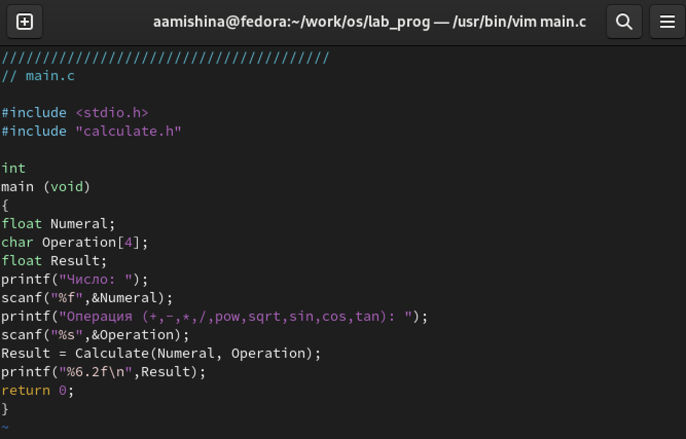{ width=70% }

## Компиляция программы посредством gcc

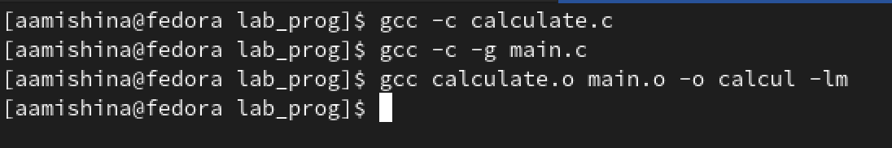{ width=70% }

## Создаю Makefile

- В Makefile указываю компилятор gcc, флаг –g и дополнительные библиотеки –lm. Описываю, какие команды необходимо запустить, чтобы получить файлы calcul, calculate.o и main.o, подключив дополнительные библиотеки и флаги. А в поле clean описывается удаление файлов calcul и файлов, оканчивающихся на “.o”.

## Создаю Makefile

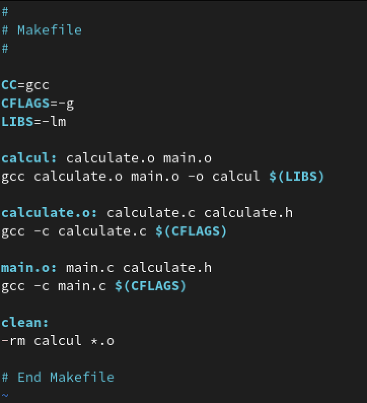{ width=45% }

## Запуск отладчика GDB

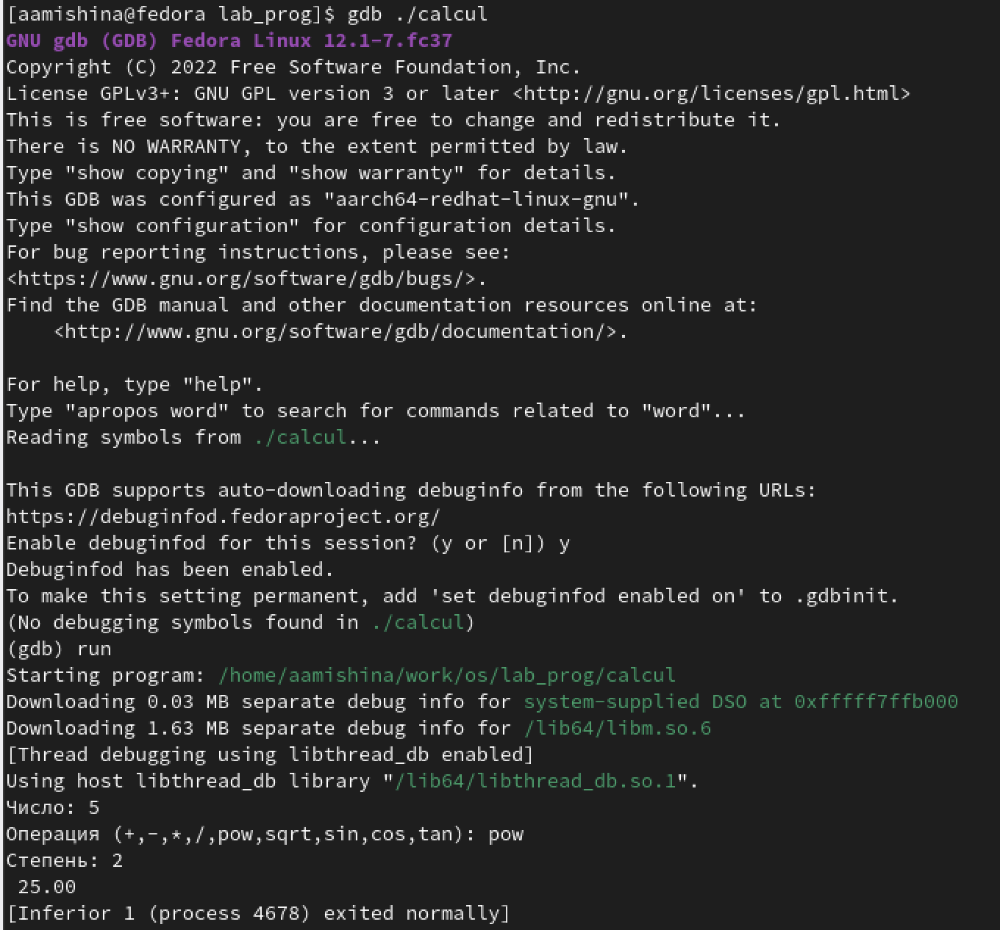{ width=40% }

## Просмотр строк

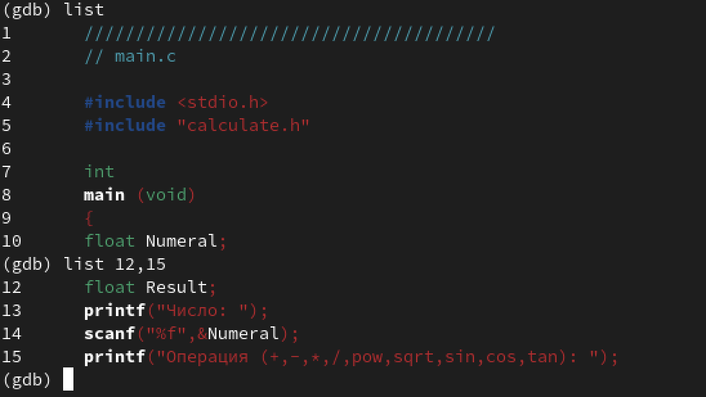{ width=70% }

## Работа с gdb и файлами

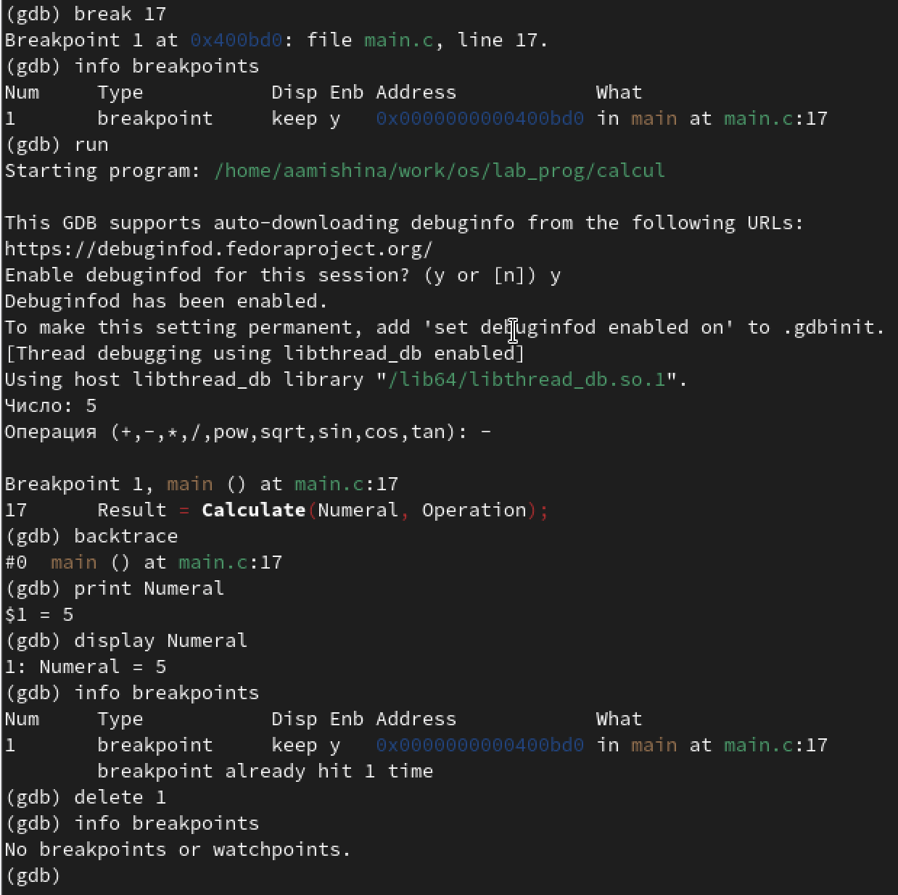{ #fig:010 width=40% }

## Утилита splint

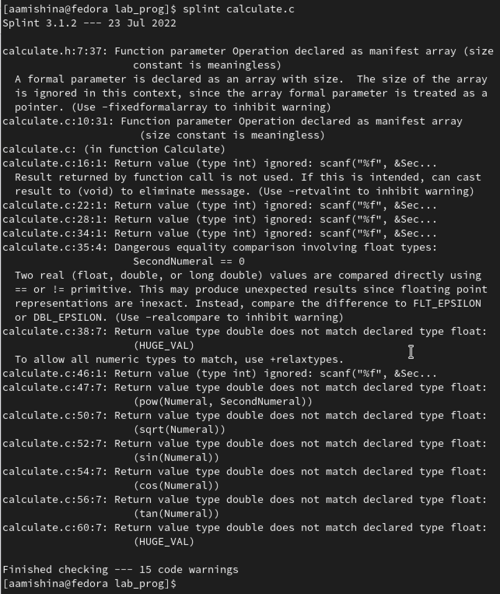{ width=35% }

## Утилита splint

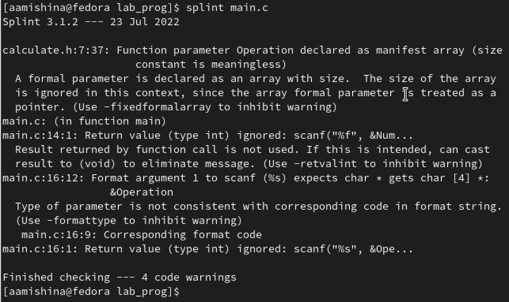{ width=70% }

## Вывод

- В ходе выполнения лабораторной работы я приобрела простейшие навыки разработки, анализа, тестирования и отладки приложений в ОС типа UNIX/Linux на примере создания на языке программирования С калькулятора с простейшими функциями.
