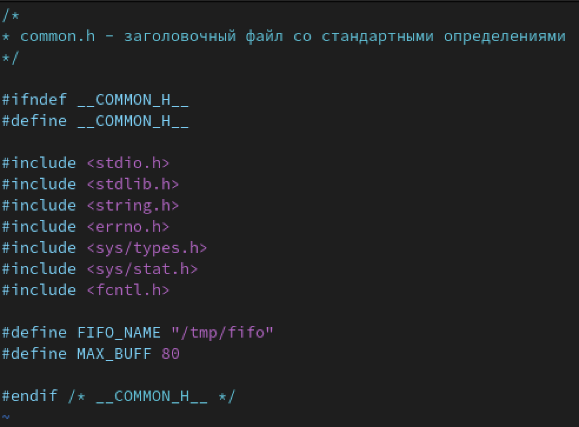
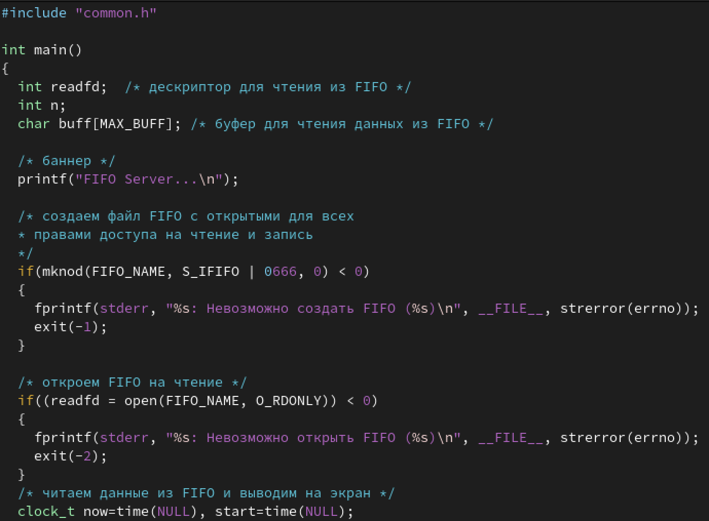
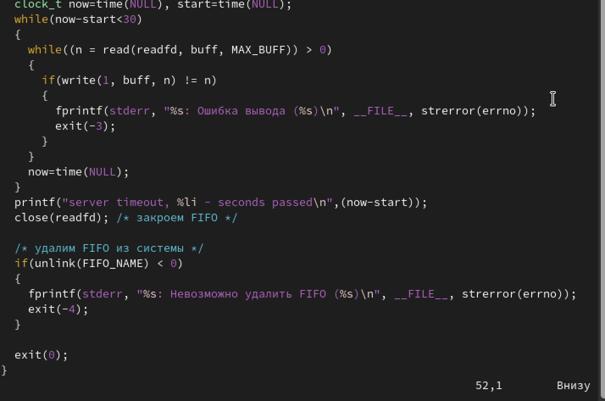
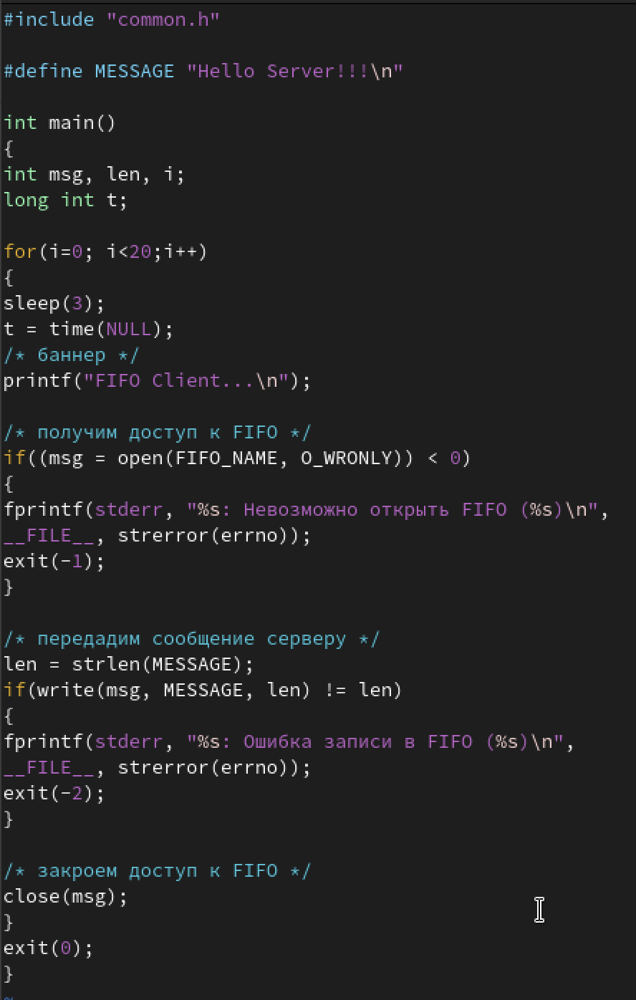
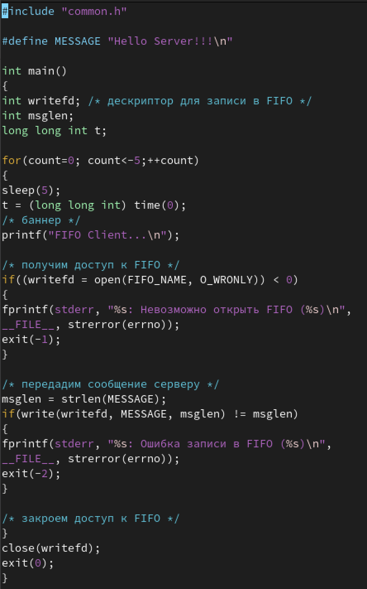
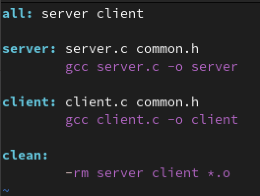
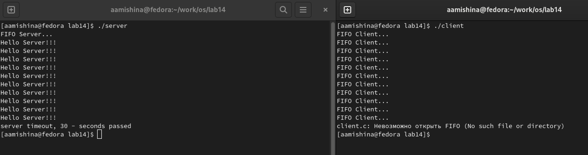

---
## Front matter
lang: ru-RU
title: Лабораторная работа №14
subtitle: Операционные системы
author:
  - Мишина А. А.
date: 11 мая 2023

## i18n babel
babel-lang: russian
babel-otherlangs: english

## Formatting pdf
toc: false
toc-title: Содержание
slide_level: 2
aspectratio: 169
section-titles: true
theme: metropolis
header-includes:
 - \metroset{progressbar=frametitle,sectionpage=progressbar,numbering=fraction}
 - '\makeatletter'
 - '\beamer@ignorenonframefalse'
 - '\makeatother'
---

## О себе

- Мишина Анастасия Алексеевна
- Группа НПИбд-02-22

## Цель

- Приобретение практических навыков работы с именованными каналами

## Задачи

- Изучите приведённые в тексте программы server.c и client.c. Взяв данные примеры за образец, напишите аналогичные программы, внеся следующие изменения:
1. Работает не 1 клиент, а несколько (например, два).
2. Клиенты передают текущее время с некоторой периодичностью (например, раз в пять
секунд). Используйте функцию sleep() для приостановки работы клиента.
3. Сервер работает не бесконечно, а прекращает работу через некоторое время (например, 30 сек). Используйте функцию clock() для определения времени работы сервера. Что будет в случае, если сервер завершит работу, не закрыв канал?

# Выполнение лабораторной работы

## Создание поддиректории и файлов

{ width=90% }

## Файл common.h

{ width=50% }

## Файл server.c

{ width=50% }

## Файл server.c

{ width=50% }

## Файл client.c

{ width=30% }

## Файл client2.c

{ width=30% }

## Makefile

{ width=50% }

## Запуск программы

{ width=90% }

## Вывод

- В ходе выполнения лабораторной работы я приобрела практические навыки в работы с именованными каналами.
