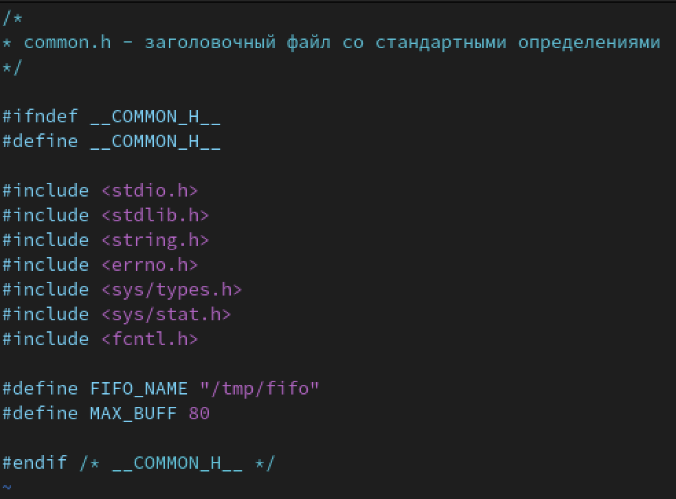
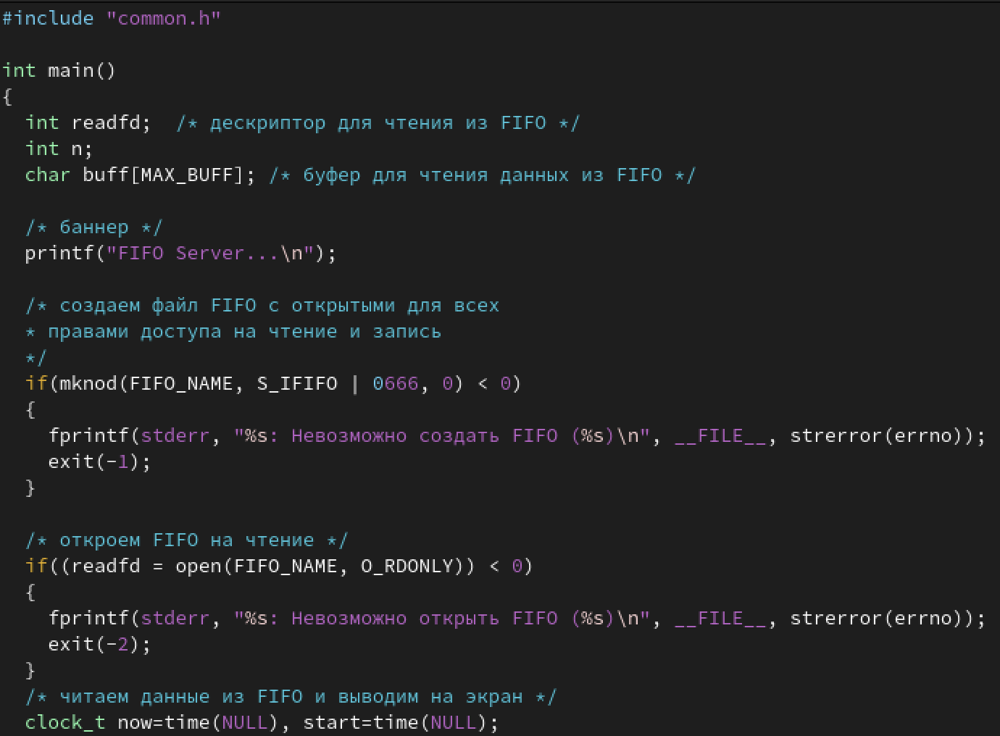
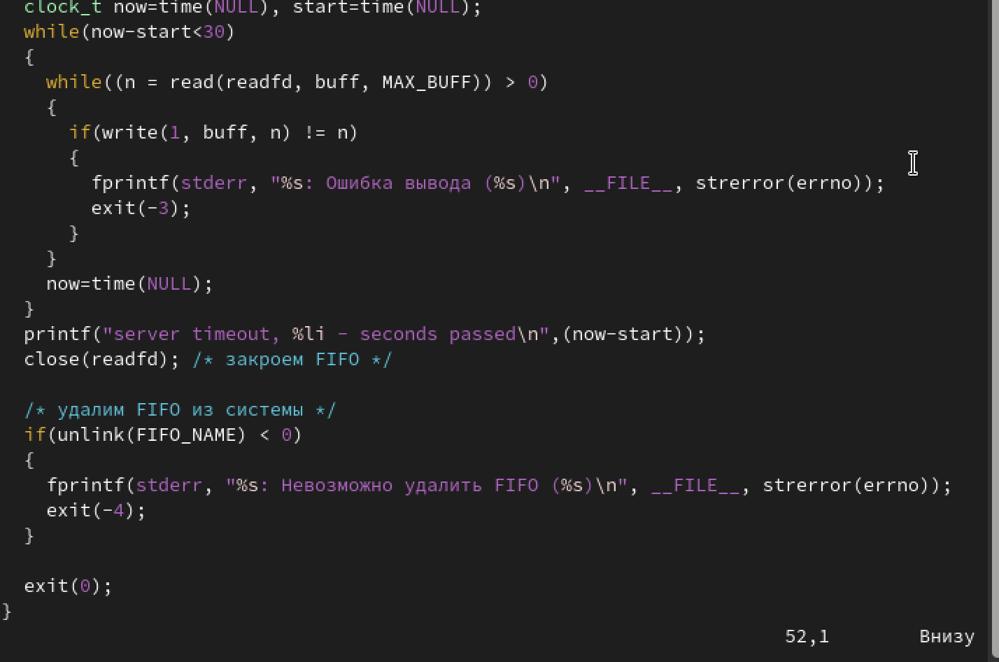
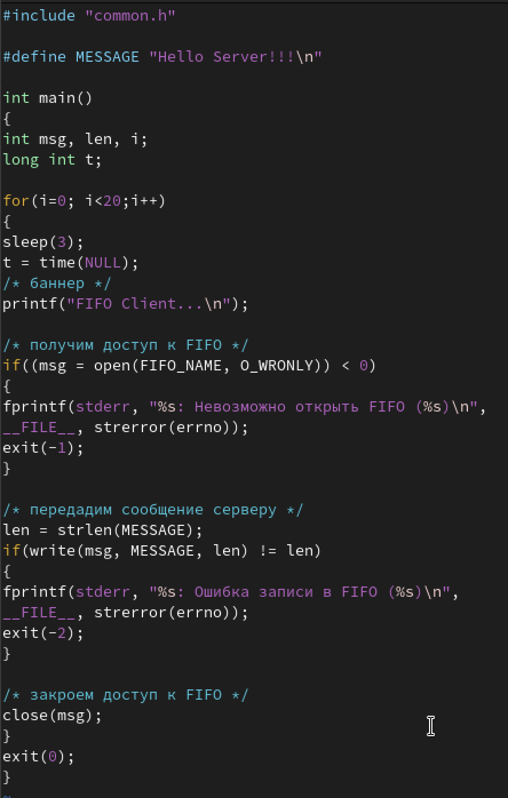
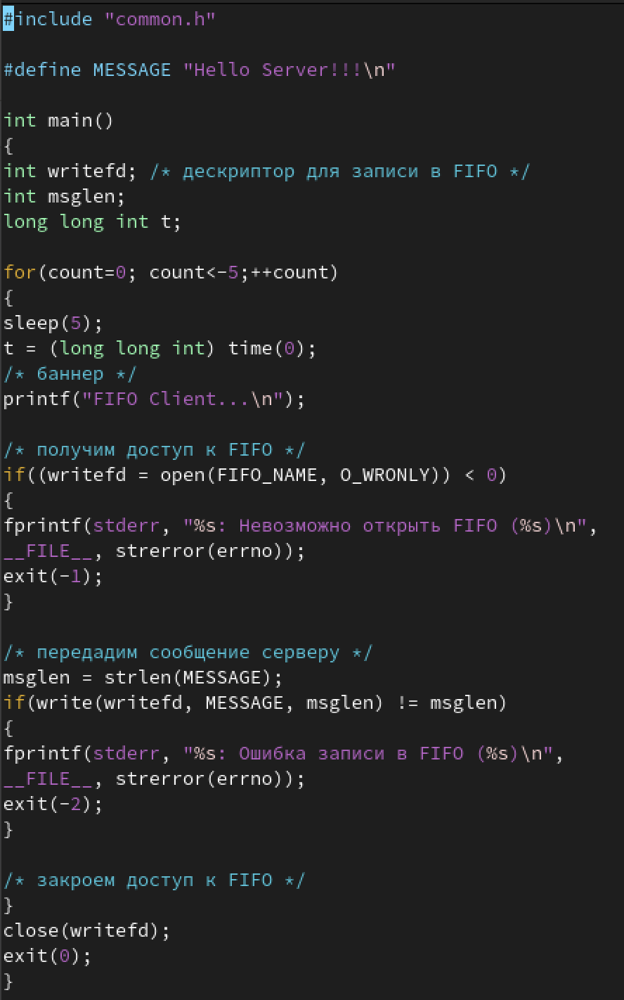
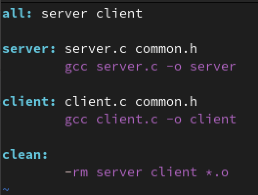
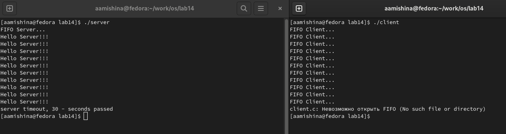

---
## Front matter
title: "Отчёт по лабораторной работе №14"
subtitle: "Дисциплина: Операционные системы"
author: "Мишина Анастасия Алексеевна"

## Generic options
lang: ru-RU
toc-title: "Содержание"

## Bibliography
bibliography: bib/cite.bib
csl: pandoc/csl/gost-r-7-0-5-2008-numeric.csl

## Pdf output format
toc: true # Table of contents
toc-depth: 2
lof: true # List of figures
lot: true # List of tables
fontsize: 14pt
linestretch: 1.5
papersize: a4
documentclass: scrreprt
## I18n polyglossia
polyglossia-lang:
  name: russian
  options:
	- spelling=modern
	- babelshorthands=true
polyglossia-otherlangs:
  name: english
## I18n babel
babel-lang: russian
babel-otherlangs: english
## Fonts
mainfont: PT Serif
romanfont: PT Serif
sansfont: PT Sans
monofont: PT Mono
mainfontoptions: Ligatures=TeX
romanfontoptions: Ligatures=TeX
sansfontoptions: Ligatures=TeX,Scale=MatchLowercase
monofontoptions: Scale=MatchLowercase,Scale=0.9
## Biblatex
biblatex: true
biblio-style: "gost-numeric"
biblatexoptions:
  - parentracker=true
  - backend=biber
  - hyperref=auto
  - language=auto
  - autolang=other*
  - citestyle=gost-numeric
## Pandoc-crossref LaTeX customization
figureTitle: "Рис."
tableTitle: "Таблица"
listingTitle: "Листинг"
lofTitle: "Список иллюстраций"
lotTitle: "Список таблиц"
lolTitle: "Листинги"
## Misc options
indent: true
header-includes:
  - \usepackage{indentfirst}
  - \usepackage{float} # keep figures where there are in the text
  - \floatplacement{figure}{H} # keep figures where there are in the text
---

# Цель работы

Приобретение практических навыков работы с именованными каналами

# Задание

Изучите приведённые в тексте программы server.c и client.c. Взяв данные примеры за образец, напишите аналогичные программы, внеся следующие изменения:

1. Работает не 1 клиент, а несколько (например, два).

2. Клиенты передают текущее время с некоторой периодичностью (например, раз в пять
секунд). Используйте функцию sleep() для приостановки работы клиента.

3. Сервер работает не бесконечно, а прекращает работу через некоторое время (например, 30 сек). Используйте функцию clock() для определения времени работы сервера. Что будет в случае, если сервер завершит работу, не закрыв канал?

# Теоретическое введение

Одним из видов взаимодействия между процессами в операционных системах является обмен сообщениями. Под сообщением понимается последовательность байтов, передаваемая от одного процесса другому.

В операционных системах типа UNIX есть 3 вида межпроцессорных взаимодействий:
общеюниксные (именованные каналы, сигналы), System V Interface Definition (SVID — разделяемая память, очередь сообщений, семафоры) и BSD (сокеты).

Для передачи данных между неродственными процессами можно использовать механизм именованных каналов (named pipes). Данные передаются по принципу FIFO (First In First Out) (первым записан — первым прочитан), поэтому они называются также FIFO
pipes или просто FIFO. Именованные каналы отличаются от неименованных наличием идентификатора канала, который представлен как специальный файл (соответственно имя именованного канала — это имя файла). Поскольку файл находится на локальной файловой системе, данное IPC используется внутри одной системы.

# Выполнение лабораторной работы

Создаю поддиректорию ~/work/os/lab14, в ней создаю и заполняю файлы common.h, service.c, client.c, client2.c (рис. [-@fig:001]):

{ #fig:001 width=70% }

Содержимое заголовочного файла common.h заполняю согласно описанию лабораторной работы (рис. [-@fig:002]):

{ #fig:002 width=70% }

Заполняю файл server.c, реализующий сервер. Использую функцию clock для определения времени работы сервера. Сервер работает не бесконечно, а прекращает работу через некоторое время, в моем случае, через 30 секунд (рис. [-@fig:003]), (рис. [-@fig:004]):
 
{ #fig:003 width=70% }

{ #fig:004 width=70% }

Заполняю файлы client.c (рис. [-@fig:005]) и client2.c (рис. [-@fig:006]). Использую функцию sleep для приостановки работы клиента. Клиенты передают текущее время с некоторой периодичностью, в моем случае раз в пять секунд:

{ #fig:005 width=70% }

{ #fig:006 width=70% }

Создаю и заполняю Makefile (рис. [-@fig:007]): 

{ #fig:007 width=70% }

Затем выполняю программу. На одной консоли запускаю программу server, а на другой консоли запускаю программу client (рис. [-@fig:008]). 

{ #fig:008 width=90% }

# Вывод

В ходе выполнения лабораторной работы я приобрела практические навыки в работы с именованными каналами.

# Ответы на контрольные вопросы

1. В чем ключевое отличие именованных каналов от неименованных?

Именованные каналы отличаются от неименованных наличием идентификатора канала, который представлен как специальный файл (соответственно имя именованного канала — это имя файла).

2. Возможно ли создание неименованного канала из командной строки?

Создание неименованного канала из командной строки возможно командой pipe.

3. Возможно ли создание именованного канала из командной строки?

Создание именованного канала из командной строки возможно с помощью mkfifo.

4. Опишите функцию языка С, создающую неименованный канал.

Функция языка С, создающая неименованный канал: int read(int pipe_fd, void *area, int cnt); int write(int pipe_fd, void *area, int cnt); Первый аргумент этих вызовов - дескриптор канала, второй - указатель на область памяти, с которой происходит обмен, третий - количество байт. Оба вызова возвращают число переданных байт (или -1 - при ошибке).

5. Опишите функцию языка С, создающую именованный канал.

Функция языка С, создающая именованный канал: int mkfifo (const char *pathname, mode_t mode); Первый параметр — имя файла, идентифицирующего канал, второй параметр маска прав доступа к файлу. Вызов функции mkfifo() создаёт файл канала (с именем, заданным макросом FIFO_NAME): mkfifo(FIFO_NAME, 0600).

6. Что будет в случае прочтения из fifo меньшего числа байтов, чем находится в канале?
Большего числа байтов?

При чтении меньшего числа байтов, возвращается требуемое число байтов, остаток сохраняется для следующих чтений. 

При чтении большего числа байтов, возвращается доступное число байтов 

7. Аналогично, что будет в случае записи в fifo меньшего числа байтов, чем позволяет
буфер? Большего числа байтов?

Запись числа байтов, меньшего ёмкости канала или FIFO, гарантированно атомарно. Это означает, что в случае, когда несколько процессов одновременно записывают в канал, порции данных от этих процессов не перемешиваются. 

При записи большего числа байтов, чем это позволяет канал или FIFO, вызов write блокируется до освобождения требуемого места.

8. Могут ли два и более процессов читать или записывать в канал?

Два и более процессов могут читать и записывать в канал.

9. Опишите функцию write (тип возвращаемого значения, аргументы и логику работы).

Функция write записывает length байтов из буфера buffer в файл, определенный дескриптором файла fd. Эта операция чисто 'двоичная' и без буферизации. При единице возвращает действительное число байтов. Функция write возвращает число действительно записанных в файл байтов или -1 при ошибке, устанавливая при этом errno.

10. Опишите функцию strerror.

Строковая функция strerror - функция языков C/C++, транслирующая код ошибки, который обычно хранится в глобальной переменной errno, в сообщение об ошибке, понятном человеку.
