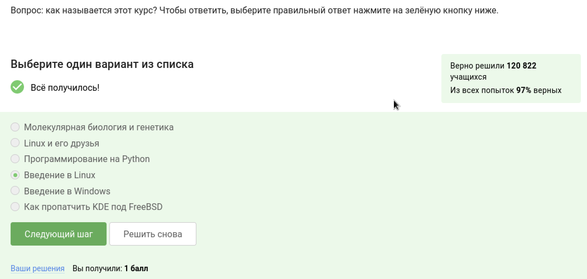
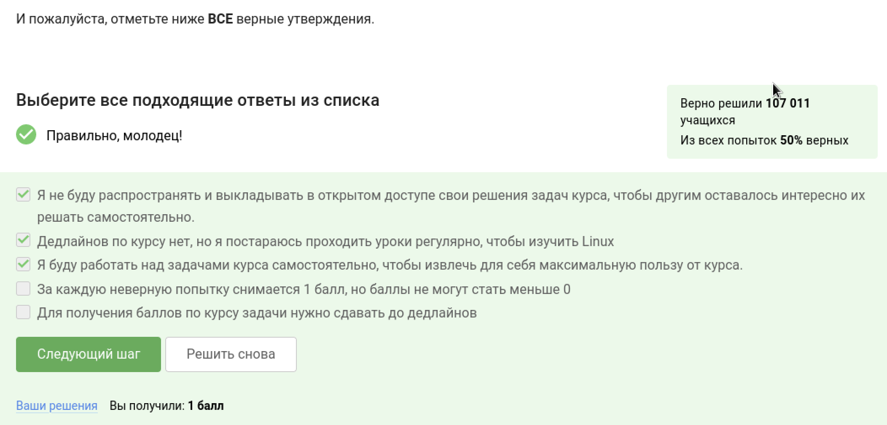
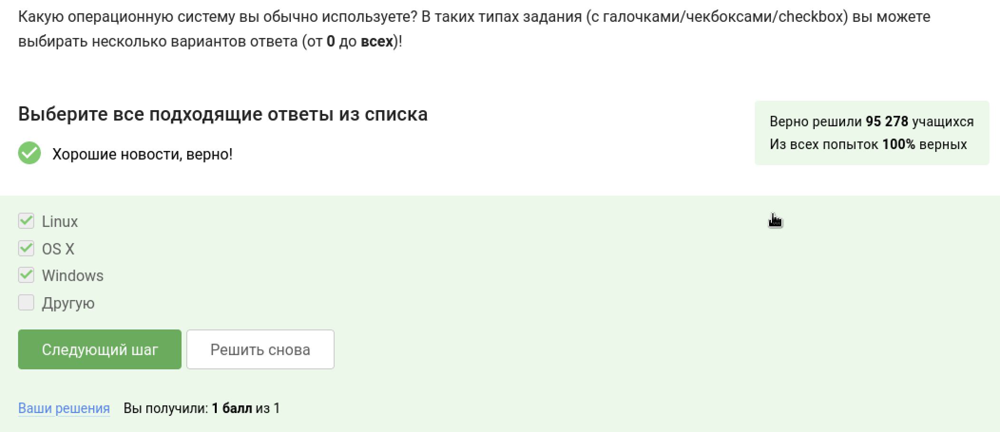
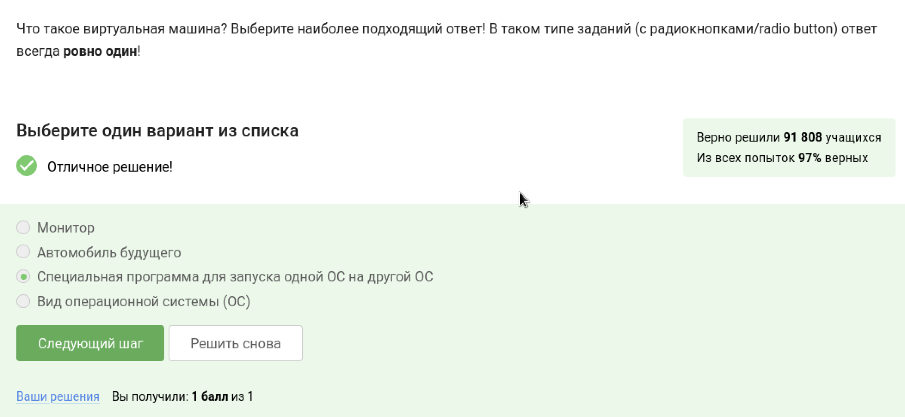
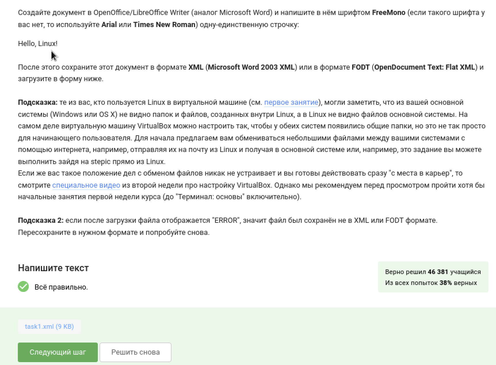
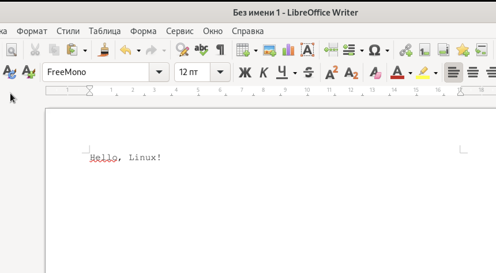
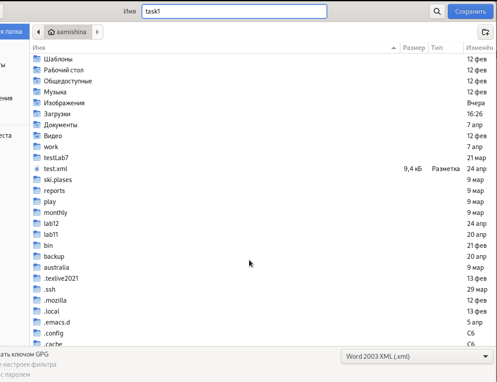

---
## Front matter
title: "Отчёт о прохождении внешнего курса часть 1"
subtitle: "Дисциплина: Операционные системы"
author: "Мишина Анастасия Алексеевна"

## Generic options
lang: ru-RU
toc-title: "Содержание"

## Bibliography
bibliography: bib/cite.bib
csl: pandoc/csl/gost-r-7-0-5-2008-numeric.csl

## Pdf output format
toc: true # Table of contents
toc-depth: 2
lof: true # List of figures
lot: true # List of tables
fontsize: 14pt
linestretch: 1.5
papersize: a4
documentclass: scrreprt
## I18n polyglossia
polyglossia-lang:
  name: russian
  options:
	- spelling=modern
	- babelshorthands=true
polyglossia-otherlangs:
  name: english
## I18n babel
babel-lang: russian
babel-otherlangs: english
## Fonts
mainfont: PT Serif
romanfont: PT Serif
sansfont: PT Sans
monofont: PT Mono
mainfontoptions: Ligatures=TeX
romanfontoptions: Ligatures=TeX
sansfontoptions: Ligatures=TeX,Scale=MatchLowercase
monofontoptions: Scale=MatchLowercase,Scale=0.9
## Biblatex
biblatex: true
biblio-style: "gost-numeric"
biblatexoptions:
  - parentracker=true
  - backend=biber
  - hyperref=auto
  - language=auto
  - autolang=other*
  - citestyle=gost-numeric
## Pandoc-crossref LaTeX customization
figureTitle: "Рис."
tableTitle: "Таблица"
listingTitle: "Листинг"
lofTitle: "Список иллюстраций"
lotTitle: "Список таблиц"
lolTitle: "Листинги"
## Misc options
indent: true
header-includes:
  - \usepackage{indentfirst}
  - \usepackage{float} # keep figures where there are in the text
  - \floatplacement{figure}{H} # keep figures where there are in the text
---

# Цель работы

Приобретение практических навыков работы с операционной системой Линукс. Введение.

# Задание

1.1 Общая информация о курсе
1.2 Как установить Linux
1.3 Осваиваем Linux
1.4 Terminal: основы
1.5 Запуск исполняемых файлов
1.6 Ввод / вывод
1.7 Скачивание файлов из интернета
1.8 Работа с архивами
1.9 Поиск файлов и слов в файлах

# Выполнение лабораторной работы

## Глава 1.1 Общая информация о курсе

Начинаем прохождение курса с решения задания, которое знакомит нас с механикой этого курса. Курс называется введение в Линукс (рис. [-@fig:001])

{ #fig:001 width=70% }

В следующем вопросе изучаем множественный выбор вариантов ответа (рис. [-@fig:002]).

{ #fig:002 width=70% }

## Глава 1.2 как установить Linux

Так как виртуальная машина у меня уже поставлена, я пропускаю видеоролики в этой главе и решаю только тестовые вопросы (рис. [-@fig:003]).
 
{ #fig:003 width=70% }

Согласно определению виртуальной машины выбираем из списка самое близкое. Виртуальная машина - программная и/или аппаратная система, эмулирующая аппаратное обеспечение некоторой платформы и исполняющая программы для target-платформы на host-платформе или виртуализирующая некоторую платформу и создающая на ней среды, изолирующие друг от друга программы и даже операционные системы (рис. [-@fig:004]).

{ #fig:004 width=70% }

Мы смогли запустить Linux на своем компьютере, отвечаем положительно (рис. [-@fig:005]).

{ #fig:005 width=70% }

## Глава 1.3 Осваиваем Linux

Первое задание в этой главе (рис. [-@fig:006]).

{ #fig:006 width=70% }

Для выполнения этого задания откроем LibreOfficeWriter, создадим файл и напишем в нем необходимую строку (рис. [-@fig:007]). Сохраняем файл в формате .xml (рис. [-@fig:008]). Готовый файл прикрепляем к курсу на stepik.

{ #fig:007 width=70% }

{ #fig:008 width=70% }

## Глава 1.4 Terminal: основы

## Глава 1.5 Запуск исполняемых файлов

## Глава 1.6 Ввод / вывод

## Глава 1.7 Скачивание файлов из интернета

## Глава 1.8 Работа с архивами

## Глава 1.9 Поиск файлов и слов в файлах

# Вывод

В ходе выполнения данной части курса я прошла введение в Linux и познакомилась с основной механикой курса. Также мне рассказали о базовых сведениях в работе с этой операционной системой.
