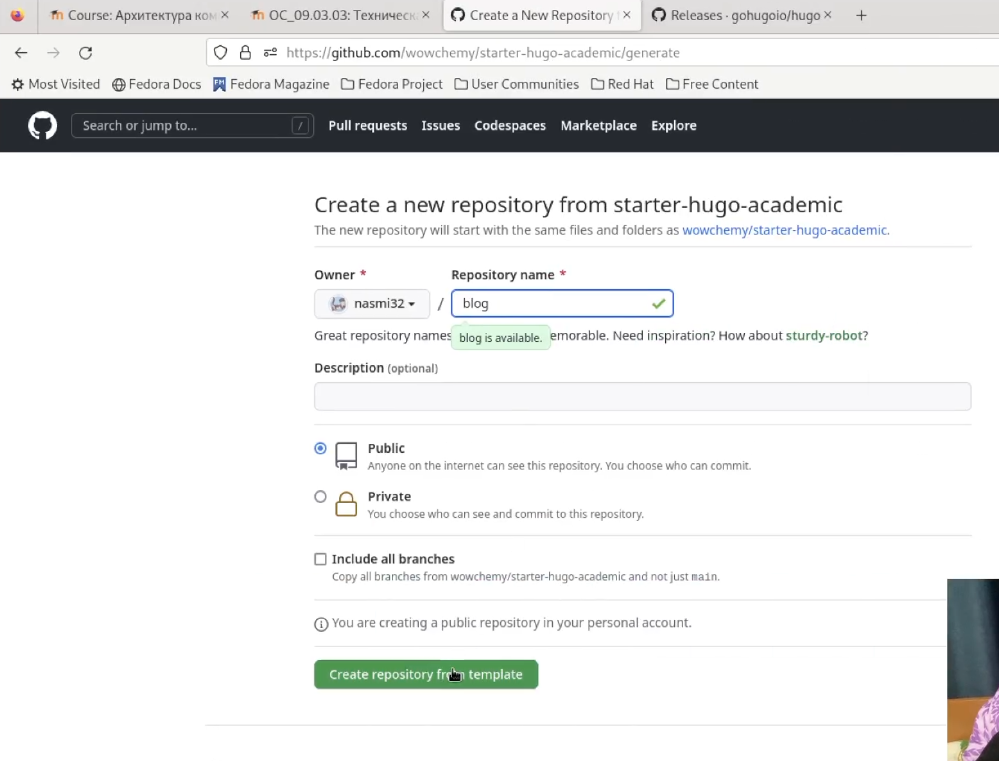
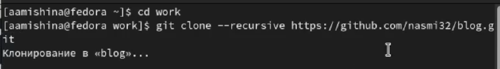
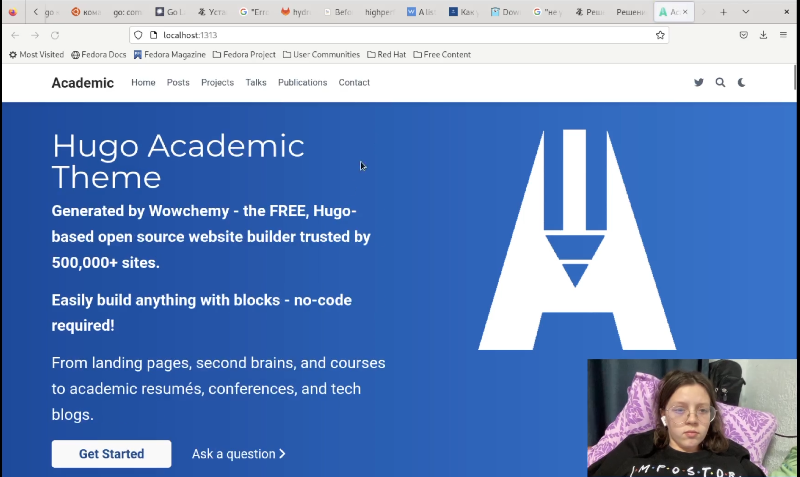
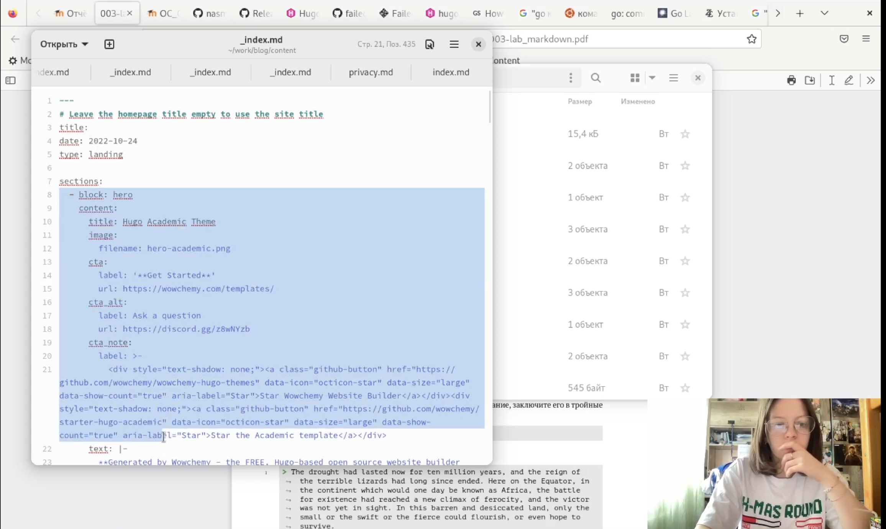
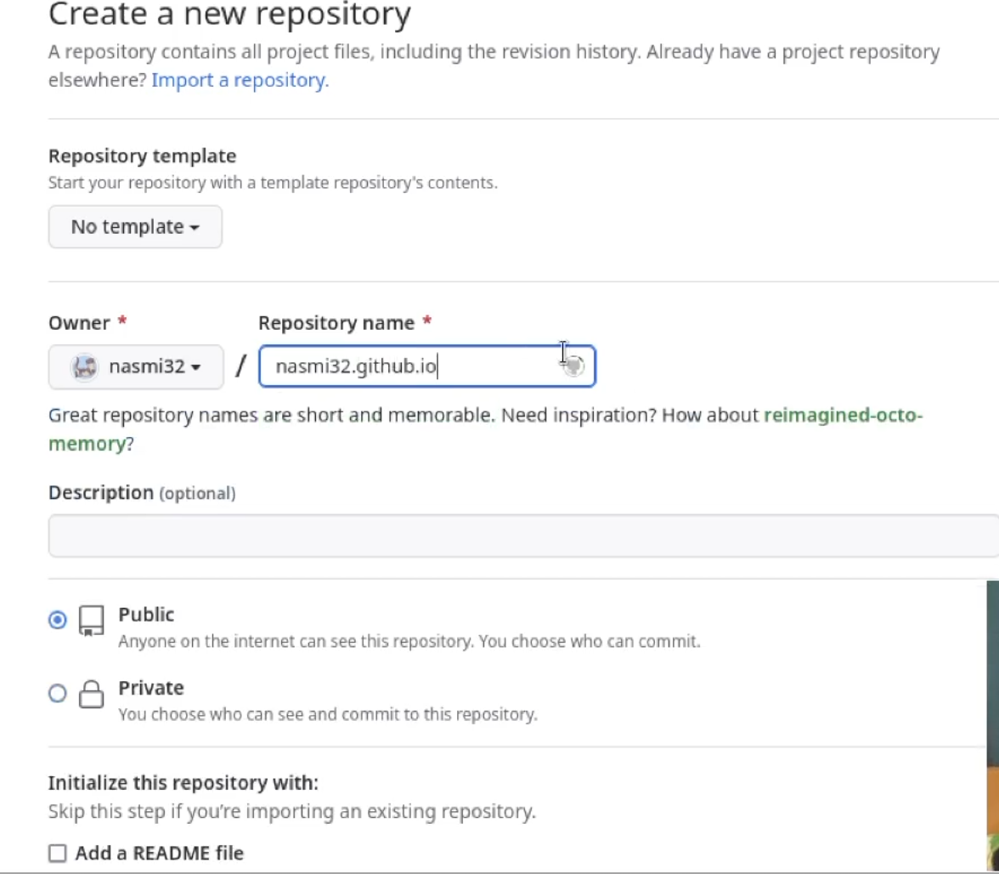
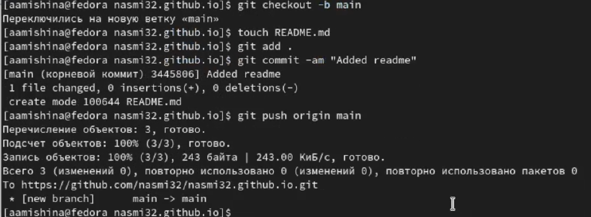
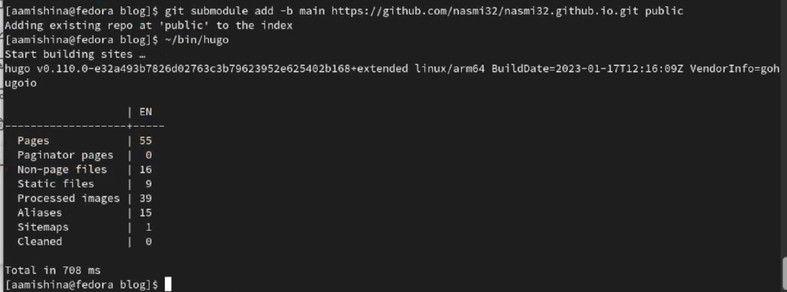
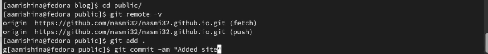

---
## Front matter
lang: ru-RU
title: Индивидуальный проект. Этап №1
subtitle: Размещение на Github pages заготовки для персонального сайта.
author:
  - Мишина А. А.
date: 24 февраля 2023

## i18n babel
babel-lang: russian
babel-otherlangs: english

## Formatting pdf
toc: false
toc-title: Содержание
slide_level: 2
aspectratio: 169
section-titles: true
theme: metropolis
header-includes:
 - \metroset{progressbar=frametitle,sectionpage=progressbar,numbering=fraction}
 - '\makeatletter'
 - '\beamer@ignorenonframefalse'
 - '\makeatother'
---

## О себе

- Мишина Анастасия Алексеевна
- Группа НПИбд-02-22

## Цели и задачи

- Целью данной работы является размещение заготовки сайта на Github pages.

# Выполнение работы

## Копирование шаблона сайта

{width=50% }

## Клонирование репозитория

{width=70% }

## Запуск hugo server

{width=70% }

## Удаление welcome page

{ width=70% }

## Результат

{width=70% }

## Создание репозитория с названием адреса сайта и его клонирование

{width=50% }

## Создаем новую ветку main, добавляем файл README.txt и пушим на гитхаб

{width=70% }

## Убираем public из .gitignore и добавляем submodule в папку public

{width=70% }

## Отправляем файлы на Github

{width=70% }

## Мой сайт

{width=70% }

## Вывод

- В ходе выполнения данной работы я разместила заготовку для персонального сайта на Github pages.
