---
## Front matter
title: "Индивидуальный проект. Этап №1"
subtitle: "Размещение на Github pages заготовки для персонального сайта."
author: "Мишина Анастасия Алексеевна"

## Generic options
lang: ru-RU
toc-title: "Содержание"

## Bibliography
bibliography: bib/cite.bib
csl: pandoc/csl/gost-r-7-0-5-2008-numeric.csl

## Pdf output format
toc: true # Table of contents
toc-depth: 2
lof: true # List of figures
lot: true # List of tables
fontsize: 14pt
linestretch: 1.5
papersize: a4
documentclass: scrreprt
## I18n polyglossia
polyglossia-lang:
  name: russian
  options:
	- spelling=modern
	- babelshorthands=true
polyglossia-otherlangs:
  name: english
## I18n babel
babel-lang: russian
babel-otherlangs: english
## Fonts
mainfont: PT Serif
romanfont: PT Serif
sansfont: PT Sans
monofont: PT Mono
mainfontoptions: Ligatures=TeX
romanfontoptions: Ligatures=TeX
sansfontoptions: Ligatures=TeX,Scale=MatchLowercase
monofontoptions: Scale=MatchLowercase,Scale=0.9
## Biblatex
biblatex: true
biblio-style: "gost-numeric"
biblatexoptions:
  - parentracker=true
  - backend=biber
  - hyperref=auto
  - language=auto
  - autolang=other*
  - citestyle=gost-numeric
## Pandoc-crossref LaTeX customization
figureTitle: "Рис."
tableTitle: "Таблица"
listingTitle: "Листинг"
lofTitle: "Список иллюстраций"
lotTitle: "Список таблиц"
lolTitle: "Листинги"
## Misc options
indent: true
header-includes:
  - \usepackage{indentfirst}
  - \usepackage{float} # keep figures where there are in the text
  - \floatplacement{figure}{H} # keep figures where there are in the text
---

# Цель работы

Целью данной работы является размещение заготовки сайта на Github pages.

# Выполнение лабораторной работы

Для начала требовалось скачать hugo (рис. [-@fig:001]).

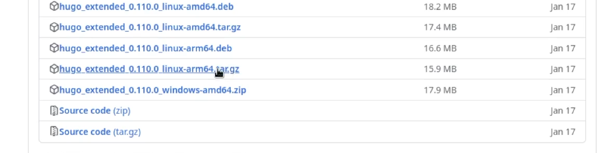{ #fig:001 width=90% }

Затем было необходимо скопировать шаблон сайта на репозиторий GitHub (рис. [-@fig:002]) и клонировать этот репозиторий в локальную папку Blog (рис. [-@fig:003]).

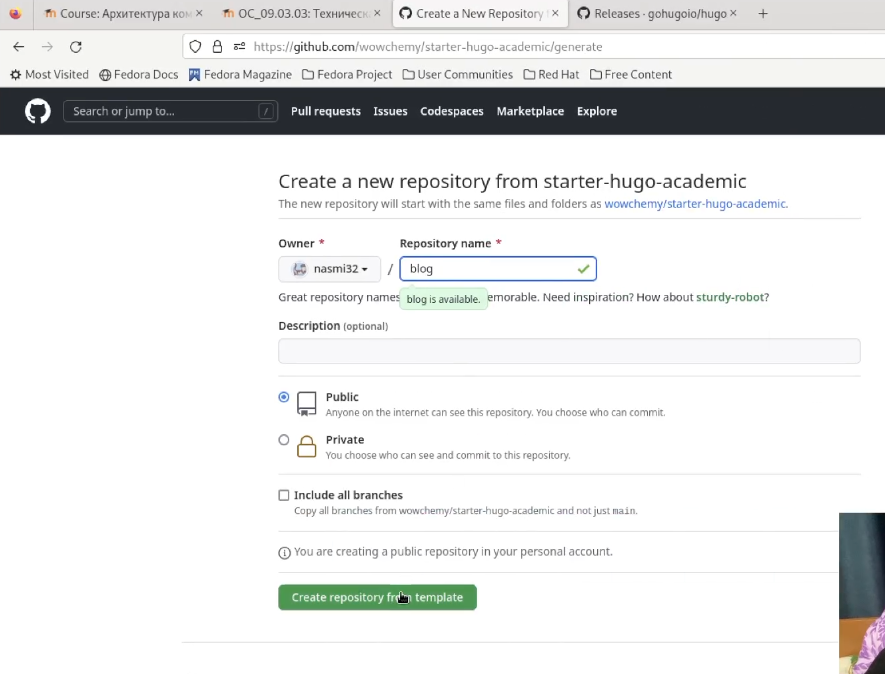{ #fig:002 width=90% }

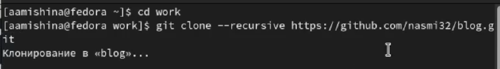{ #fig:003 width=90% }

Запускаем hugo (рис. [-@fig:004]), удаляем папку public (рис. [-@fig:005]) и запускаем hugo server (рис. [-@fig:006]).

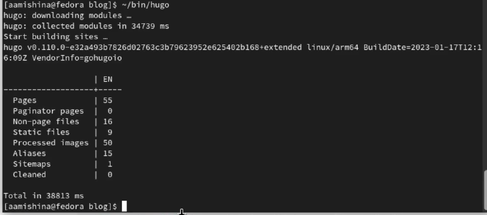{ #fig:004 width=90% }

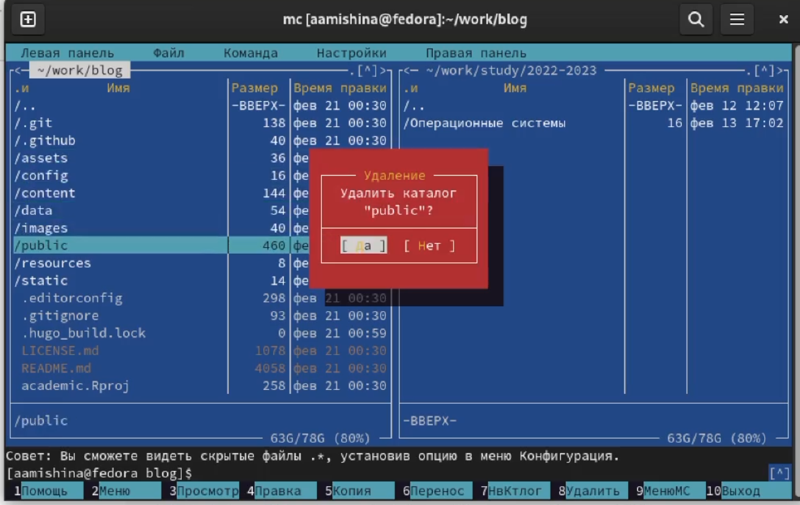{ #fig:005 width=90% }

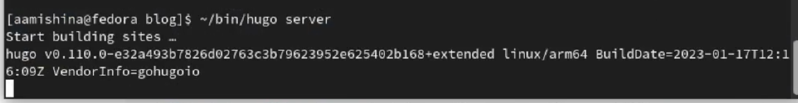{ #fig:006 width=90% }

Переходим по локальной ссылке (рис. [-@fig:007]).

{ #fig:007 width=90% }

Затем удаляем welcome page. Для этого заходим в файл _index.md и удаляем часть "block: hero" (рис. [-@fig:008]). Смотрим на результат (рис. [-@fig:009]).

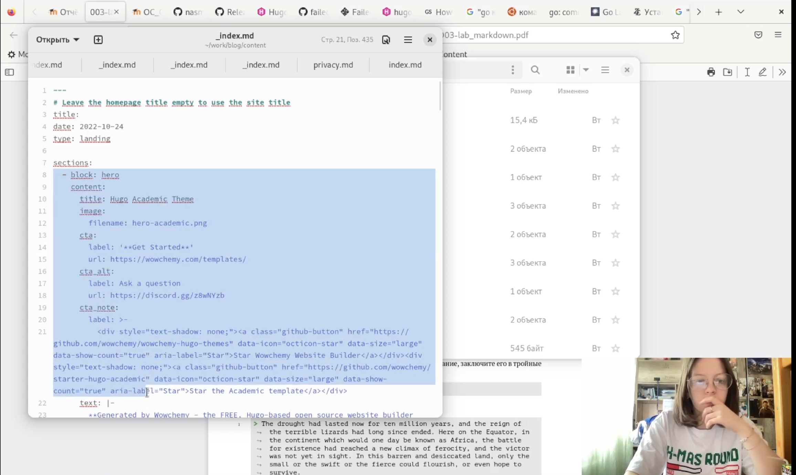{ #fig:008 width=90% }

{ #fig:009 width=90% }

Создаем новый репозиторий с названием адреса сайта (рис. [-@fig:010]) и клонируем его в локальную папку (рис. [-@fig:011]).

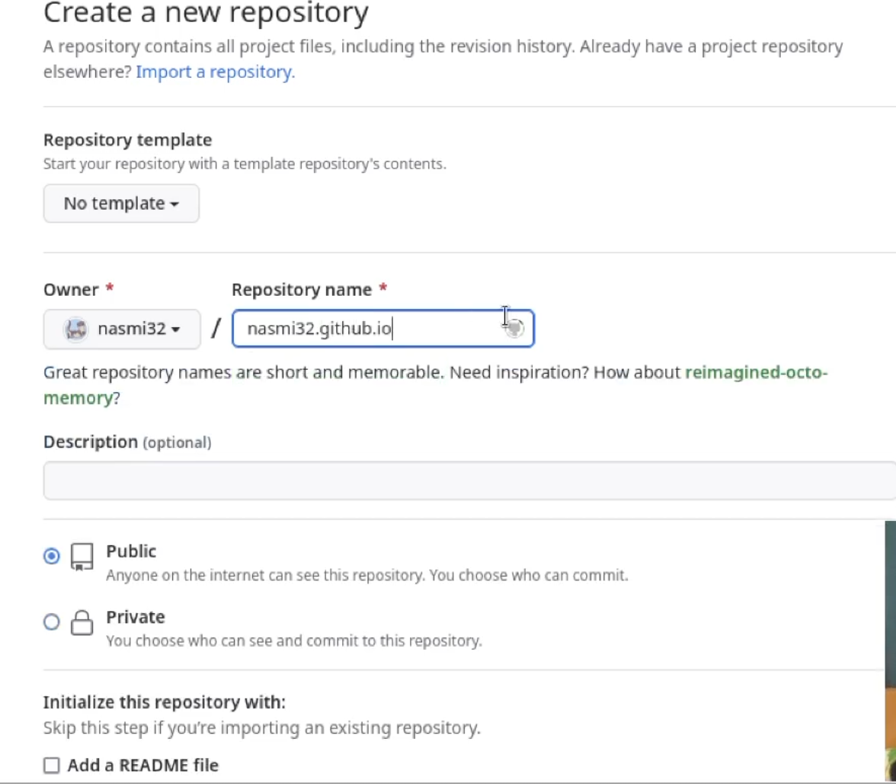{ #fig:010 width=90% }

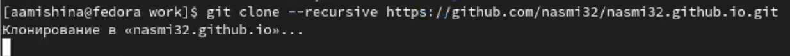{ #fig:011 width=90% }

Создаем новую ветку main, добавляем файл README.txt и пушим на гитхаб (рис. [-@fig:012]).

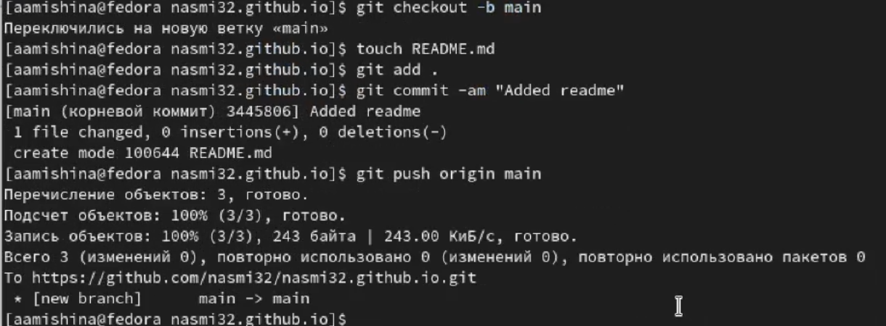{ #fig:012 width=90% }

Переходим в blog. Убираем public из .gitignore (рис. [-@fig:013]) и добавляем submodule в папку public (рис. [-@fig:014]).

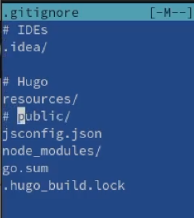{ #fig:013 width=90% }

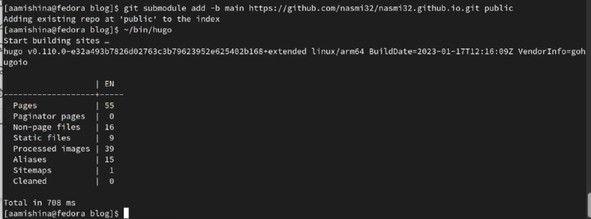{ #fig:014 width=90% }

Переходим в public и отправляем все новые файлы на GitHub (рис. [-@fig:015]).

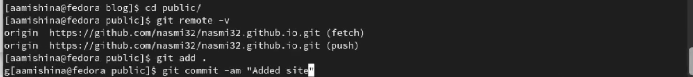{ #fig:015 width=90% }

После всего этого переходим на наш сайт (рис. [-@fig:016]).

{ #fig:016 width=90% }

# Выводы

В ходе выполнения данной работы я разместила заготовку для персонального сайта на Github pages.
