---
## Front matter
lang: ru-RU
title: Индивидуальный проект. Этап №2
subtitle: Добавление к сайту данных о себе.
author:
  - Мишина А. А.
date: 14 марта 2023

## i18n babel
babel-lang: russian
babel-otherlangs: english

## Formatting pdf
toc: false
toc-title: Содержание
slide_level: 2
aspectratio: 169
section-titles: true
theme: metropolis
header-includes:
 - \metroset{progressbar=frametitle,sectionpage=progressbar,numbering=fraction}
 - '\makeatletter'
 - '\beamer@ignorenonframefalse'
 - '\makeatother'
---

## О себе

- Мишина Анастасия Алексеевна
- Группа НПИбд-02-22

## Цели и задачи

- Целью данной работы являются размещение на сайте данных о себе и создание постов.

# Выполнение работы

## Смена фотографии на странице сайта

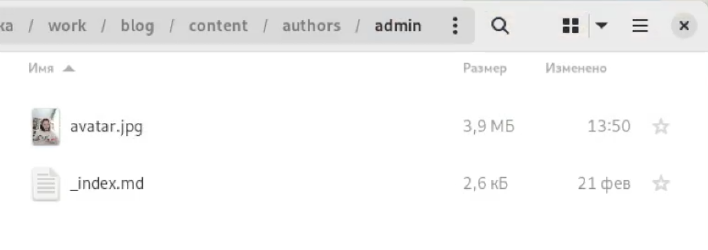{width=70% }

## Смена информации о себе

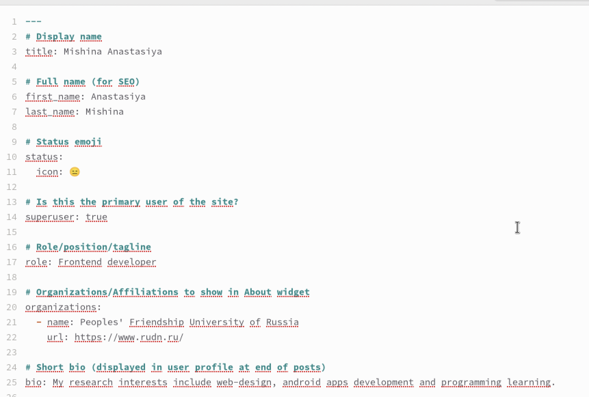{width=60% }

## Смена информации о себе

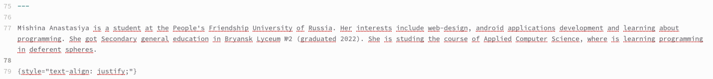{width=90% }

## Интересы и образование

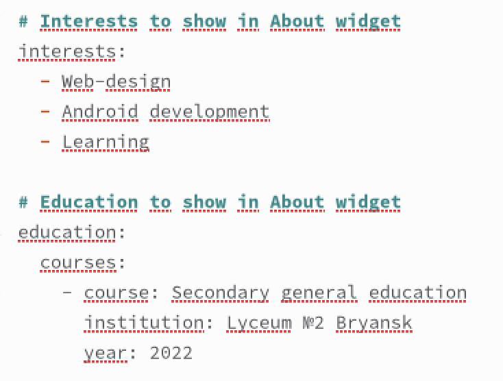{width=60% }

## Создание поста о прошедшей неделе

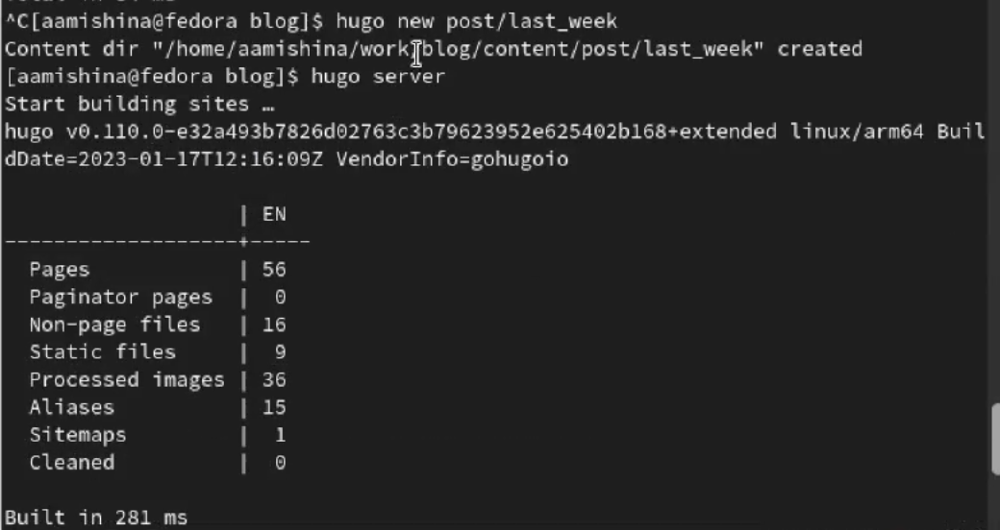{width=60% }

## Создание поста о прошедшей неделе

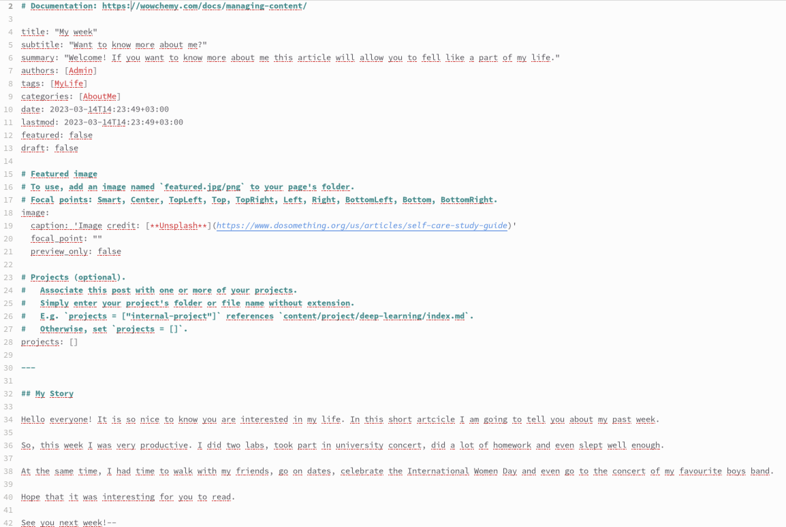{width=70% }

## Создание поста о Git

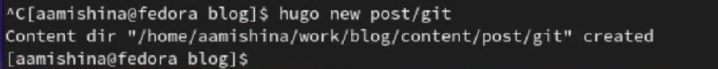{width=60% }

## Создание поста о Git

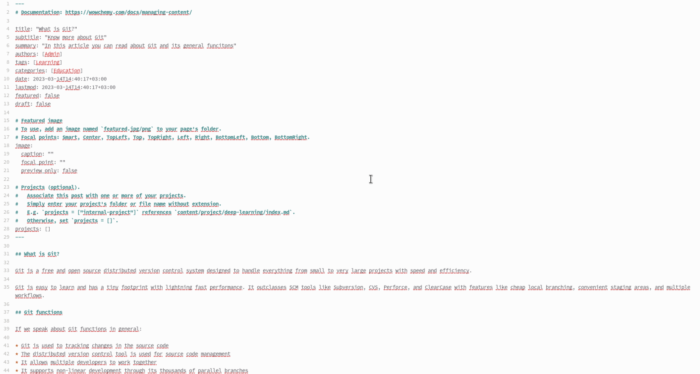{width=70% }

## Мой сайт

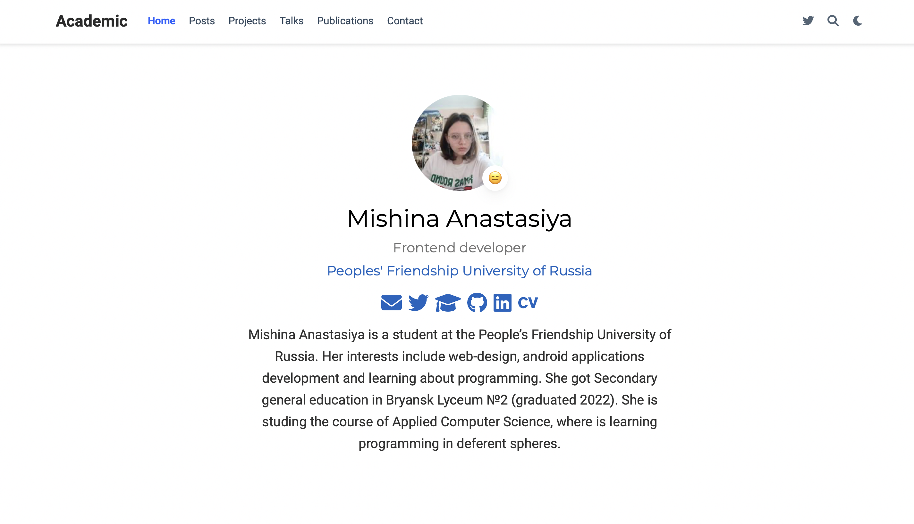{width=70% }

## Мой сайт

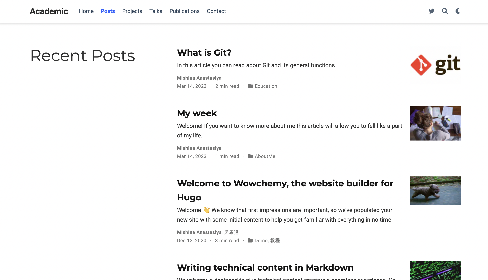{width=70% }

## Мой сайт

{width=70% }

## Мой сайт

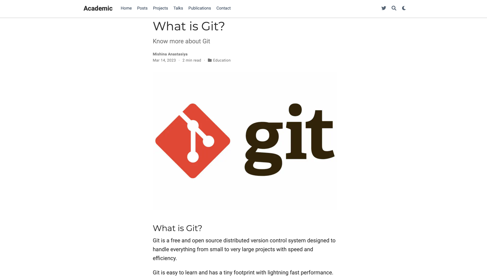{width=70% }

## Вывод

- В ходе выполнения данной работы я разместила на сайте свою биографию, фотографию, создала два поста о своей прошлой неделе и о гите.
