---
## Front matter
title: "Индивидуальный проект. Этап №2"
subtitle: "Добавление к сайту данных о себе."
author: "Мишина Анастасия Алексеевна"

## Generic options
lang: ru-RU
toc-title: "Содержание"

## Bibliography
bibliography: bib/cite.bib
csl: pandoc/csl/gost-r-7-0-5-2008-numeric.csl

## Pdf output format
toc: true # Table of contents
toc-depth: 2
lof: true # List of figures
lot: true # List of tables
fontsize: 14pt
linestretch: 1.5
papersize: a4
documentclass: scrreprt
## I18n polyglossia
polyglossia-lang:
  name: russian
  options:
	- spelling=modern
	- babelshorthands=true
polyglossia-otherlangs:
  name: english
## I18n babel
babel-lang: russian
babel-otherlangs: english
## Fonts
mainfont: PT Serif
romanfont: PT Serif
sansfont: PT Sans
monofont: PT Mono
mainfontoptions: Ligatures=TeX
romanfontoptions: Ligatures=TeX
sansfontoptions: Ligatures=TeX,Scale=MatchLowercase
monofontoptions: Scale=MatchLowercase,Scale=0.9
## Biblatex
biblatex: true
biblio-style: "gost-numeric"
biblatexoptions:
  - parentracker=true
  - backend=biber
  - hyperref=auto
  - language=auto
  - autolang=other*
  - citestyle=gost-numeric
## Pandoc-crossref LaTeX customization
figureTitle: "Рис."
tableTitle: "Таблица"
listingTitle: "Листинг"
lofTitle: "Список иллюстраций"
lotTitle: "Список таблиц"
lolTitle: "Листинги"
## Misc options
indent: true
header-includes:
  - \usepackage{indentfirst}
  - \usepackage{float} # keep figures where there are in the text
  - \floatplacement{figure}{H} # keep figures where there are in the text
---

# Цель работы

Целью данной работы являются размещение на сайте данных о себе и создание постов.

# Выполнение лабораторной работы

Для начала требовалось поменять фотографию на странице сайта. Для этого помещаем свою фотографию в папку admin и называем ее avatar.jpg (рис. [-@fig:001]).

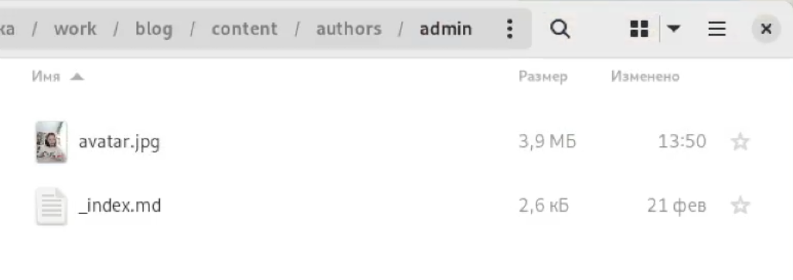{ #fig:001 width=90% }

Меняем информацию о себе. Вписываем свое имя, краткую характеристику (рис. [-@fig:002]) и биографию (рис. [-@fig:003]).

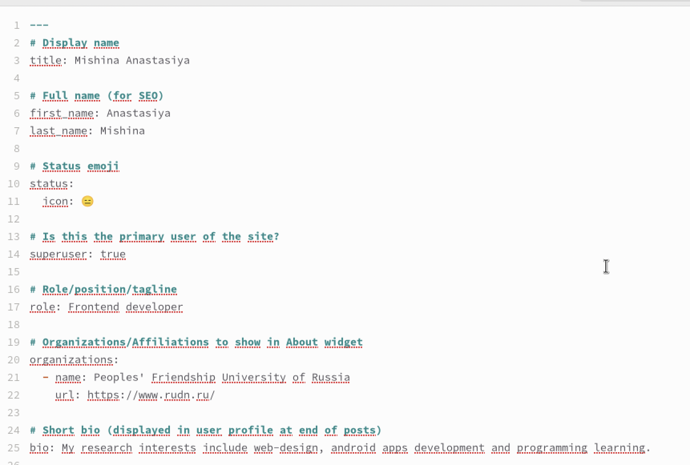{ #fig:002 width=90% }

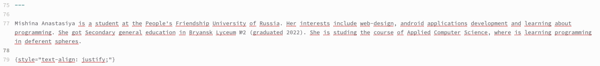{ #fig:003 width=90% }

Описываем по заданию свои интересы и полученное образование (рис. [-@fig:004]).

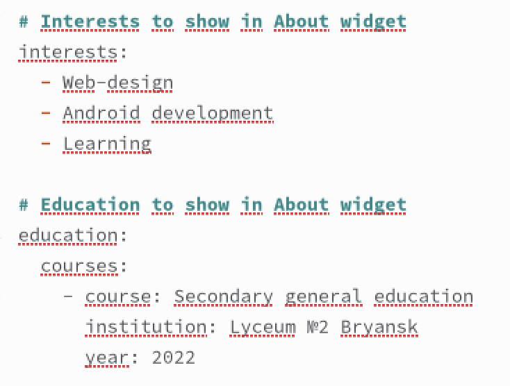{ #fig:004 width=90% }

Далее требовалось создать два поста. Первый пост был о своей прошедшей неделе. Переходим в терминал и создаем новую папку с постом last_week (рис. [-@fig:005]). Затем уже в новой папке открываем md файл и пишем о своей прошедшей неделе. Помимо текста добавляем картинку, кладем ее в папку нашего поста, называем featured.jpg (рис. [-@fig:006]).

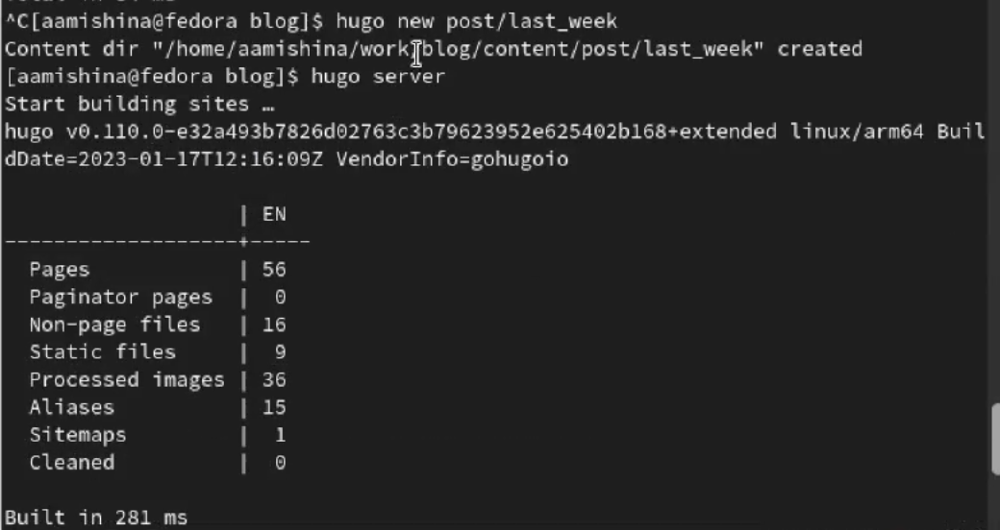{ #fig:005 width=90% }

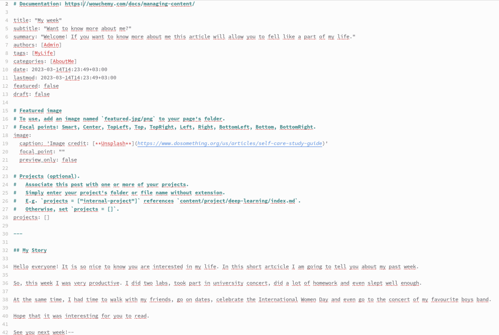{ #fig:006 width=90% }

Аналогично создаем второй пост. Я выбрала написать пост про систему контроля версий git (рис. [-@fig:007]), (рис. [-@fig:008]).

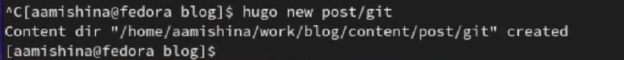{ #fig:007 width=90% }

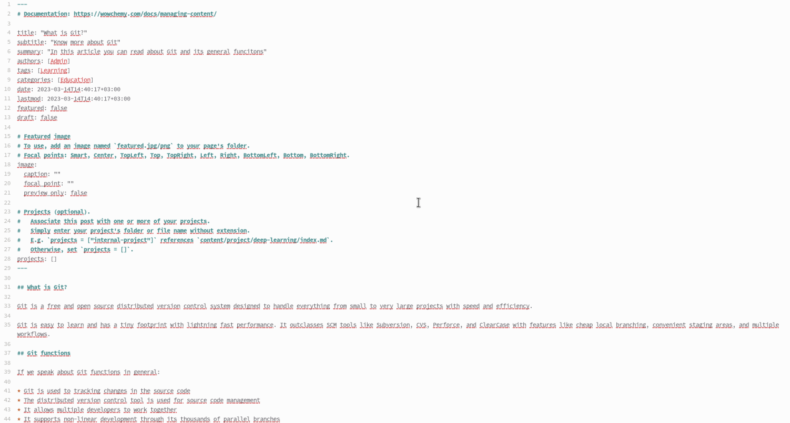{ #fig:008 width=90% }

Итак, вот такой сайт у нас получился за второй этап индивидуального проекта.

Мои фотография и биография (рис. [-@fig:009]). При создании сайта мы использовали новый шаблон, где уже не показываются интересы и образование на главной странице. Чтобы это исправить я указала данную информацию в своей биографии.

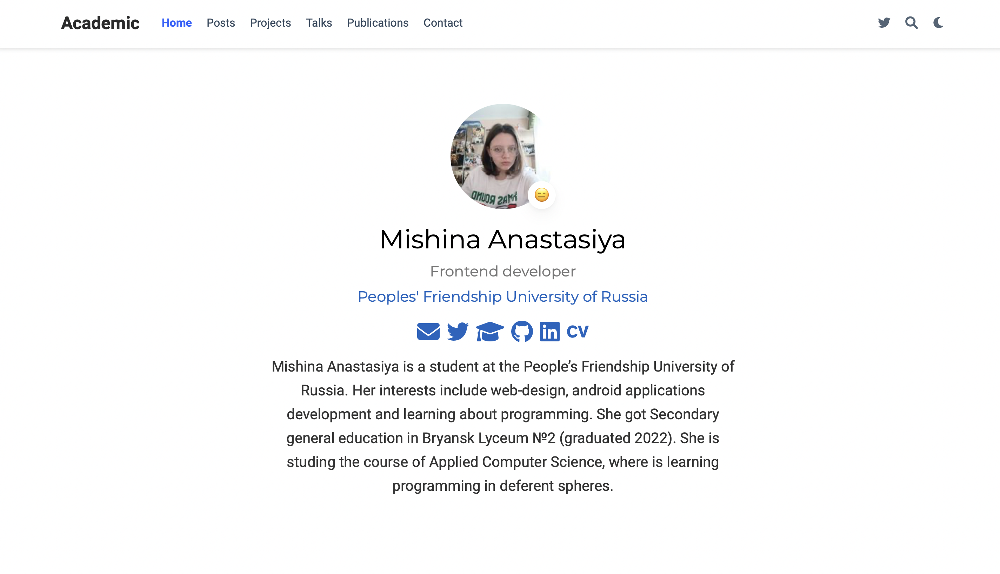{ #fig:009 width=90% }

"Внешний" вид постов на главной странице сайта (рис. [-@fig:010]).

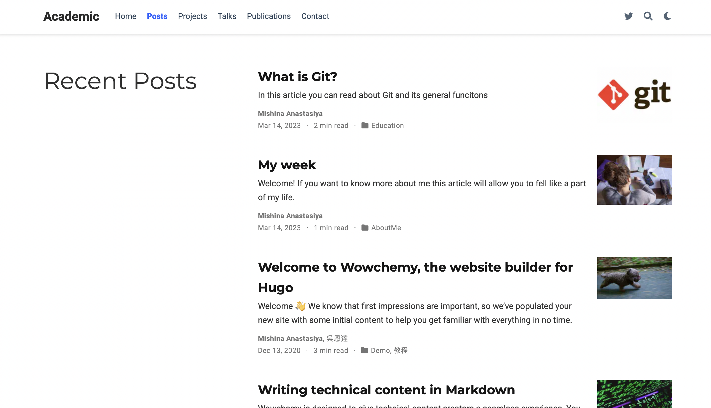{ #fig:010 width=90% }

Пост про прошедшую неделю (рис. [-@fig:011]).

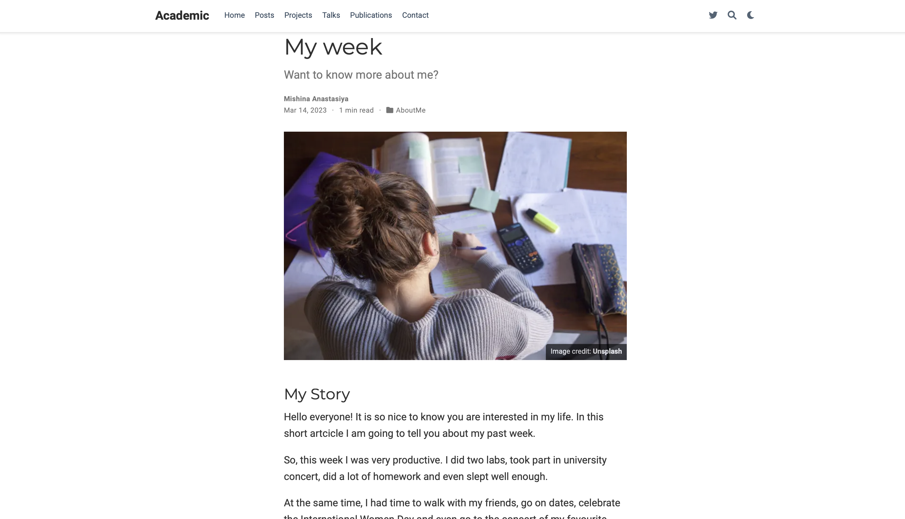{ #fig:011 width=90% }

Пост про Git (рис. [-@fig:012]).

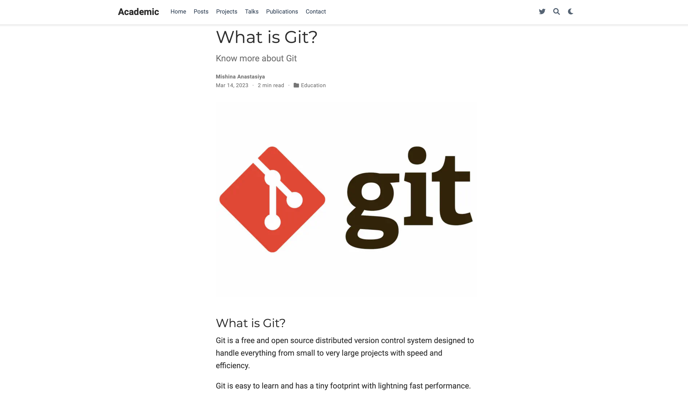{ #fig:012 width=90% }

# Выводы

В ходе выполнения данной работы я разместила на сайте свою биографию, фотографию, создала два поста о своей прошлой неделе и о гите.
