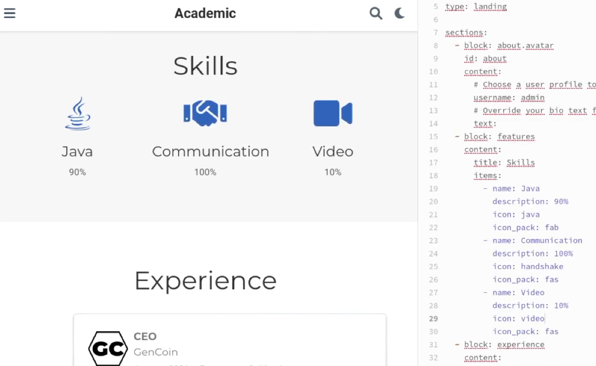
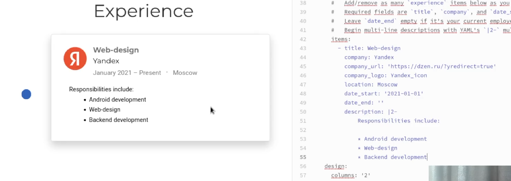
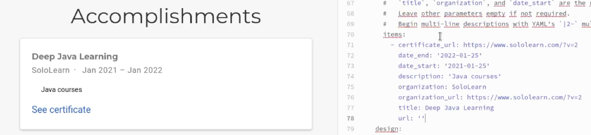
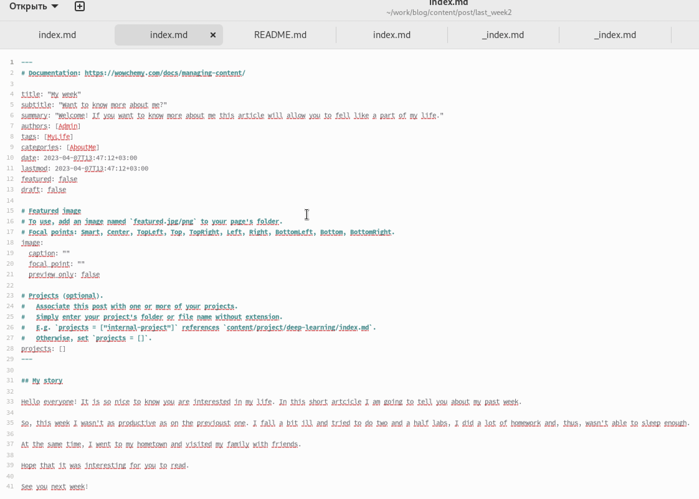
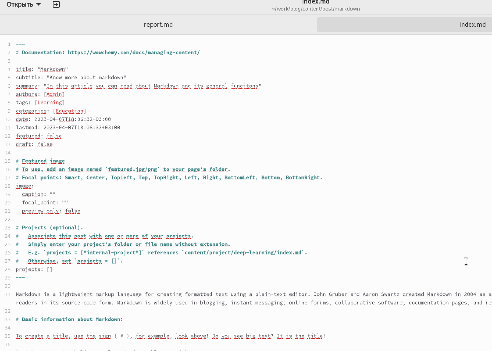
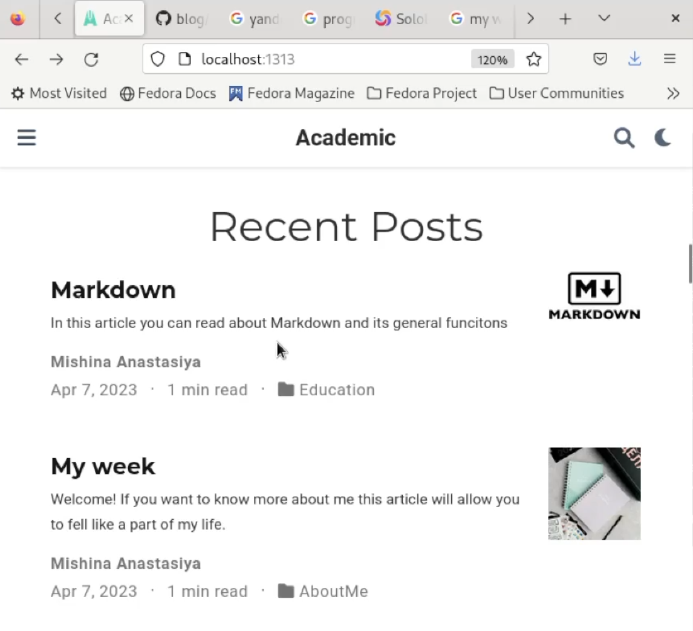
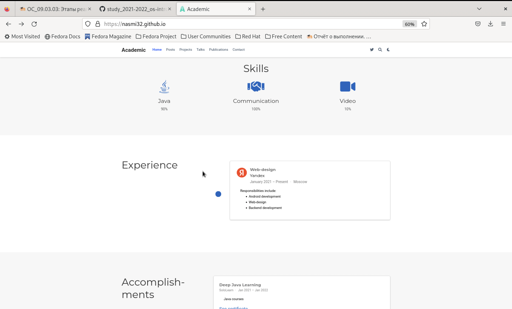
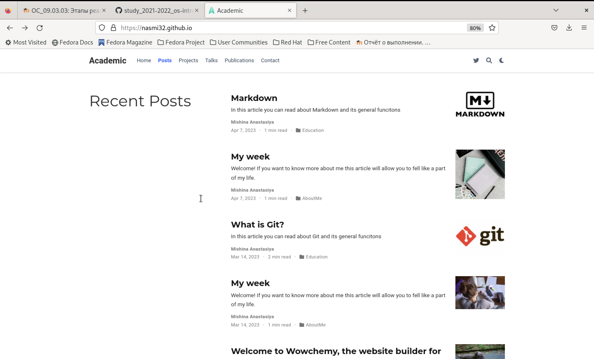
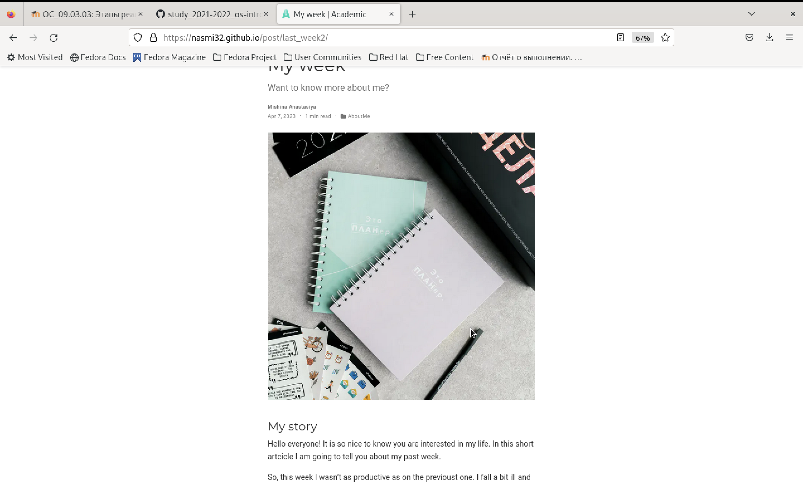
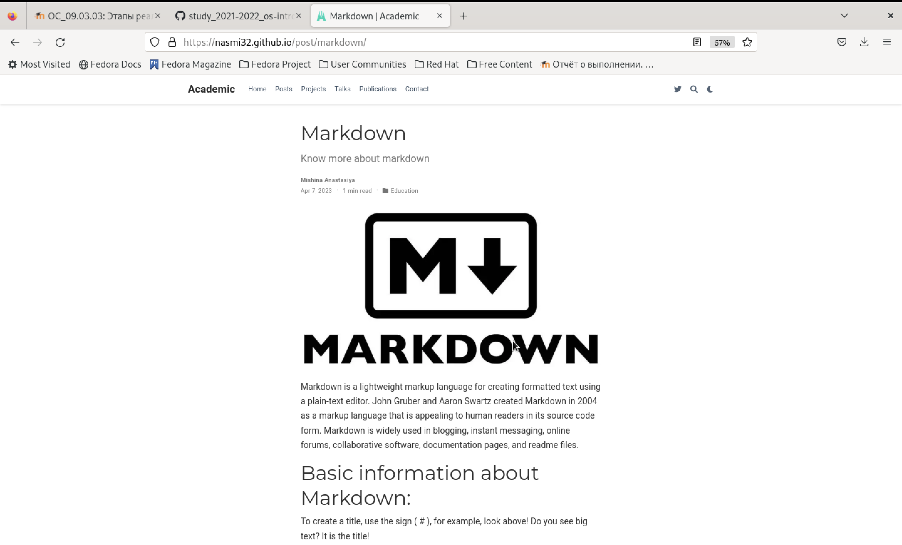

---
## Front matter
lang: ru-RU
title: Индивидуальный проект. Этап №3
subtitle: Добавление к сайту данных о себе.
author:
  - Мишина А. А.
date: 8 апреля 2023

## i18n babel
babel-lang: russian
babel-otherlangs: english

## Formatting pdf
toc: false
toc-title: Содержание
slide_level: 2
aspectratio: 169
section-titles: true
theme: metropolis
header-includes:
 - \metroset{progressbar=frametitle,sectionpage=progressbar,numbering=fraction}
 - '\makeatletter'
 - '\beamer@ignorenonframefalse'
 - '\makeatother'
---

## О себе

- Мишина Анастасия Алексеевна
- Группа НПИбд-02-22

## Цели и задачи

- Добавить к сайту информацию о навыках, опыте и достижениях, а также разместить несколько постов.

## Задачи

 - Добавить к сайту достижения:
1. Добавить информацию о навыках (Skills).
2. Добавить информацию об опыте (Experience).
3. Добавить информацию о достижениях (Accomplishments).
       
- Сделать пост по прошедшей неделе.
       
- Добавить пост на тему по выбору:
1. Легковесные языки разметки.
2. Языки разметки. LaTeX.
3. Язык разметки Markdown.
       
# Выполнение работы

## Навыки

{ width=70% }

## Опыт

{ width=70% }

## Достижения

{ width=70% }

## Пост о прошедшей неделе

{ width=50% }

## Поста о markdown

{ width=50% }

## Проверка постов

{ width=50% }

## Проверка на публичном сайте

{ width=50% }

## Проверка на публичном сайте

{ width=50% }

## Проверка на публичном сайте

{ width=50% }

## Проверка на публичном сайте

{ width=50% }

## Вывод

- В ходе выполнения третьего этапа индивидуального проекта я добавила к сайту информацию о навыках, достижениях и опыте, а также разместила несколько постов.
