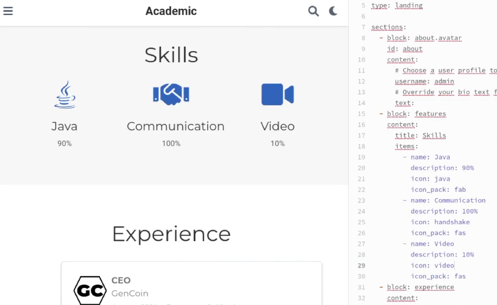
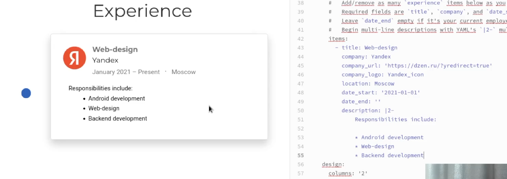
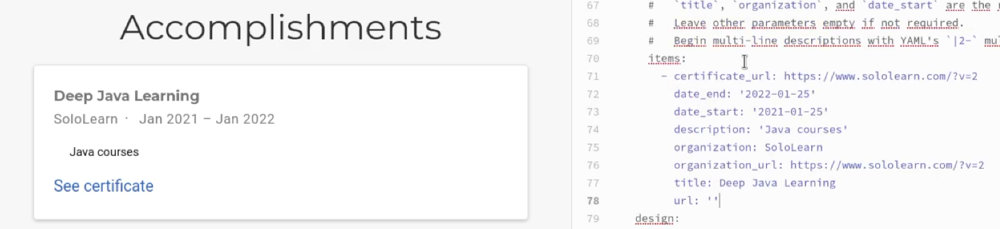
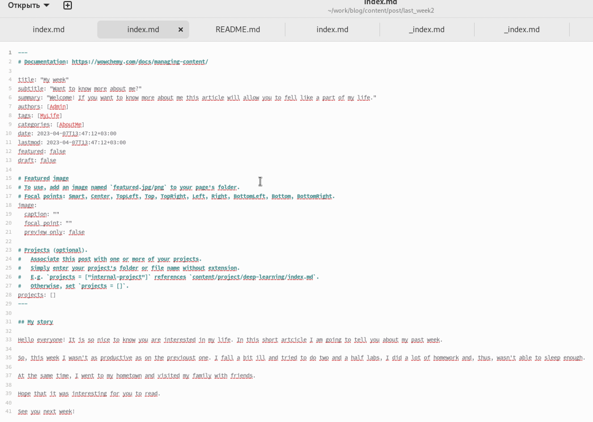
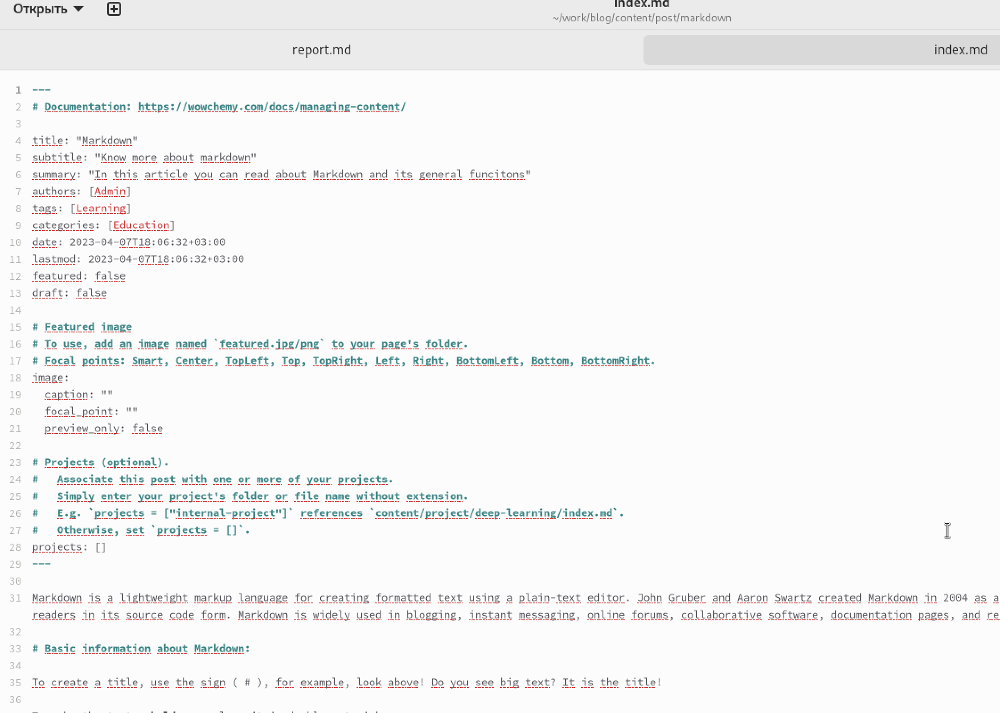
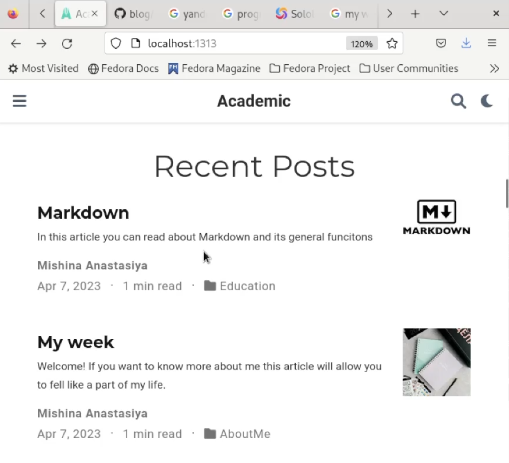
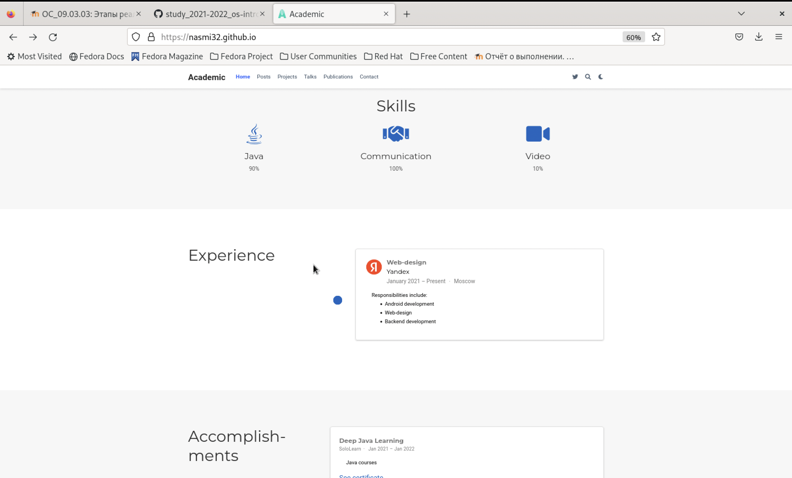
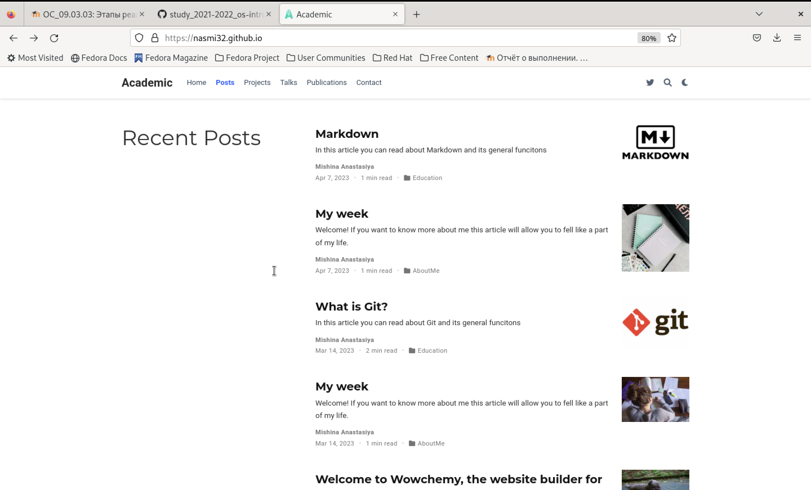
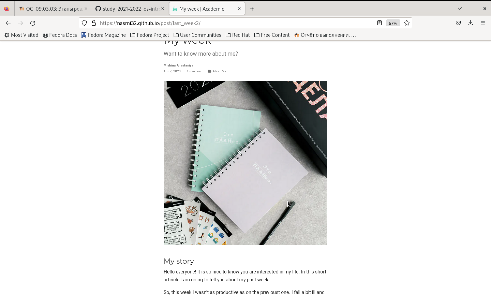
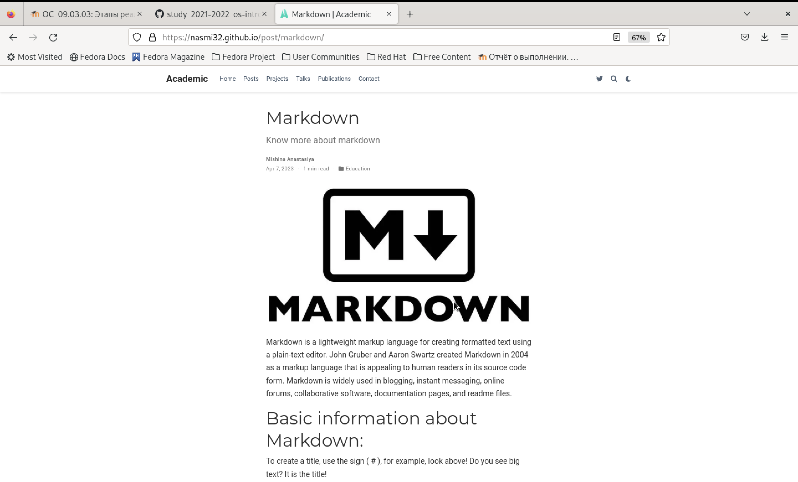

---
## Front matter
title: "Индивидуальный проект"
subtitle: "Этап 3"
author: "Мишина Анастасия Алексеевна"

## Generic otions
lang: ru-RU
toc-title: "Содержание"

## Bibliography
bibliography: bib/cite.bib
csl: pandoc/csl/gost-r-7-0-5-2008-numeric.csl

## Pdf output format
toc: true # Table of contents
toc-depth: 2
lof: true # List of figures
lot: true # List of tables
fontsize: 12pt
linestretch: 1.5
papersize: a4
documentclass: scrreprt
## I18n polyglossia
polyglossia-lang:
  name: russian
  options:
	- spelling=modern
	- babelshorthands=true
polyglossia-otherlangs:
  name: english
## I18n babel
babel-lang: russian
babel-otherlangs: english
## Fonts
mainfont: PT Serif
romanfont: PT Serif
sansfont: PT Sans
monofont: PT Mono
mainfontoptions: Ligatures=TeX
romanfontoptions: Ligatures=TeX
sansfontoptions: Ligatures=TeX,Scale=MatchLowercase
monofontoptions: Scale=MatchLowercase,Scale=0.9
## Biblatex
biblatex: true
biblio-style: "gost-numeric"
biblatexoptions:
  - parentracker=true
  - backend=biber
  - hyperref=auto
  - language=auto
  - autolang=other*
  - citestyle=gost-numeric
## Pandoc-crossref LaTeX customization
figureTitle: "Рис."
tableTitle: "Таблица"
listingTitle: "Листинг"
lofTitle: "Список иллюстраций"
lotTitle: "Список таблиц"
lolTitle: "Листинги"
## Misc options
indent: true
header-includes:
  - \usepackage{indentfirst}
  - \usepackage{float} # keep figures where there are in the text
  - \floatplacement{figure}{H} # keep figures where there are in the text
---

# Цель работы

Добавить к сайту информацию о навыках, опыте и достижениях, а также разместить несколько постов.

# Задание

Добавить к сайту достижения:

       Список достижений.
       
       Добавить информацию о навыках (Skills).
       
       Добавить информацию об опыте (Experience).
       
       Добавить информацию о достижениях (Accomplishments).
       
       Сделать пост по прошедшей неделе.
       
       Добавить пост на тему по выбору:
       
       Легковесные языки разметки.
       
       Языки разметки. LaTeX.
       
       Язык разметки Markdown.

# Выполнение

Введя команду ~/bin/hugo server, получем ссылку на локальный сайт, на котором будем промежуточно отслеживать все изменения.

В папке content открываем файл _index.md и изменяем информацию о навыках, меняем навыки из шаблона на свои (рис. [-@fig:001]).

{ #fig:001 width=90% }

Изменяем информацию об опыте, меняем опыт из шаблона на свой (рис. [-@fig:002]).

{ #fig:002 width=90% }

Изменяем информацию о достижениях, меняем достижения из шаблона на свои (рис. [-@fig:003]).

{ #fig:003 width=90% }

Введя команду ~/bin/hugo new post/last_week2, создаем новый пост на тему о прошедшей неделе. Затем заполняем созданный пост информацией о прошедшей неделе (рис. [-@fig:004]).

{ #fig:004 width=90% }

Создаем второй пост markdown, вновь используя команду ~/bin/hugo new post/markdown. Далее заполняем пост необходимой информацией и добавляем картинку (рис. [-@fig:005]).

{ #fig:005 width=90% }

Далее проверяю изменения на локальном сайте, ссылку на который я получила в начале с помощью команды ~/bin/hugo server (рис. [-@fig:006]).

{ #fig:006 width=90% }

Затем в каталоге blog выполняем ~/bin/hugo и отправляем изменения на сервер. Проверяем изменения на публичном сайте и убеждаемся, что выполненные действия корректны (рис. [-@fig:007]), (рис. [-@fig:008]), (рис. [-@fig:009]), (рис. [-@fig:010]).

{ #fig:007 width=90% }

{ #fig:008 width=90% }

{ #fig:009 width=90% }

{ #fig:010 width=90% }

# Вывод

В ходе выполнения третьего этапа индивидуального проекта я добавила к сайту информацию о навыках, достижениях и опыте, а также разместила несколько постов.
