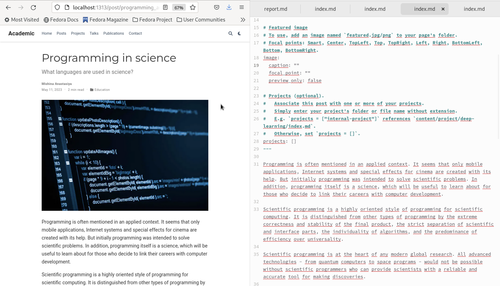

---
## Front matter
lang: ru-RU
title: Индивидуальный проект. Этап №5
subtitle: Добавление к сайту данных о себе.
author:
  - Мишина А. А.
date: 11 мая 2023

## i18n babel
babel-lang: russian
babel-otherlangs: english

## Formatting pdf
toc: false
toc-title: Содержание
slide_level: 2
aspectratio: 169
section-titles: true
theme: metropolis
header-includes:
 - \metroset{progressbar=frametitle,sectionpage=progressbar,numbering=fraction}
 - '\makeatletter'
 - '\beamer@ignorenonframefalse'
 - '\makeatother'
---

## О себе

- Мишина Анастасия Алексеевна
- Группа НПИбд-02-22

## Цели и задачи

- Добавить к сайту данные о собственных ресурсах и сделать несколько постов.

## Задачи

Добавить к сайту все остальные элементы:

	Сделать записи для персональных проектов.

	Сделать пост по прошедшей неделе.

	Добавить пост на тему по выбору.

	Языки научного программирования.
       
# Выполнение работы

## Добавление проекта

{ width=70% }

## ~/bin/hugo new post/название_поста

{ width=70% }

## Пост о прошедшей неделе

{ width=70% }

## Поста о науке и программировании

{ width=70% }

## ~/bin/hugo

{ width=70% }

## Проверка на публичном сайте

{ width=70% }

## Вывод

- В ходе выполнения данного этапа я добавила к сайту остальные данные, разместила проект и создала два поста.
