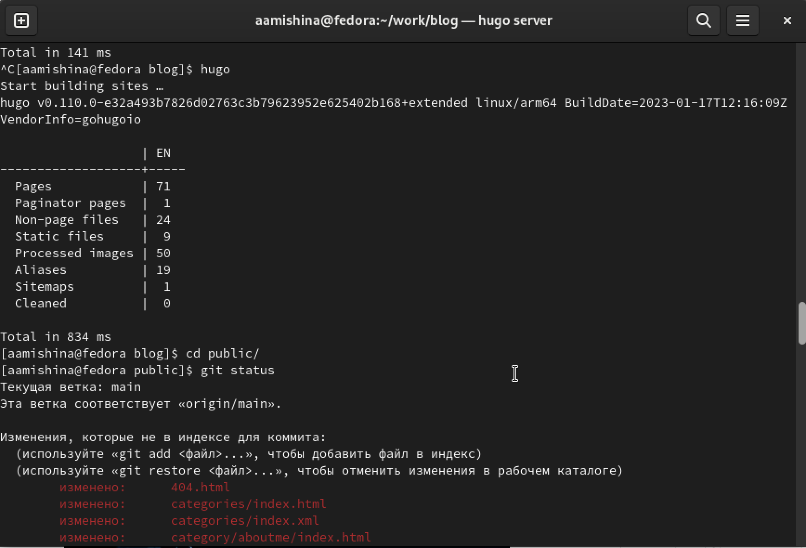

---
## Front matter
title: "Индивидуальный проект"
subtitle: "Этап 5"
author: "Мишина Анастасия Алексеевна"

## Generic otions
lang: ru-RU
toc-title: "Содержание"

## Bibliography
bibliography: bib/cite.bib
csl: pandoc/csl/gost-r-7-0-5-2008-numeric.csl

## Pdf output format
toc: true # Table of contents
toc-depth: 2
lof: true # List of figures
lot: true # List of tables
fontsize: 12pt
linestretch: 1.5
papersize: a4
documentclass: scrreprt
## I18n polyglossia
polyglossia-lang:
  name: russian
  options:
	- spelling=modern
	- babelshorthands=true
polyglossia-otherlangs:
  name: english
## I18n babel
babel-lang: russian
babel-otherlangs: english
## Fonts
mainfont: PT Serif
romanfont: PT Serif
sansfont: PT Sans
monofont: PT Mono
mainfontoptions: Ligatures=TeX
romanfontoptions: Ligatures=TeX
sansfontoptions: Ligatures=TeX,Scale=MatchLowercase
monofontoptions: Scale=MatchLowercase,Scale=0.9
## Biblatex
biblatex: true
biblio-style: "gost-numeric"
biblatexoptions:
  - parentracker=true
  - backend=biber
  - hyperref=auto
  - language=auto
  - autolang=other*
  - citestyle=gost-numeric
## Pandoc-crossref LaTeX customization
figureTitle: "Рис."
tableTitle: "Таблица"
listingTitle: "Листинг"
lofTitle: "Список иллюстраций"
lotTitle: "Список таблиц"
lolTitle: "Листинги"
## Misc options
indent: true
header-includes:
  - \usepackage{indentfirst}
  - \usepackage{float} # keep figures where there are in the text
  - \floatplacement{figure}{H} # keep figures where there are in the text
---

# Цель работы

Добавить к сайту остальные элементы: сделать запись персонального проекта, а также разместить два поста.

# Задание

Добавить к сайту все остальные элементы:

	Сделать записи для персональных проектов.

	Сделать пост по прошедшей неделе.

	Добавить пост на тему по выбору.

	Языки научного программирования.

# Выполнение лабораторной работы

Сначала я выполнила команду ~/bin/hugo server, чтобы получить ссылку на локальный сайт и просматривать там изменения. Затем я добавила свой проект и проверила его на локальном сайте (рис. [-@fig:001]).

{ #fig:001 width=70% }

Далее я создала два поста с помощью команды ~/bin/hugo new post/название_поста. Мои посты были на тему прошлой недели и о языках научного программирования (рис. [-@fig:002]).

{ #fig:002 width=70% }

Я заполнила пост о прошедшей неделе необходимой информацией, сохранила его и проверила на локальном сайте (рис. [-@fig:003]).

{ #fig:003 width=70% }

Далее заполнила второй пост о науке и программировании, затем сохранила и проверила изменения на локальном сайте (рис. [-@fig:004]).

{ #fig:004 width=70% }

Затем я выполнила исполняемый файл ~/bin/hugo в каталоге blog, и проверила изменения в public с помощью команды git status (рис. [-@fig:005]). 

{ #fig:005 width=70% }

После того, как я убедилась, что в public произошли необходимые изменения, я запушила(отправила) изменения на сервер (рис. [-@fig:006]).

{ #fig:006 width=70% }

После того, как все изменения отправились на сервер, я открыла мой публичный сайт и проверила все изменения. Убедилась в корректности выполнения всех действий (рис. [-@fig:007]).

{ #fig:007 width=70% }

# Вывод

В ходе выполнения данного этапа я добавила к сайту остальные данные, разместила проект и создала два поста.
